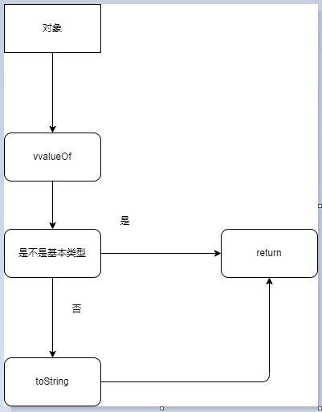

# 非全等比较 == / !=

- 参考文件

  > [1、非严格相当 ==](https://developer.mozilla.org/zh-CN/docs/Web/JavaScript/Reference/Operators/Equality)

  > [2.JS 相等性判断](https://developer.mozilla.org/zh-CN/docs/Web/JavaScript/Equality_comparisons_and_sameness#%E9%9D%9E%E4%B8%A5%E6%A0%BC%E7%9B%B8%E7%AD%89)

* <b style="color:#aaffaa">特殊情况</b>

  ```js
  NaN == NaN; // false
  nudefined == null; // true
  // 如果其中一个操作数为 null 或 undefined，
  // 另一个操作数也必须为 null 或 undefined 以返回 true。否则返回 false。
  -+infinity == -+infinity; // FALSE
  ```

1. 当其中一方为数字或布尔值时，现将自己的布尔值转<b style="color: #aaffaa">换成数字</b>， 另一方是 string 、 Boolean、 Object 都会将另一方转换成数字<b style="color:#aaffaa">最后用数字做比较</b>。

   ```js
   1 == []; // false
   1 == true; // true
   1 == "qwe"; // false
   1 == "1"; // true
   ```

   对象转成成数字过程

   

   ```js
   // 例子：
   [] == ![]; // true
   ```

   ![] 为强制转换为布尔值 false, ==> [] == false 然后转换为 [] == 0,接着将左边的 [] 调用到 toString 转换为 '' == 0, 将 string '' 转换为 0 后 比较 0 == 0 ，最后为 true 。

2. 注意 String 对象比较，使用构造的字符串 new String() 是对象。如果将其中之一与字符串文字进行比较，则该 String 对象将被转换为字符串文字并对其内容进行比较。但是，如果两个操作数都是 String 对象，则将它们作为对象进行比较，并且必须引用相同的对象才能进行比较：

   ```js
   const string1 = "hello";
   const string2 = String("hello");
   const string3 = new String("hello");
   const string4 = new String("hello");
   /**
    * 1 和 2 都是 字符串， 3 和 4 都是对象， 字符串和字符串比较或是字符串
    * 和字符串实例对象比较只要值相等就相等。对象比较只比较地址
    */
   console.log(string1 == string2); // true
   console.log(string1 == string3); // true
   console.log(string2 == string3); // true
   console.log(string3 == string4); // false 对象地址不一致 所以 false
   console.log(string4 == string4); // true
   ```
