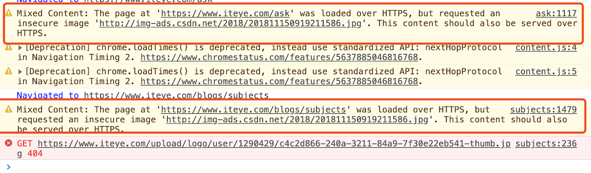

# XMLHttpRequest API

```js
function GetWebData(URL) {
	/**
	 * 1:新建XMLHttpRequest请求对象
	 */
	let xhr = new XMLHttpRequest();

	/**
	 * 2:注册相关事件回调处理函数
	 */
	xhr.onreadystatechange = function () {
		switch (xhr.readyState) {
			case 0: //请求未初始化
				console.log("请求未初始化");
				break;
			case 1: //OPENED
				console.log("OPENED");
				break;
			case 2: //HEADERS_RECEIVED
				console.log("HEADERS_RECEIVED");
				break;
			case 3: //LOADING
				console.log("LOADING");
				break;
			case 4: //DONE
				if (this.status == 200 || this.status == 304) {
					console.log(this.responseText);
				}
				console.log("DONE");
				break;
		}
	};

	xhr.ontimeout = function (e) {
		console.log("ontimeout");
	};
	xhr.onerror = function (e) {
		console.log("onerror");
	};

	/**
	 * 3:打开请求
	 */
	xhr.open("Get", URL, true); //创建一个Get请求,采用异步

	/**
	 * 4:配置参数
	 */
	xhr.timeout = 3000; //设置xhr请求的超时时间
	xhr.responseType = "text"; //设置响应返回的数据格式
	xhr.setRequestHeader("X_TEST", "time.geekbang");

	/**
	 * 5:发送请求
	 */
	xhr.send();
}
```

**XMLHttpRequest 使用问题**

1. 跨域请求问题。

   不属于同一域名下请求会有跨域问题。

   ```
   Access to XMLHttpRequest at 'https://time.geekbang.org/' from origin 'https://www.geekbang.org' has been blocked by CORS policy: No 'Access-Control-Allow-Origin' header is present on the requested resource.
   ```

2. 混合协议访问问题。

   比如 https 协议的网站中带有一些 http 请求的资源
   
