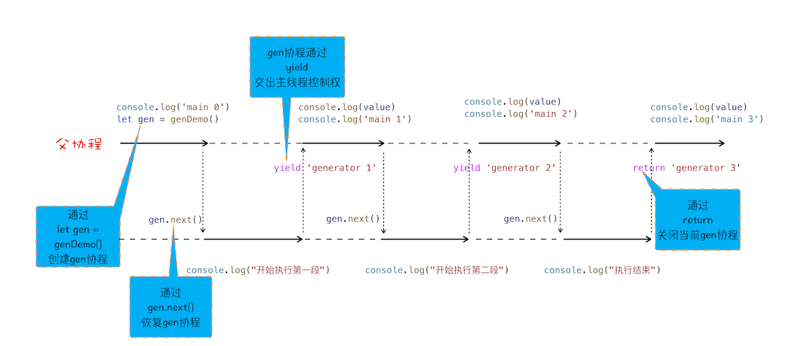

# Promise & async/await

## Promise

在 Promise 没有出现之前看看我们的代码都是怎么处理异步编程的。

```js
//执行状态
function onResolve(response) {
	console.log(response);
}
function onReject(error) {
	console.log(error);
}

let xhr = new XMLHttpRequest();
xhr.ontimeout = function (e) {
	onReject(e);
};
xhr.onerror = function (e) {
	onReject(e);
};
xhr.onreadystatechange = function () {
	onResolve(xhr.response);
};

//设置请求类型，请求URL，是否同步信息
let URL = "https://time.geekbang.com";
xhr.open("Get", URL, true);

//设置参数
xhr.timeout = 3000; //设置xhr请求的超时时间
xhr.responseType = "text"; //设置响应返回的数据格式
xhr.setRequestHeader("X_TEST", "time.geekbang");

//发出请求
xhr.send();
```

在这段代码中，我们将整个请求的处理流程都暴露在同一段代码中, 而实际上我们只关注的是请求的输入和获取到的返回结果，这样使得我们的代码变得非常臃肿，不不连贯。这些异步回调影响到我们的编码方式, 所以我们将异步请求的处理过程封装起来。

```js
//makeRequest用来构造request对象
function makeRequest(request_url) {
	let request = {
		method: "Get",
		url: request_url,
		headers: "",
		body: "",
		credentials: false,
		sync: true,
		responseType: "text",
		referrer: "",
	};
	return request;
}

//[in] request，请求信息，请求头，延时值，返回类型等
//[out] resolve, 执行成功，回调该函数
//[out] reject  执行失败，回调该函数
function XFetch(request, resolve, reject) {
	let xhr = new XMLHttpRequest();
	xhr.ontimeout = function (e) {
		reject(e);
	};
	xhr.onerror = function (e) {
		reject(e);
	};
	xhr.onreadystatechange = function () {
		if ((xhr.status = 200)) resolve(xhr.response);
	};
	xhr.open(request.method, URL, request.sync);
	xhr.timeout = request.timeout;
	xhr.responseType = request.responseType;
	//补充其他请求信息
	//...
	xhr.send();
}

XFetch(
	makeRequest("https://time.geekbang.org"),
	function resolve(data) {
		console.log(data);
	},
	function reject(e) {
		console.log(e);
	}
);
```

这样我们使用 XFetch 发送请求，可以使我们的关注点放在输入和输出上不用关注请求流程中的处理流程。但是当处理一个接口依赖于另一个接口的数据这种业务时，就会有**回调地狱**问题。

```js
XFetch(makeRequest('https://time.geekbang.org/?category'),
      function resolve(response) {
          console.log(response)
          XFetch(makeRequest('https://time.geekbang.org/column'),
              function resolve(response) {
                  console.log(response)
                  XFetch(makeRequest('https://time.geekbang.org')
                      function resolve(response) {
                          console.log(response)
                      }, function reject(e) {
                          console.log(e)
                      })
              }, function reject(e) {
                  console.log(e)
              })
      }, function reject(e) {
          console.log(e)
      })
```

问题：

- 嵌套调用层级太多， 代码可读性差。

- 每个请求都有相同的同样的响应处理和错误处理，增加无用的代码量。且每次都有 resolve 和 reject 两个状态。这样嵌套调用大大增加了不确定性。

为了解决这两个问题，Promise 就诞生了， 我们看看 Promise 是怎么解决这两个问题的。

重构 XFetch 代码:

```js
function XFetch(request) {
	function executor(resolve, reject) {
		let xhr = new XMLHttpRequest();
		xhr.open("GET", request.url, true);
		xhr.ontimeout = function (e) {
			reject(e);
		};
		xhr.onerror = function (e) {
			reject(e);
		};
		xhr.onreadystatechange = function () {
			if (this.readyState === 4) {
				if (this.status === 200) {
					resolve(this.responseText, this);
				} else {
					let error = {
						code: this.status,
						response: this.response,
					};
					reject(error, this);
				}
			}
		};
		xhr.send();
	}
	return new Promise(executor);
}
```

重构请求流程

```js
// 对多个错误处理进程合并。消灭回调地狱。
var x1 = XFetch(makeRequest("https://time.geekbang.org/?category"));
var x2 = x1.then(function onResolve(value) {
	// 延时绑定的回调函数
	console.log(value);
	// 将返回值穿透到最外层。
	return XFetch(makeRequest("https://www.geekbang.org/column"));
}，function onReject(error) {
    console.log(error)
});
var x3 = x2.then((value) => {
	console.log(value);
	return XFetch(makeRequest("https://time.geekbang.org"));
});
x3.catch((error) => {
	console.log(error);
});
```

Promise 主要通过以下两步来解决回调问题的：

首先，Promise 实现了回调函数的延时绑定。回调函数的延时绑定在代码上体现就是先创建 Promise 对象 x1，通过 Promise 的构造函数 executor 来执行业务逻辑；创建好 Promise 对象 x1 之后，再使用 x1.then 来设置回调函数。

其次，需要将回调函数 onResolve 的返回值穿透到最外层。因为我们会根据 onResolve 函数的传入值来决定创建什么类型的 Promise 任务，创建好的 Promise 对象需要返回到最外层，这样就可以摆脱嵌套循环了。

至于合并错误处理则是基于 Promise 的错误具有 "冒泡"性质。会一直向后传递，直到被 onReject 函数处理或 catch 语句捕获为止。这样就不需要频繁的添加错误处理了。

## async / await (ES7)

虽然 Promise 使得请求流程非常线性化了， 但是后续的处理可能会使用到多个 then 函数处理。 这样依然不利于阅读。基于这个原因 ES7 引入了 async 、 await , 它提供了在不阻塞主线程的情况下使用同步代码实现异步访问资源的能力，并且使得代码逻辑更加清晰。 async / await 使用的是 Promise 和 Generator 作为底层技术，下面我们先了解下 Generator。

<b style="color: #aaffaa"> Generator(生成器)</b>

生成器函数是一个带星号函数，而且是可以暂停执行和恢复执行的。

```js
function* genDemo() {
	console.log("开始执行第一段");
	yield "generator 2";

	console.log("开始执行第二段");
	yield "generator 2";

	console.log("开始执行第三段");
	yield "generator 2";

	console.log("执行结束");
	return "generator 2";
}

console.log("main 0");
let gen = genDemo();
console.log(gen.next().value);
console.log("main 1");
console.log(gen.next().value);
console.log("main 2");
console.log(gen.next().value);
console.log("main 3");
console.log(gen.next().value);
console.log("main 4");

/**
 * main 0
开始执行第一段
 generator 2
 main 1
开始执行第二段
 generator 2
 main 2
开始执行第三段
 generator 2
 main 3
 执行结束
 generator 2
 main 4
 */
```

如上面的代码，在生成器函数内部执行一段代码，如果遇到 yield 关键字，那么 JavaScript 引擎将返回关键字后面的内容给外部，并暂停该函数的执行。外部函数可以通过 next 方法恢复函数的执行。

它是如何做到暂停和恢复的呢？答案是利用**协程**。**协程是一种比线程更加轻量级的存在， 协程不是被操作系统内核所管理，而完全是由程序所控制（也就是在用户态执行）**你可以把协程看成是跑在线程上的任务，一个线程上可以存在多个协程，但是在线程上同时只能执行一个协程，比如当前执行的是 A 协程，要启动 B 协程，那么 A 协程就需要将主线程的控制权交给 B 协程，这就体现在 A 协程暂停执行，B 协程恢复执行；同样，也可以从 B 协程中启动 A 协程。通常，如果从 A 协程启动 B 协程，我们就把 A 协程称为 B 协程的父协程。



为了直观理解父协程和 gen 协程是如何切换调用栈的，你可以参考下图：


现在我们在用生成器配合 fetch 做一下请求。

```js
//foo函数
function* foo() {
	let response1 = yield fetch("https://www.geekbang.org");
	console.log("response1");
	console.log(response1);
	let response2 = yield fetch("https://www.geekbang.org/test");
	console.log("response2");
	console.log(response2);
}

//执行foo函数的代码
let gen = foo();
function getGenPromise(gen) {
	return gen.next().value;
}
// 我们把执行生成器的代码封装成一个函数，并把这个执行生成器代码的函数称为执行器（可参考著名的co框架）
// co： https://www.npmjs.com/package/co
// getGenPromise 是执行器。
getGenPromise(gen)
	.then((response) => {
		console.log("response1");
		console.log(response);
		return getGenPromise(gen);
	})
	.then((response) => {
		console.log("response2");
		console.log(response);
	});
```

肃然生成器满足了我们的需求， 但是为了更美观， ES7 引入了 async / await , async 是一个通过异步执行并隐式返回 Promise 作为结果的函数。await 是暂停当前协程并将带状态的 Promise 返回给父协程。

```js
async function foo() {
	console.log(1);
	let a = await 100;
	console.log(a);
	console.log(2);
}
console.log(0);
foo();
console.log(3);

// 0 1 3 100 2
```


## Test

打印输出结果。

```js
// test 1
let x1 = Promise.reject();
let x2 = x1.then(
	() => {},
	function (err) {
		console.log(err, "err");
	}
);

x2.catch((error) => {
	console.log(error, "err2");
});
```

答案： undefined， "err"

```js
// test 2

async function foo() {
	console.log("foo");
}
async function bar() {
	console.log("bar start");
	await foo();
	console.log("bar end");
}
console.log("script start");
setTimeout(function () {
	console.log("setTimeout");
}, 0);
bar();
new Promise(function (resolve) {
	console.log("promise executor");
	resolve();
}).then(function () {
	console.log("promise then");
});
console.log("script end");

// 答案： script start > bar start > foo >  promise executor > script end  > bar end > promise then > setTimeout
```

实现模拟一个 Promise。

```js

```
