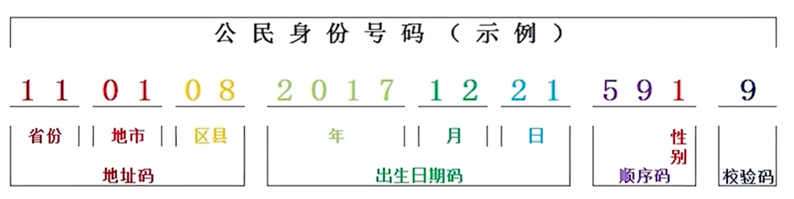

# 常用正则表达式

国内手机号码：

使用的时候要看看当前的号码有没有新出的。现在有 17 开头的了。

```javascript
/^(13[0-9]|14[57]|15[012356789]|18[012356789])\d{8}$/g;
```

邮箱：

```javascript
w+([-+.]w+)*@w+([-.]w+)*.w+([-.]w+)*
```

网址：

```javascript
var str = "https://www.runoob.com:80/html/html-tutorial.html";
var patt1 = /(\w+):\/\/([^/:]+)(:\d*)?([^# ]*)/;
arr = str.match(patt1);
// 验证网址:
// “^https?://([w-]+.)+[w-]+(/[w-./?%&=]_)?$”
```

```javascript

```

每隔三个数字加一个逗号:

```JavaScript

'123123211312.333333'.replace(/(?=(?!^)(?:\d{3})+(?:\.|$))(\d{3}(\.\d+$)?)/g, ',$1');
// 123,123,211,312.333333

'-1019234801211.2142345678'.replace(/(?<!._\..\*)(\d)(?=(\d{3})+($|\.))/g, '$1,');
// 简单些的
let reg = /(?!^)(?=(\d{3})+\b)/g
```

身份证号码：

18 位身份证校验规则：

> 01 | 2345 | 6789 | 0123 | 456 | 7

01: 表示省份

2345： 表示市， 县， 区；

6789 和 0123: 表示 出生年月日, 年份 4 位， 月和日各两位；

456: 表示同一区域同年同月同日生的次序， 最后一位 6 兼具性别作业， 男为基数， 女位偶数；

最后一位为校验码；



密码强度判断：
