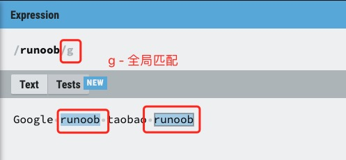
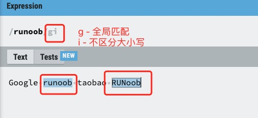
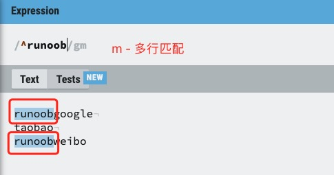
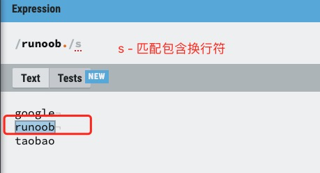

# RegExp 修饰符

## G

g 修饰符可以查找字符串中所有的匹配项：



```JavaScript

var str="Google runoob taobao runoob";
var n1=str.match(/runoob/);   // 查找第一次匹配项
var n2=str.match(/runoob/g);  // 查找所有匹配项
```

## i

i 修饰符为不区分大小写匹配，实例如下：


## m

m 修饰符可以使 ^ 和 $ 匹配一段文本中每行的开始和结束位置。g 只匹配第一行，添加 m 之后实现多行。



```JavaScript
var str="runoobgoogle\ntaobao\nrunoobweibo";
var n1=str.match(/^runoob/g);   // 匹配一个
var n2=str.match(/^runoob/gm);  // 多行匹配
```

## s

默认情况下的圆点 . 是 匹配除换行符 \n 之外的任何字符，加上 s 之后, . 中包含换行符 \n



```JavaScript
var str="google\nrunoob\ntaobao";
var n1=str.match(/google./);   // 没有使用 s，无法匹配\n
var n2=str.match(/runoob./s);  // 使用 s，匹配\n

```

## u (新的匹配模式）

匹配大于 4 字节的字符 。
