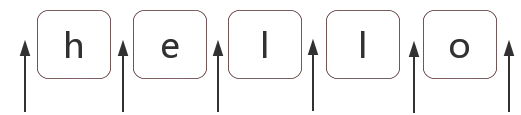

# 定位符

在 ES5 中，共有 6 个锚字符：

^ $ \b \B (?=p) (?!p)

> 注意：不能将限定符与定位符一起使用。由于在紧靠换行或者单词边界的前面或后面不能有一个以上位置，因此不允许诸如 ^\* 之类的表达式。

<b style="color:#aaffaa">$</b>

匹配输入字符串的结尾位置。如果设置了 RegExp 对象的 Multiline 属性，则 $ 也匹配 '\n' 或 '\r'。要匹配 $ 字符本身，请使用 `\$`。

<b style="color:#aaffaa">^</b>

匹配输入字符串的开始位置，除非在方括号表达式中使用，当该符号在方括号表达式中使用时，表示不接受该方括号表达式中的字符集合。要匹配 ^ 字符本身，请使用 `\^` 。

<b style="color:#aaffaa">\b</b>

匹配一个单词边界，即字与空格间的位置。

<b style="color:#aaffaa">\B</b>

非单词边界匹配。

## 什么是位置呢？

位置是相邻字符之间的位置。比如，下图中箭头所指的地方：



## 开始 ^ 和结束 $;

```JavaScript
var result = "hello".replace(/^|$/g, '#');
console.log(result);
// "#hello#"
```

## \b 和\B

\b 是单词边界，具体就是\w 和\W 之间的位置，也包括\w 和^之间的位置，也包括\w 和$之间的位置。

比如一个文件名是"[JS] Lesson\*01.mp4"中的\b，如下：

```JavaScript

var result = "[JS] Lesson_01.mp4".replace(/\b/g, '#');
console.log(result);
//"[#JS#] #Lesson_01#.#mp4#"
```

知道了\b 的概念后，那么\B 也就相对好理解了。

\B 就是\b 的反面的意思，非单词边界。具体说来就是\w 与\w、\W 与\W、^与\W，\W 与$之间的位置。

```JavaScript
var result = "[JS] Lesson_01.mp4".replace(/\B/g, '#');
console.log(result);
// => "#[J#S]# L#e#s#s#o#n#\*#0#1.m#p#4"
```

## (?=p)和(?!p) 、(?<=p)和 (?<!p)
