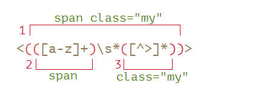

# 正则分组和反向引用

参考地址：

https://zh.javascript.info/regexp-groups

https://blog.csdn.net/raoshihong/article/details/17004641

## 分组 ()

每个分组代表一个子表达式, 用圆括号 () 将所有选择项括起来，相邻的选择项之间用 | 分隔。() 表示捕获分组，() 会把每个分组里的匹配的值保存起来 。

```JavaScript

var str = "https://www.runoob.com:80/html/html-tutorial.html";
var patt1 = /(\w+):\/\/([^/:]+)(:\d*)?([^# ]*)/;
arr = str.match(patt1);
/*
[
'https://www.runoob.com:80/html/html-tutorial.html', 整个正则匹配到的字符串
'https', 第一个分组 (\w+) 匹配到的内容
'www.runoob.com', 第二个分组 ([^/:]+) 匹配到的内容
':80', 第三个分组 (:\d*) 匹配到的内容
'/html/html-tutorial.html'  第四个分组 ([^# ]*) 匹配到的内容
]
*/
```

但用圆括号会有一个副作用，使相关的匹配会被缓存，此时可用 ?: 放在第一个选项前来消除这种副作用。

其中 ?: 是非捕获元之一，还有两个非捕获元是 ?= 和 ?!，这两个还有更多的含义，前者为正向预查，在任何开始匹配圆括号内的正则表达式模式的位置来匹配搜索字符串，后者为负向预查，在任何开始不匹配该正则表达式模式的位置来匹配搜索字符串。

```JavaScript
'235abc5123defg456'.match(/([0-9])([a-z]+)\1/g);
// 表达式 ([0-9]) 匹配到的值 5 被缓存下来 通过 \1 （表示获取第一个子表达式的值，\2... 同理）因此正则要匹配的是
// 数字 ([a-z]+) 数字;
['5abc5']

'235abc5123defg456'.match(/(?:[0-9])([a-z]+)\1/g);
// null 没有被缓存；也没有组号所以 用 \1 是获取不到分组匹配的值的

let str = "Gogogo John!";
let regexp1 = /(go)+ (\w+)/i;
str.match(regexp1);
// ['Gogogo John', 'go', 'John', index: 0, input: 'Gogogo John!', groups: undefined]
// ?: 从捕获组中排除 'go'
let regexp2 = /(?:go)+ (\w+)/i;
str.match(regexp2); // ['Gogogo John', 'John', index: 0, input: 'Gogogo John!', groups: undefined]
```

## 反向引用

对一个正则表达式模式或部分模式两边添加圆括号将导致相关匹配存储到一个临时缓冲区中，所捕获的每个子匹配都按照在正则表达式模式中从左到右出现的顺序存储。缓冲区编号从 1 开始，最多可存储 99 个捕获的子表达式。每个缓冲区都可以使用 \n 访问，其中 n 为一个标识特定缓冲区的一位或两位十进制数。可以使用非捕获元字符 ?:、?= 或 ?! 来重写捕获，忽略对相关匹配的保存。

检测相邻的重复出现的单词

```JavaScript
var str = "Is is the cost of of gasoline going up up";
var patt1 = /\b([a-z]+) \1\b/igm; // \1 就是 子表达式 ([a-z] +) 匹配到的值
str.match(patt1);
// [Is is,of of,up up]
```

字符串交换位置方法 str.replace(regexp, replacement) 用 replacement 替换 str 中匹配 regexp 的所有捕获组。这使用 $n 来完成，其中 n 是组号。

```JavaScript

let str = "John Bull";
let regexp = /(\w+) (\w+)/;
str.replace(regexp, '$2, $1'); // Bull, John

或：
str.replace(regexp, function () {
    return `${RegExp.$2} ${RegExp.$1}`;
}));
```

对于命名括号，引用为 $<name>。例如，让我们将日期格式从 “year-month-day” 更改为 “day.month.year”：

```JavaScript
let regexp = /(?<year>[0-9]{4})-(?<month>[0-9]{2})-(?<day>[0-9]{2})/g;
let str = "2019-10-30, 2020-01-01";
alert( str.replace(regexp, '$<day>.$<month>.$<year>') );
// 30.10.2019, 01.01.2020
```

## 分组的配置规则：

1.反向引用需要使用到分组，分组就是使用()括起来的部分为一个整体，在进行分组匹配时的原则是：由外向内，由左向右；

2.反向引用如:\1,\2 等

\1：表示的是引用第一次匹配到的()括起来的部分
\2：表示的是引用第二次匹配到的()括起来的部分, 例如：

```JavaScript
let regexp =  /^(\d)\1[0-9](\d)\1{2}/
regexp.test('335933')// true;   // 这里的第二个 \1 是指第一个分组匹配到的值 3；
regexp.test('336444') // false

// 又如
let reg1 = /^(\d)\1[0-9](\d)\2{2}$/
reg1.test('447555') // 第一个 \1 是第一个分组 (\d) 匹配到的 4， \2 是第二个分组 (\d) 匹配到的 5
```

在嵌套的情况下：



```JavaScript
let str = '<span class="my">';
let regexp = /<(([a-z]+)\s*([^>]*))>/;
let result = str.match(regexp);
[
    '<span class="my">',  // 这个表达式匹配到的
    'span class="my"',    // 分组\1 (([a-z]+)\s*([^>]*))
    'span',    // 分组 \2   ([a-z]+)
    'class="my"',  // 分组 \3 ([^>]*)
]
```
