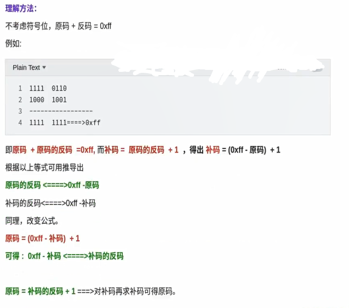

# JaveScript 运算

var 变量的及声明函数的都会预解析

Javascript 所有的数学运算符<b> ( + 、 - 、 \*、 / 、% ) 都会触发隐式转换

---

JavaScript 一些运算符的其他用途。

\+ , - ,\ ~ ,! (函数)前四符号任何一个放在前面都会使函数变成函数表达式；
\+ 号会触发字符串拼接；

```js
var a = +(function (a, b) {
	var obj = {
		add: function () {
			return a + b;
		},
	};
})(1, 2);

console.log(a.add());
```

## 位运算符

**& :** 与运算 ， 如果两位都是 1 则设置每位为 1

**| :** 或运算, 如果两位之一为 1 则设置每位为 1

**~ ：** 位取反运算， 反转所有位

**^ :** 异或运算如果两位只有一位为 1 则设置每位为 1

**<< ：** 零填充左位移 通过从右推入零向左位移，并使最左边的位脱落。

**>> ：** 有符号右位移， 通过从左推入最左位的拷贝来向右位移，并使最右边的位脱落。

**>>> :** 零填充右位移 通过从左推入零来向右位移，并使最右边的位脱落

> 表格中 4 位的都是前面省了 4 个 0；

|  code   | 结果 | 等同于（补码） | 结果（补码） |
| :-----: | :--: | :------------- | :----------- |
|  5 & 1  |  1   | 0101&0001      | 0001         |
| 5 \| 1  |  5   | 0101 \| 0001   | 0101         |
|  5 ^ 1  |  4   | 0101 ^ 0001    | 0100         |
|   ~ 5   |  -6  | ~0101          | 1010         |
|  ~ -5   |  4   | ~ 10000101     | 11111011     |
| 5 << 1  |  10  | 0101 << 1      | 1010         |
| 5 >> 1  |  2   | 0101 >> 1      | 0010         |
| -5 >> 1 |  -3  | 11111011 >> 1  | 11111101     |
| 5 >>> 1 |  2   | 0101 >>> 1     | 0010         |

**位运算符的其他用法**

> 1、~~ 向下取整

```javascript
// 12
~~12.5;
```

> 2、 ~ 判断索引是否存在

```javascript
~"米莉波比布朗".indexOf("莉");
```

> 3、 ^ 交叉赋值 (只能连个都是数字时才行)

在了解这个技巧之前需要先了解两个准则：

1、两个相同的数进行按位异或等于 0

2、任意一个数与 0 进行按位异或等于自身

```javascript
// ES 6
// 使用解构赋值
var x = 1;
var y = ((2)[(x, y)] = [y, x]);

// 使用 ^ 运算符
let a = 2,
	b = 3;
a = a ^ b;
b = a ^ b;
a = a ^ b;
```

> 4、 & 判断奇数或偶数

偶数与 0b1，按位与，结果必定等于 0

奇数与 0b1，按位与，结果必定等于 1

```javascript
// 奇数
(3 & 1) === 1;

// 偶数
(4 & 1) === 0;
```

> 十进制转换成 2 进制

```javascript
// （3 >>> 0) 表示用32 位二进制表示法, 它和 -3.toString(2) 得到的结果是不一样的
(-3 >>> 0).toString(2);
```

## 其他

**二进制的原码 、反码、补码转换运算**

对于有符号数而言：

1、二进制的最高位是符号位：0 表示正数，1 表示负数

2、正数的原码、反码、补码都一样；

3、负数的反码 = 它的原码符号位不变，其他位取反（0 ->1 ; 1->0 ）；

4、负数的补码 = 它的反码 +1；

5、0 的反码、补码都是 0；

6、在计算机运算的时候，都是以补码的方式来运算的；

计算例子：

    1-2 = 1 + ( -2 )

    1 的 补码： 00000001， -2 的补码：10000010 （原码）--> 111111101 （反码）--> 11111110（补码）

    补码相加得到结果的补码： 00000001 + 11111110 = 11111111

`如果想将二进制转换为十进制，必须得到二进制的原码`

    负数的补码 - 1 得到反码： 11111110；

    反码反转得到原码（负数符号位不变）：10000001  = -1；


