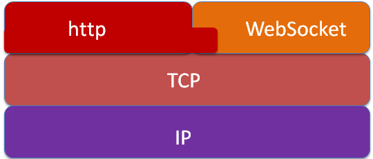

# websocket

**websocket 特点:**

节省通信开销：以前的 WebServer 使用推送或用轮询技术完成实时通信，需要客户端不停向服务器发送 HTTP 请求，但是 HTTP 的 Header 是非常长的，里面包含的数据可能只是一个很小的值，占用了很多带宽和服务器资源，用 WebSocket 可以避免这一问题

服务器主动传送数据给客户端：WebSocket 可以使服务器和客户端相互推送信息

实时通信：一旦握手建立后，就可以实时通信。

websocket 的最大优点是它通过单个 TCP 连接提供双向通信(全双工)。

**websocket URL**

**websocket 与 TCP、HTTP 的关系**

WebSocket 与 http 协议一样都是基于 TCP 的，所以他们都是可靠的协议，Web 开发者调用的 WebSocket 的 send 函数在 browser 的实现中最终都是通过 TCP 的系统接口进行传输的。WebSocket 和 Http 协议一样都属于应用层的协议，那么他们之间有没有什么关系呢？答案是肯定 的，WebSocket 在建立握手连接时，数据是通过 http 协议传输的，这里面用到的只是 http 协议一些简单的字段。但是在建立连接之后，真正的数据传输阶段是不需要 http 协议参与的。

