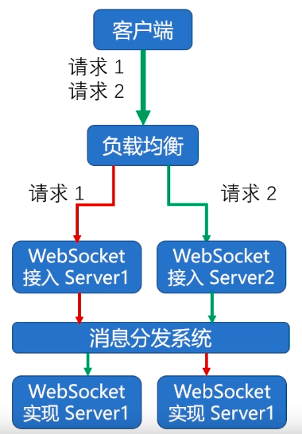

# websocket 的约束

1、 websocket 做需要做可伸缩性服务时， 需要设计比较复杂的架构。 如图：

接入层只做协议转换， 转换为消息分发系统（如 kafka）可以识别的协议

2、 websocket 长连接需要基于 Ping/Pong 心跳机制来维持。

WebSocket 对开发者要求高了许多：

对前端开发者，往往要具备数据驱动使用 javascript 的能力，且需要维持住 ws 连接（否则消息无法推送）；

对后端开发者而言，难度增大了很多：

    一是长连接需要后端处理业务的代码更稳定（不要随便把进程和框架都crash掉）
    二是推送消息相对复杂一些
    三是成熟的http生态下有大量的组件可以复用，websocket则太新了一点。
