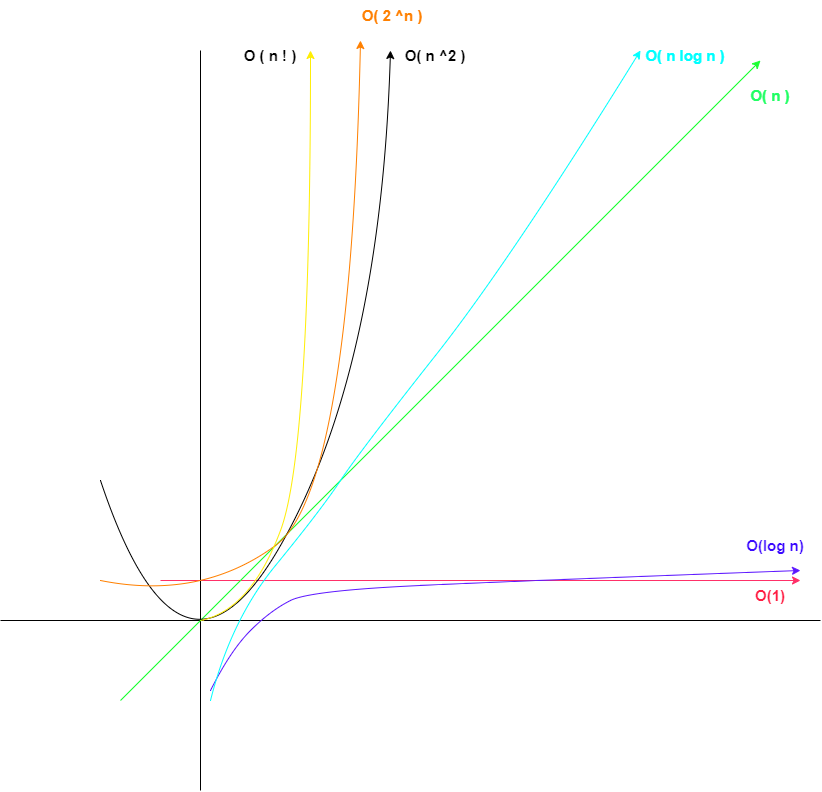

# 时间复杂度

算法的运行时间。

```javascript
function func(n) {
	for (var i = 0 /*  1 次 */; i < n; /* n + 1 次 */ i++ /* n 次 */) {
		console.log(i); // n 次
	}
	return n; // 1次
	// 总共执行了 3n + 3 次 记作 T（n）= 3n + 3
	// n 是输入数据的大小 、 或者是输入数据的数量， 而 T 是 当输入数量为 n 的时候， 这段代码的总执行次数
}
```

但是当 代码一段代码特别多的时候， 使用 T(n) 就很麻烦了， 实际检验中不可能要一条条语句去数， 而且函数 越复杂， 越难检查。

所以 算法一般使用 T(n) 的简化值去衡量代码的运行效率。这个简化的估算值叫做时间复杂度。

## 时间复杂度的计算

1、如果 T(n) = 常数， 那么 时间复杂度可以直接估算为 1；例如 T(n) = 3 ==== 时间复杂度 为 1， 记作 O(1)

2、如果是 T(n) = 3n + 3 , 当 n 无穷大时， 3 可以忽略不计， 3 \* 无穷大 = 无穷大， 所以 系数 3 可以去掉 。 T(n)= 3n + 3 的时间复杂度 为 n；记作 O(n)

3、对于多项式， 如： T(n)=5n^3+6666n^2+233 ， 这里只保留次方最高的一项既可， 同时 系数去掉， 所以时间复杂度 为 n^3 ；记作 O(n^3)

## 一些常见的代码复杂度计算

**时间复杂度为 O(n^2)， 因此有多少重循环就有多少次方。**

```javascript
function func1(n) {
	for (var i = 0; i < n; i++) {
		// n
		for (j = 0; j < n; j++) {
			// n
			console.log(j, i); // 1
		}
	}
}
```

**多项式的如下**

```javascript
function func2(n) {
	// n^2 次
	for (var i = 0; i < n; i++) {
		// n
		for (j = 0; j < n; j++) {
			// n
			console.log(j, i); // 1
		}
	}
	// n 次
	for (var i = 0; i < n; i++) {
		// n
		console.log(i); // 1
	}
	// 总共 为 n^2 + n ，取最高次项。
}

function func3() {
	for (var i = 0; i < n; i++) {
		// n
		for (j = i; j < n; j++) {
			// T(n)=n+(n-1)+(n-2)+……+2+ 1
			console.log(j, i); // 1
		}
	}
	// 所以总的次数为 n _ (n + 1) / 2
}
```

**时间复杂度为 log2(n) 的函数**

```javascript
// T(n)=3log2n+2=O(log2n) 底数和系数是一样的， 也要去掉 记作 O(log n)
function func4(n) {
	// n
	for (var i = 0; i < n; i *= 2) {
		console.log(i); // 1
	}
}
```

时间复杂度又快到慢顺序： O(1) ===> O(logn) ===> O(n) ===> O(nlogn) ===> O(n^2) ===> O(n^3) ===> O(2^n)


