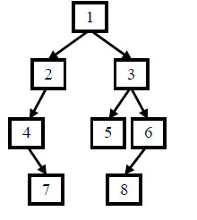

1. 重建二叉树

给定节点数为 n 的二叉树的前序遍历和中序遍历结果，请重建出该二叉树并返回它的头结点。

```javascript
/* function TreeNode(x) {
    this.val = x;
    this.left = null;
    this.right = null;
} */
function reConstructBinaryTree(pre, vin) {
	// write code here
	if (pre.length === 0 || vin.length === 0) {
		return null;
	}

	let root = new TreeNode(pre[0]);
	let root_index = vin.indexOf(pre[0]); // 这个变成全局变量就很麻烦。

	root.left = reConstructBinaryTree(
		pre.slice(1, root_index + 1),
		vin.slice(0, root_index)
	);

	root.right = reConstructBinaryTree(
		pre.slice(root_index + 1),
		vin.slice(root_index + 1)
	);

	return root;
}
```

二叉树的前序遍历：根左右；中序遍历：左根右 (根是根节点的意思)



前序遍历：[1,2,4,7,3,5,6,8]

中序遍历：[4,7,2,1,5,3,8,6]
