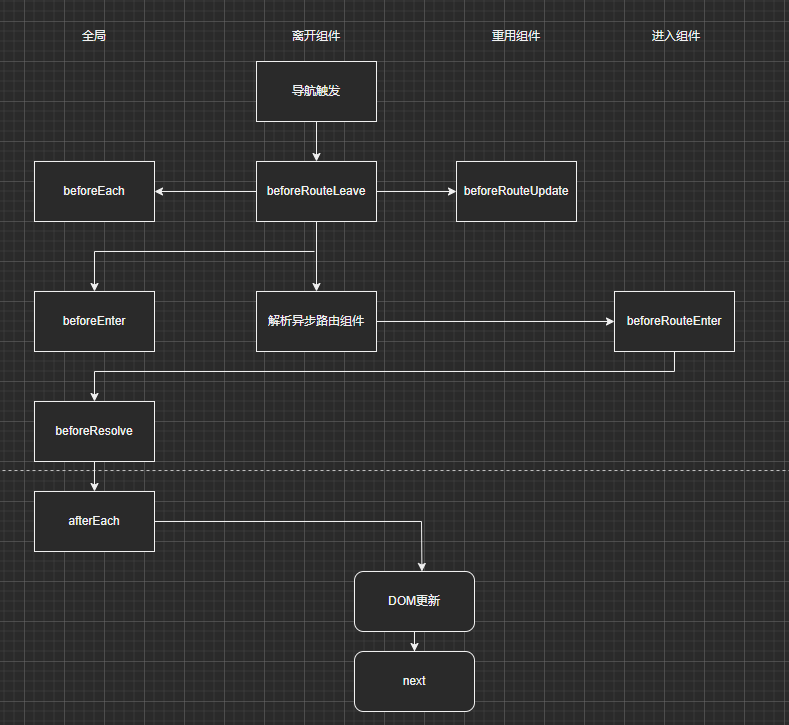

#### Vue 组件:

> 同步组件

> 异步组件

```js
{
    path:'/Dynamic',
    name: 'Dynamic',
    // component: Dynamic
    // 1.require进行加载
    component: resolve => (require(['@/components/dynamicComponent'], resolve),
    //2.ES6的懒加载
    //  webpack 打包时，打出的 chunck 就是这个 dynamic.
    // component: () => impdrt('@/components/dynamicComponent', 'dynamic'),
    // 3.webpack require.ensure懒加载
    // component: r => require.ensure([], () => r(require('@/components/dynamicComponent')),dynamic),
    // trunk


}
```

> 动态组件

> 路由守卫
> 
> 从某个路由开始：beforeEach 、 beforeRouteLeave、beforeRouteUpdate 同时触发， 接着触发 beforeEnter , 解析异步路由组件 并触发 beforeRouteEnter， 解析完了触发 beforeResolve， 然后触发 afterEach, 开始异步更新 dom， 最后调用 next

```js

```

> scrollBehavior 页面滚动加载

```

```
