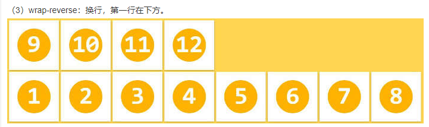

## flex 布局

```html
<ul>
	<!--父元素称为 容器 -->
	<li>
		<!--子元素成为 项目  -->
	</li>
</ul>
```

```CSS
ul {
    display: flex;
}

```

## 容器属性及其值

**flex-direction:**

    row | row-reverse | column | column-reverse;
    row（默认值）：主轴为水平方向，起点在左端。
    row-reverse：主轴为水平方向，起点在右端。
    column：主轴为垂直方向，起点在上沿。
    column-reverse：主轴为垂直方向，起点在下沿。

**flex-wrap：**

> nowrap | wrap | wrap-reverse（反换行）;



**flex-flow ：` <flex-direction> | <flex-wrap>`**是这两个的封装。

**justify-content：**

justify-content 属性定义了项目在主轴上的对齐方式。

    flex-start | flex-end | center | space-between | space-around;

**align-items：**

属性定义项目在交叉轴上如何对齐。

    flex-start | flex-end | center | baseline | stretch;
    baseline: 项目的第一行文字的基线对齐。

    stretch（默认值）：

    如果项目未设置高度或设为auto，将占满整个容器的高度。拉伸所有行来填满剩余空间。剩余空间平均地分配给每一行。

**align-content**

align-content 属性定义了多根轴线的对齐方式。如果项目只有一根轴线，该属性不起作用。

    flex-start | flex-end | center | space-between | space-around | stretch;

    stretch（默认值）：轴线占满整个交叉轴。

## 在项目（容器里的子元素）上的属性

**`order`：** 定义项目的排列顺序。数值越小，排列越靠前，默认为 0。

**`flex-grow`：** 定义项目的放大比例，默认为 0，即如果存在剩余空间，也不放大。

**`flex-shrink`：** 定义了项目的缩小比例，默认为 1，即如果空间不足，该项目将缩小。

**`flex-basis`：** 指定了 flex 元素在主轴方向上的初始大小，默认值 是 auto.

> 当一个元素同时被设置了 flex-basis (除值为 auto 外) 和 width (或者在 flex-direction: column 情况下设置了 height) , flex-basis 具有更高的优先级。

```CSS

/_ 指定<'width'> _/
flex-basis: 10em;
flex-basis: 3px;
flex-basis: auto;

/_ 固有的尺寸关键词 _/
flex-basis: fill;
flex-basis: max-content;
flex-basis: min-content;
flex-basis: fit-content;

/_ 在 flex item 内容上的自动尺寸 _/
flex-basis: content;

/_ 全局数值 _/
flex-basis: inherit;
flex-basis: initial;
flex-basis: unset;
```

<b style="color:#aaffaa">flex </b>： 是 flex-grow, flex-shrink 和 flex-basis 的简写，默认值为 initial (0 1 auto)。该属性有两个快捷值：auto (1 1 auto) 和 none (0 0 auto)。

[MDN flex 解析](https://developer.mozilla.org/zh-CN/docs/Web/CSS/flex)

<b style="color:#aaffaa">单值语法: 值必须为以下其中之一：</b>

1、**一个无单位数** ( number ): 它会被用作 flex 的值, 其余将 flex-shrink 的值定为 1， flex-basis 的值被定为 0%。

2、**一个有单位的数值**：它会被当作 flex-basis 的值， 其余的 flex-grow He 。

3、关键字 none，auto 或 initial.

<b style="color:#aaffaa">双值语法: </b> 第一个值 **必须为一个无单位数**，并且它会被当作 flex-grow 的值。第二个值必须为以下之一：

- 一个无单位数：它会被当作 flex-shrink 的值。
- 一个有单位数：它会被当作 flex-basis 的值。

<b style="color:#aaffaa">
三值语法：
</b>

第一个值必须为一个无单位数，并且它会被当作 <flex-grow> 的值。

第二个值必须为一个无单位数，并且它会被当作 <flex-shrink> 的值。

第三个值必须为一个有效的宽度值，并且它会被当作 flex-basis 的值。

`none | [ <'flex-grow'> <'flex-shrink'>? || <'flex-basis'> ]`

```CSS

/_ 关键字值 _/
flex: auto;
flex: initial;
flex: none;

/_ 一个值，无单位数字：flex-grow _/

flex: 2;  相当于 flex: 2 1 0%;

/_ 一个值，width/height: flex-basis _/
flex: 10em;
flex: 30px; 相当于 flex：1 1 30px;
flex: min-content;

/_ 两个值：flex-grow | flex-basis _/
flex: 1 30px; 相当于flex: 1 1 30px;

/_ 两个值：flex-grow | flex-shrink _/
flex: 2 2; 相当于 flex: 2 2 0%;

/_ 三个值：flex-grow | flex-shrink | flex-basis _/
flex: 2 2 10%;

/_全局属性值 _/
flex: inherit;
flex: initial; 相当于将属性设置为"flex: 0 1 auto"。
flex: unset;

```

align-self： align-self 属性允许单个项目有与其他项目不一样的对齐方式，可覆盖 align-items 属性。默认值为 auto，表示继承父元素的 align-items 属性，如果没有父元素，则等同于 stretch。

> auto | flex-start | flex-end | center | baseline | stretch;
