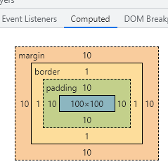
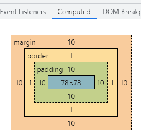

# 盒模型

盒模型由四部分组成的：内容（content）、内边框（padding）、边框（border）和外边框（margin）。

```CSS
	.box .w3cBox,
	.box .ieBox {
		height: 100px;
		width: 100px;
		border: 1px solid #333;
		margin: 10px;
		padding: 10px;
	}
	.w3cBox {
		background-color: aqua;
	}
	.ieBox {
		background-color: aquamarine;
		box-sizing: border-box;
	}

```

```html
<div class="box">
	<div class="w3cBox">w3c 盒模型</div>
	<div class="ieBox">ie 盒模型</div>
</div>
```

## 标准盒模型计算方式

    宽： 100 + 10 * 2 + 1 * 2  + 10 * 2 = 142 px
    高:  100 + 10 * 2 + 1 * 2  + 10 * 2 = 142 px

w3c 盒模型计算后的盒子大小



## ie 盒模型计算方式

只要不管你怎么设置 内边距(padding) 和 边框(border) , 反正 padding 和 border 设置了就要拿设置的 width 来挤压， 最后加起来的就是 width 设置的值。

    宽： 100 + 10 * 2 = 120px
    高:  100 + 10 * 2 = 120 px

ie 盒模型计算后的大小



## 设置盒模型方式

```CSS
div {
    box-sizing: content-box; /* 标准盒模型 */
    box-sizing: border-box; /* IE  盒模型 */
    box-sizing: inherit; /* 继承父元素飞盒模型 */
}
```
