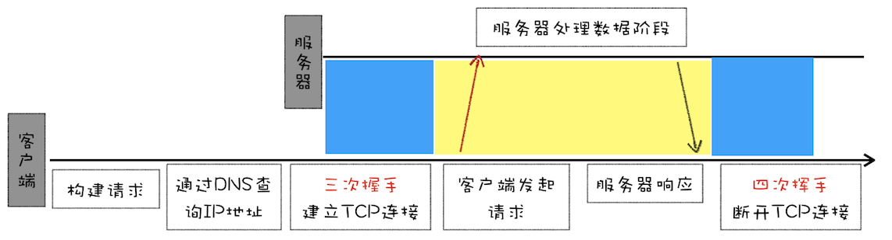
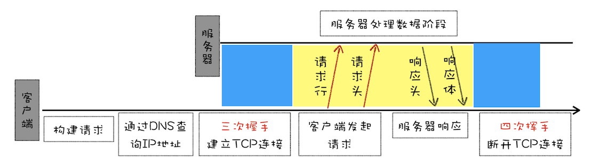
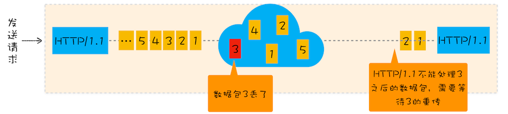
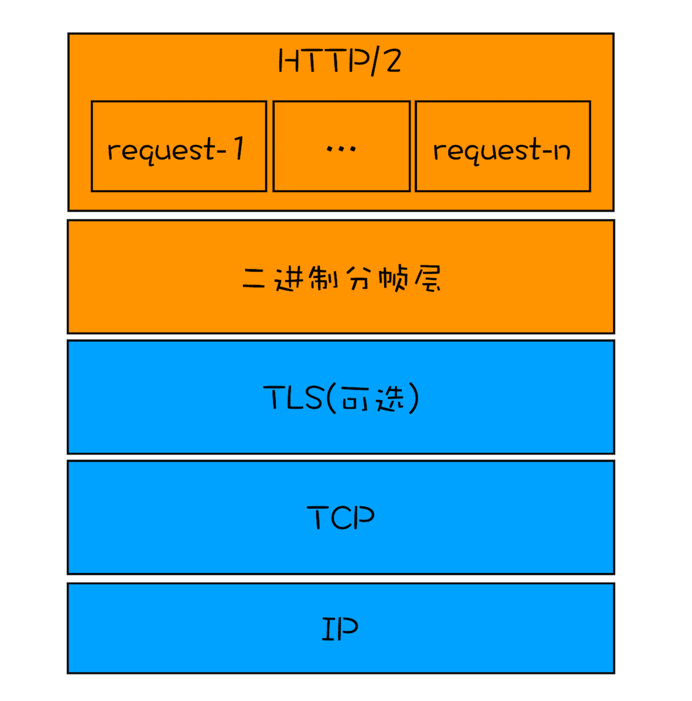
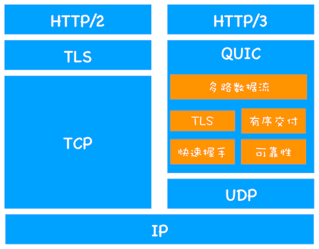
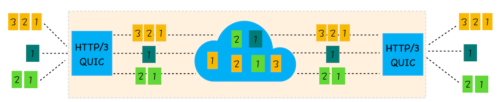

# HTTP

## HTTP 0.9

需求很简单， 主要用于学术交流。请求流程如下：



- 因为 HTTP 都是基于 TCP 协议的，所以客户端先要根据 IP 地址、端口和服务器建立 TCP 连接，而建立连接的过程就是 TCP 协议三次握手的过程。

- 建立好连接之后，会发送一个 GET 请求行的信息，如 GET /index.html 用来获取 index.html。

- 服务器接收请求信息之后，读取对应的 HTML 文件，并将数据以 ASCII 字符流返回给客户端。

- HTML 文档传输完成后，断开连接。

**特点：**

1. 只有一个请求行，并没有 HTTP 请求头和请求体，因为只需要一个请求行就可以完整表达客户端的需求了。

2. 服务器也没有返回头信息，这是因为服务器端并不需要告诉客户端太多信息，只需要返回数据就可以了。

3. 返回的文件内容是以 ASCII 字符流来传输的，因为都是 HTML 格式的文件，所以使用 ASCII 字节码来传输是最合适的。

## HTTP 1.0

由于 HTTP 1.0 增加了请求头和响应头，支持 JavaScript、CSS、图片、音频、视频等不同类型的文件下载，而编码方式不局限于 ASCll 。 还支持其他编码，例如 UTF-8



主要的头信息有：

```
accept: text/html // 文件类型
accept-encoding: gzip, deflate, br  // 压缩方式
accept-Charset: ISO-8859-1,utf-8 // 编码方式
accept-language: zh-CN,zh // 语言版本
status Code: 200  // 状态码
cache-control: public, max-age=432000, no-transform, immutable // 缓存机制
user-agent: Mozilla/5.0 (Windows NT 10.0; Win64; x64) AppleWebKit/537.36 (KHTML, like Gecko) Chrome/111.0.0.0 Safari/537.36 // 用户代理

```

## HTTP 1.1

http 1.1 对 http 1.0 做了如下改进：

1. 由于 http1.0 对每个请求都需要建立 TCP 连接和关闭 TCP 连接， 随着互联网的发展导致服务器增加了大量的无用开销。 因此 http1.1 增加了 `Connection: keep-alive` 请求头来创建持久连接。只需要一次创建 TCP 连接， 后面的请求都可以复用这个这个 TCP 通道。 浏览器默认使用 持久连接， 同一域名下最多支持 6 个 TCP 持久连接， 关闭则用 `Connection: close`

2. 虽然 http1.1 做了持久连接以减少 tcp 简历连接的开销，但是当客户端没有及时获取到当前请求数据的话还是会导致后面的请求阻塞的。这就是对头阻塞问题。 为了解决这个问题各大浏览器厂商到做了管线化技术， 但在最终都放弃了。

3. 提供虚拟主机支持不同的域名， 用 host 请求头表示， 这样服务器可以根据不同的域名作不同的处理。使用 CDN 的实现域名分片机制。

4. 用 Content-lenght: 912 来告知浏览器数据的大小， 引入 Chunk transfer 机制解决动态生成内容提供完美支持。最后用零长度的数据作为发送完成的标志。

5. 增加了客户端 Cookie 、 安全机制。

**HTTP1.1 缺点**

> 带宽是指每秒最大能发送或者接收的字节数。我们把每秒能发送的最大字节数称为上行带宽，每秒能够接收的最大字节数称为下行带宽。

HTTP/1.1 对带宽的利用率却并不理想，很难将宽带用满。主要原因有三个：

第一、 TCP 的慢启动， 发送过程会有一个从 0 到一个稳定速度的提速过程。

第二、 HTTP /1.1 队头阻塞问题



第三、同时开启了多条 TCP 连接，那么这些连接会竞争固定的带宽。

## HTTP 2.0

为了解决 HTTP 1.1 的问题，HTTP2.0 的解决方案是一个域名只使用一个 TCP 长连接来传输数据, 并且实现资源的并行请求， 即任何时候都可以将请求发送给服务器， 不需要到的前面的请求接收完成才能发送。

HTTP 2.0 最核心的是**多路复用技术**, 浏览器并发多个请求，利用不同的传输线路传输，传输给服务器， 这样利用多个线路看作是一个线路的话就是一条高速线路。这就是多路复用。然后服务器根据请求资源优先等级（如遇到 js, css 这些高优先级的资源请求会暂停之前的请求着先处理这些请求 ）处理好资源， 后以同样的方式响应客户端。

**HTTP2.0 多路复用的实现**


- 首先，浏览器准备好请求数据，包括了请求行、请求头等信息，如果是 POST 方法，那么还要有请求体。

- 这些数据经过二进制分帧层处理之后，会被转换为一个个带有请求 ID 编号的帧，通过协议栈将这些帧发送给服务器。

- 服务器接收到所有帧之后，会将所有相同 ID 的帧合并为一条完整的请求信息。

- 然后服务器处理该条请求，并将处理的响应行、响应头和响应体分别发送至二进制分帧层。

- 同样，二进制分帧层会将这些响应数据转换为一个个带有请求 ID 编号的帧，经过协议栈发送给浏览器。

- 浏览器接收到响应帧之后，会根据 ID 编号将帧的数据提交给对应的请求。

**HTTP2.0 的其他特性**

1. 设置请求的优先级

2. 服务器推送

3. 对请求头和响应头进行压缩。

**HTTP2.0 的缺陷**

1. http2.0 由于所以请求建立在同一一个 TCP 管道中，当请求中的任意一路数据出现丢包的情况就会影响到该 TCP 连接中的所有请求。

2. TCP 建立连接时的网络延时有可能会很长。在物理距离较近的情况下每个 RTT 所用的时间大约在 10ms 以内，较远的话可能要 100ms 毫秒， 甚至更久。因此一个 TCP 握手过程就需要 300 - 400ms。

   网络延时（RTT Round Trip Time）从浏览器发送一个数据包到服务器，再从服务器返回数据包到浏览器的整个往返时间称为 RTT。TCP 的三次握手需要用到 1. 5 个 RTT, 若是用 HTTPS 进行传输还需要进行 TLS 建立安全连接，每个 TLS 连接大约花费 1 ~ 2 个 RTT。

3. 中间设备僵化， 在数据传输的过程中会遇到很多设备和软件。 例如： 路由器，防火墙， 交换机等等， 这些设备中都适用了大量的 TCP 特性。很难再去更改支持其他的传输协议。

## HTTP3.0

由于 HTTP3.0 需要支持更高的传输效率，以及 TCP 传输协议的诸多限制，HTTP3.0 采用了一个折中的方法，建立了一套基于 UDP 协议实现类似 TCP 功能的 QUIC 协议。

HTTP2.0 对比 HTTP3.0

<center>
 
</center>

**QUIC 协议特点**

- 实现了类似 TCP 的流量控制、传输可靠性的功能。虽然 UDP 不提供可靠性的传输，但 QUIC 在 UDP 的基础之上增加了一层来保证数据可靠性传输。它提供了数据包重传、拥塞控制以及其他一些 TCP 中存在的特性。

- 集成了 TLS 加密功能。目前 QUIC 使用的是 TLS1.3，相较于早期版本 TLS1.3 有更多的优点，其中最重要的一点是减少了握手所花费的 RTT 个数。

- 实现了 HTTP/2 中的多路复用功能。和 TCP 不同，QUIC 实现了在同一物理连接上可以有多个独立的逻辑数据流（如下图）。实现了数据流的单独传输，就解决了 TCP 中队头阻塞的问题。

   

- 实现了快速握手功能。由于 QUIC 是基于 UDP 的，所以 QUIC 可以实现使用 0-RTT 或者 1-RTT 来建立连接，这意味着 QUIC 可以用最快的速度来发送和接收数据，这样可以大大提升首次打开页面的速度
