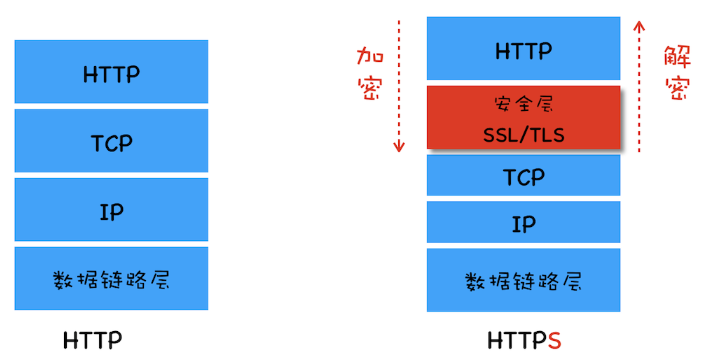

# HTTPS

在 HTTPS 之前， HTTP 都是使用明文进行数据传输， 在网络环境中数据很容易被第三方劫持，从而导致数据泄露，或者信息被篡改。因此在 HTTP 的基础之上加了一层安全层。安全层的主要功能就是对所有经过安全层的数据进行加密和解密。

## 常用的加解密方式

**对称加密**

所谓对称加密是指加密和解密都使用的是相同的密钥。对称加密缺点是效率太低，且容易被黑客获取到密钥。

**非对称加密**

非对称加密算法有 A、B 两把密钥, 分别是公钥和私钥， 公钥是每个人都能获得的，访问 HTTPS 的域名网站是， 服务器会以明文的方式发送给浏览器；而私钥只能由服务器拥有。加密时，若是用公钥加密的秘文，就需要用私钥解密；若是用私钥加密的秘文，则只能用公钥解密。非对称加密的缺点是由于黑客也可以拿到公钥而吗 i 无法保证服务器的安全。

**非对称加密和对称加密配合使用**

在传输数据阶段依然使用对称加密，但是对称加密的密钥我们采用非对称加密来传输。
