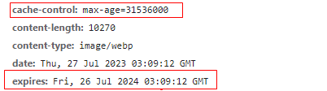

# 强缓存和协商缓存

## Cache-Control

定义所有缓存都要遵守的行为。这是一个共用的属性。不管是强缓存和协商缓存， 都需要配合 Cache-Control 这个字段来使用。

**可缓存性**

|    值    | 含义                                                                       |
| :------: | :------------------------------------------------------------------------- |
|  public  | 允许所有中间节点缓存， 如代理服务器， 等..                                 |
| private  | 值允许 client 端缓存， 如浏览器                                            |
| no-cache | 每次必须先询问服务器资源是否已经更新，不使用本地强缓存，需要使用缓存协商。 |
| no-store | 完全不使用缓存                                                             |

**其余字段**

**max-stale:** 5 表示客户端到代理服务器上拿缓存的时候，即使代理缓存过期了也不要紧，只要过期时间在 5 秒之内，还是可以从代理中获取的。

**min-fresh:** 5 表示代理缓存需要一定的新鲜度，不要等到缓存刚好到期再拿，一定要在到期前 5 秒之前的时间拿，否则拿不到。

**only-if-cached:** 这个字段加上后表示客户端只会接受代理缓存，而不会接受源服务器的响应。如果代理缓存无效，则直接返回 504（Gateway Timeout）。

**缓存期限**

|    值    | 含义                                                                            |
| :------: | :------------------------------------------------------------------------------ |
| max-age  | client 端的缓存时间，（单位是秒）                                               |
| s-maxage | 共享缓存如代理等， 的缓存时间 （单位是秒），只能用于 public。优先级高于 max-age |

> <b style="color:#aaffaa">Test :</b> 判断当前 s-maxage 当前有没有过期，若有则请求服务器，没有则拿资源的 last-modified-since 和 last-modified 或 etag 和 if-none-match 对比有没有过期，没有则返回 304；但是 s-maxage 过期了，去服务器拿资源，拿到的资源的 last-modified 和请求的 last-modified-since 对比没有变化， 还是返回了 304；所以 s-maxage 过期了不一定返回 200；

## 强缓存

（缓存生效不再发送请求）强制使用缓存，不去服务器对比；

```javascript
// http header

{
    Cache-Control: max-age=600, // 多个值用逗号隔开
    // cache-control: private, max-age=0, no-cache
    Expires: <最后期限>
}
```

若是连个时间都下发了， 则 Expires 的优先级比 Cache-Control 的低，且 Expires 是 HTTP1.0 的， 而 Cache-Control 是 http1.1 的。



## 协商缓存

协商使用缓存，每次需要向服务器请求对比，缓存生效不传回 body。协商缓存主要由这几个字段配合 Cache-Control 实现。

<b style="color:#aaffaa">last-modified 和 if-modified-since</b>

expires 和 max-age 这两个字段都是强缓存，资源获取会直接从设备缓存里面去拿，但是当服务端资源更新时，用户这边还是没有改变的。那么如何去感知服务端的变化呢？那就要用到协商缓存 last-modified 和 if-modified-since 这两个字段。通过对比这两个字段来决定是否重新从服务器获取资源。

**last-modified**

响应头，资源最近修改时间，由服务器告诉浏览器。

**if-modified-since**

请求头，资源最近修改时间，由浏览器告诉服务器。其实就是第一次访问服务端返回的 Last-Modified 的值。

<b style="color: #99f1f1">
    缺陷：
</b>

1，某些服务端没法精确获取文件的修改时间。且只能精确到秒。若是一秒内资源更新了 1 次，则同样获取不到新的资源。

2, 文件最后修改时间变了，但是文件内容没有变。这时 last-modified 也会让缓存失效。这时就需要借助 etag 和 if-none-match。

<b style="color:#aaffaa">etag 和 if-none-match </b>

**etag**

响应头，资源标识，由服务器告诉浏览器。它是资源的一个 hash 值。

> 拓展： 弱 Etag; <br/>
> 使用弱 eTag 能解决单纯编辑不修改内容而导致缓存失效的问题。弱 ETag 值只适用于提示资源是否相同。只有资源发生了根本改变，产生差异时才会改变 ETag 值。这时会在字段值最开始处附加 W/。

```javascript
ETag: W / "29322-09SpAhH3nXWd8KIVqB10hSSz66";
```

**if-none-match**

请求头，缓存资源标识，由浏览器告诉服务器。其实就是第一次访问服务端返回的 Etag 的值
