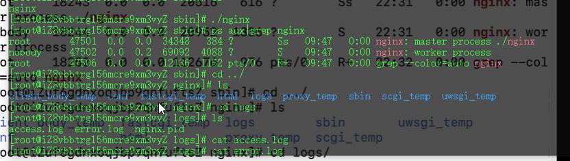
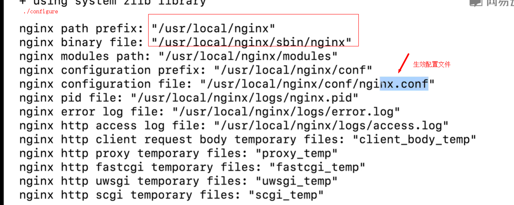
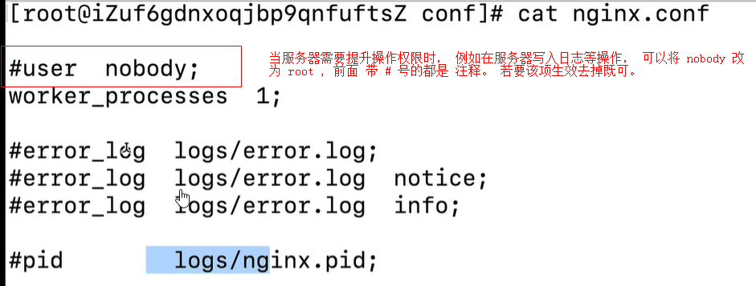

# Nginx

nginx(enginex)是一个高性能的 HTTP 和反向代理服务，也是一个 IMAP/POP3/SMTP 服务。

nginx 优点是：配置简单、支持高并发、内存消耗少、稳定性高，非常推荐大家去学习和使用

## nginx 安装

应该是 openssl--devel 改为 openssl-devel

```bash
# 安装依赖
yum -y install gcc-c++
yum -y install pcre pcre-devel
yum -y install zlib zlib-devel
yum -y install openssl openssl-devel

#下载

wget -c https://nginx.org/download/nginx-1.f8.0.tar.gz

#解压

tar -zxvf nginx-1.18.0.tar.gz
cd nginx-1.18.0

#使用默认配置

./configure

#编译和安装

#启动

cd /usr/local/nginx/sbin/

./nginx  #启动
./nginx -s stop # 此方式相当于先查出nginx进程id再使用ki11命令强制杀掉进程
./nginx-s quit # 此方式停止步骤是待nginx进程处理任务完毕进行停止。
./nginx-s reload # 重启


```

**查看 nginx 进程**

> ps aux | grep nginx

> 

**Nginx 配置文件**



nginx 默认是用 80 端口，nginx 将所以端口都映射到 80 端口，再根据域名代理作方向代理， 当开启 nginx 时， 在浏览器输入 网站没有东西时， 应检测安全组 有没有开启端口 或是 检测防火墙， 看看它们有没有开启对应的端口。

## nginx 三大目录

- 日志目录/nginx/logs

  access.log(访问日志）、error.log（错误日志）

- 配置文件目录 nginx/conf

  nginx.conf(记得一定要做定期备份哦）

- 网站文件目录 nginx/www(html)

  我们可以把我们的网站文件上传到当前目录中

## nginx 配置文件说明

nginx 配置文件所在目录：/usr/local/nginx/conf/nginx.conf

main：用于进行 nginx 全局信息的配置

events：用于 nginx 工作模式的配置

http：用于进行 http 协议信息的一些配置(常用）

server:用于进行服务器访问信息的配置，一个网站配置就是一个 serve,可以参考小峰哥的 NGINX 配置（常用）

location：用于进行访问路由的配置（常用）

upstream:用于进行负载均衡的配置



## 文件备份及还原操作

```bash
mv ./nginx.conf ./nginx.conf.back

ls

# 还原

cp nginx.conf.back  ./nginx.conf
```

## 域名解析

将我们注册的域名和我们的服务器绑定起来，通过访问我们的域名(而不是
IP 地址）来请求和访问我们的网站

过程非常简单，在域名管理后台中找到域名解析 > 添加记录 > 记录类型 A(将域名指向一个 IP 地址）> 输人域名前缀（Www
or\*） > 输入记录值（服务器 IP 地址）

## vue-router 项目 nginx 演示

vue-router 刷新功能需要后端 nginx 配合返回 index.html

```

server {
    listen 80;
    server_name www.xuefeng66.com;
    root /usr/local/nginx/html/test;
    location / {
        try_files $uri $uri/ /index.html;
        proxy buffering off;
    }
}
```

```bash
http {
    include mime.types;
    default_type application/octet-stream;

    #log_format main '$remote_addr - $remote_user [$time_local] "$request

    # '$status $body_bytes_sent "$http_referer" '
    # '"$http_user_agent" "$http_x_forwarded_for"";

    # access_log logs/access.log main;
    sendfile on;
    #tcp_nopush on;

    #keepalive_timeout 0;
    keepalive_timeout 65;

    #gzip on;

    server {
        listen  80;
        server_name www.xuefeng66.com;

        #charset koi8-r;

        #access_log logs/host.access.log main;
        #  [153 和 156行 ] root 是网页存放的地址，放在外面或 location 里面都可以。

        root /usr/local/nginx/html/dist;

        location / {
            try_files $uri $uri/ /index.html;
            proxy_buffering off;

            # 上面这两行代码可以解决 spa router 在 history 模式下， 页面刷新出现404 的情况， 原因是没有找到这个目录， 但是作为spa 页面应该返回 index.html
            index index.html index.htm;
        }

        #error_page 404  /404.htm1;

        # redirect server error pages to the static page /50x.html


```

## nodejs 项目 nginx 演示

nodejs 项目 nginx 代理实现

```bash
server {
    listen 80;
    server_name api1.xuefeng66.com;
    location / {  #  / ： 利用 aglnt 培 rote服务做质向代理
        proxy_redirect off;
        proxy_set_header Host $host;
        proxy_set_header X-Real-IP $remote_addr;
        proxy_set_header X-Forwarded-For $proxy_add_x_forwarded_for;

        # 括号里里上面的这些茶不多是质定的, 主要修改下面的 地址;
        proxy_pass http://172.29.95.138:3000; #云服务器内网IP
    }
}
```

**监听端口代理接口**

```bash

location / {
    root /home/Aircnc/dist/client
    index index.html index.htm;
    proxy_pass http:127.0.0.1:3000; #监听本地3000端口
}

location /api/ {
    proxy_pass http://127.0.0.1:9000/; # 代理接口
    client_max_body_size 50m;
    proxy_set_header Host $host;
    proxy_set_header X-Real-IP $remote addr;
    proxy_set_header X-Forwarded-For $proxy_add_x_forwarded_for;
}

```

## gZip 压缩

```bash
gzip on;
gzip_min_length 1k; # 1kb 以下的不做 gzip 压缩
gzip_buffers 4 16k; # 设置 gzip 申请内存的大小和单位 16k
gzip_comp_level 8; # 压缩级别 一般是1 - 9 数值越大越消耗cpu 资源。
gzip_types text/plain application/javascript text/css text/javascript; # 那些文件类型开启gzip
gzip_vary on; # 是否在http header中添加Vary:Accept-Encoding,建议开启

gzip_disable "MSIE [1-6]\."; # ie 6 以下不做gzip压缩。

```

# Nginx 进程守护

用 linux 自带的 screen 库

```
screen -v
screen -S 进程名称
接着在这个进程打包运行
然后 Ctrl A + D 退出这个守护进程

进入这个进程用
screen -r 进程名称

关闭这个进程用
screen -X -S 进程名称 quit

```
