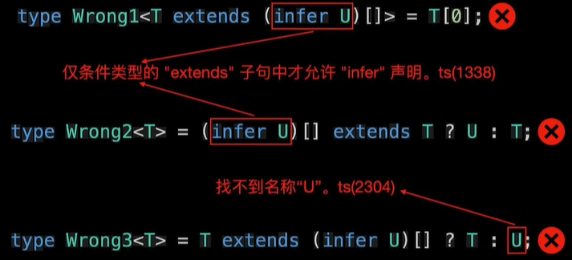

如何获取 T0 数组中元素的类型和 T1 中函数返回值的类型？利用条件类型和 infer.

### infer

用于声明类型变量，以存储在模式匹配过程中所捕获的类型。

```js
type T0 = string[];
type T1 = () => string;
type UnpackedArray<T> = T extends(infer U)[] ? U: T;

type U0 = UnpackedArray<T0>;

// 获取 数组元素类型
type EleTypArr<T> = T extends Array<infer T> ? T : never;

// vue3 的 unRef 函数

function unref<T>(ref: T) : T extends Ref<infer V> ? V : T {
    return isRef(ref) ? (ref.value as any) : ref
}
```

> 注意 ： infer 只能在 extends 子句中使用， 以及 infer 声明的变量只能在 true 分支中使用。



```ts
type UnpackedFn<T> = T extends (...args: any[]) => infer U ? U : T;

// 当遇到函数重载， 就用最后的调用签名进行类型推断

declare function foo(x: string): number;
declare function foo(x: number): string;
declare function foo(x: string | number): string | number;
type U2 = UnpackedFn<typeof foo>;
// number | string
```

 条件类型的复杂应用
```ts
type AddTypeKey<T, K extends string, V> ={
    [P in keyof T | K]: P extends keyof T ? T[P] :V
}

interface Customer {
    name: string
    degree: number
    phone: string
}

type Test = AddTypeKey<Customer, 'qq', string>
```

利用条件链推断更多类型

```js
type Unpacked<T>=
T extends (infer U) [] ? U :
T extends (...args:any [])=> infer U ? U:
T extends Promise<infer U> ? U :
T;

type T0 = Unpacked<string>;// string
type T1 = Unpacked<string[]>; // string
type T2 = Unpacked<() => string>; // string
type T3 = Unpacked<Promise<string>>;// string
type T4 = Unpacked<Promise<string>[]>; // Promise<string>
type T5 = Unpacked<Unpacked<Promise<string>[]>>; // string

// 这个是一次性将整个 string | number | boolean 当作是一个类型进行对比。 所以是never.
type Test = string | number | boolean extends string | number ? string : never; // never

type CondTyp<T> = T extends string | number ? T : never;
// 这种比较规则是 逐个对比， 将符合的类型返回， 组成联合类型
type TestCondTyp = CondTyp<string| number | boolean> // string | number

```

获取对象属性值类型

```js
type PropertyTy   pe<T> = T extends { id: infer U; name: infer R } ? [[U, R]: T;
type User = {
    id: number;
    name: string;
};

type U3 = PropertyType<User>;
// [number, string]
```

协变位置 为联合类型

```js
type PropertyType<T> = T extends {
    //  infer 这里为协变位置
    id: infer U; name: infer U
} ？ U : T;
type U4 = PropertyType<User>;
//  string | number
```

在逆变位置 上是交叉类型

```js
type Bar<T> = T extends {a: (x:infer U) => void, b: (x: infer U) => void} ? U : never;

type U5 = Bar<{a: (x: string) => void, b: (x: number) => void}>
//  never
```

联合类型转交叉类型

```js
type UnionToIntersection<U> = ( U extends any ? (arg: U) => void : never
) extends (arg: infer R) => void
? R : never;
type T6 ={ a:"a" } | { b:"b" }
type T7 = UnionToIntersection<T6>;
// { a:"a"}&{b:"b"}
// 联合类型转交叉类型
```

4.7 引入的与 infer 相关的新特性 （extends 子句）；

```js
type FirstIfString<T> =
T extends [infer S, ...unknown[]]
? S extends string
? S : never : never;

type A = FirstIfString<[string, number, number]>;
// string
type B = FirstIfString<["hello", number, number]>;
// "hello"
type C = FirstIfString<["hello"| "world", boolean]>;
//"hello"|"world"
type D = FirstIfString<[boolean, number, string]>;
// never

//  如何让 FirstIfString 的条件类型变为一个呢？

type FirstIfString<T> = T extends [infer S extends string, ...unknown[]] ? S : never;
```
