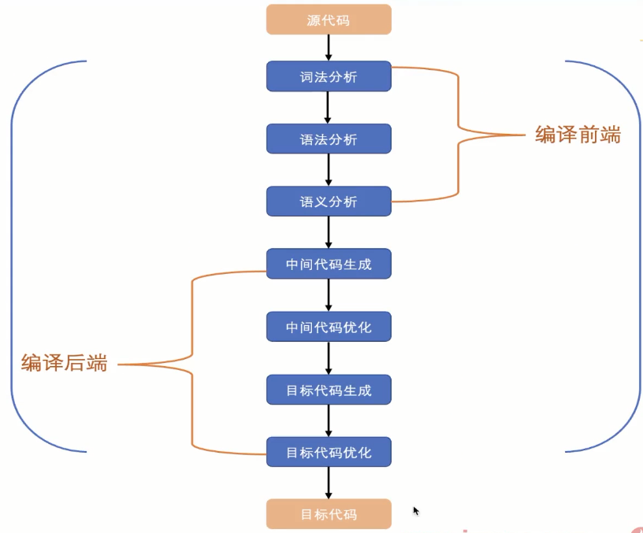
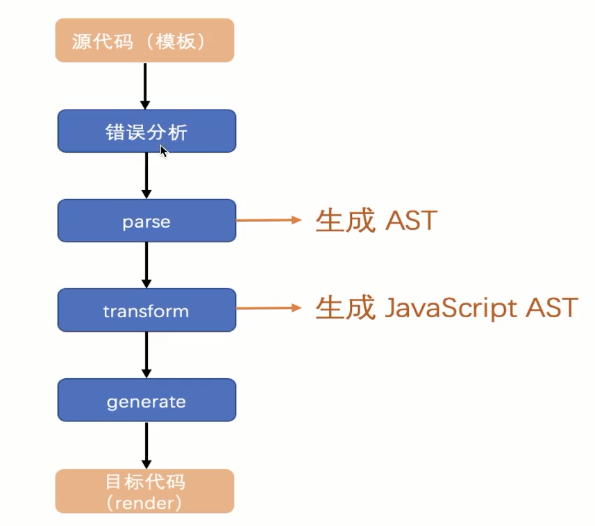

# Vue Compiler

vue 的 compiler 就是把 vue 组件编译成一个 render 函数。

## baseCompile 这个函数总共分成三部分：

1、 AST 的生成

2、 通过 transform 函数对 AST 进行转化， 这样可以得到一个 JavaScript AST。

3、 通过 generate 方法根据 AST 生成 render 函数。

完整的编译流程

而 Vue 的编译流程没有这么复杂，

## AST 转化位 javascript AST , 获取 codegenNode

AST 和 javascript AST 唯一不同的地方就是 javascript AST 有 codegenNode 属性。

codegenNode 的主要作用是为了生存 render 函数。
