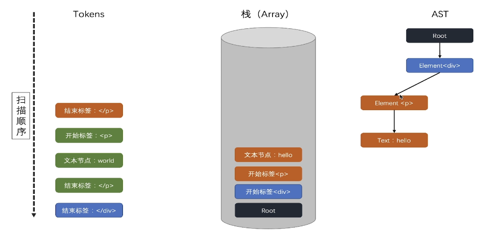

# AST 编译原理

根据 packages/compiler-core/src/compile.ts 中的代码可知,ast 对象的生成是通过 baseParse 方法得到的。

而对于 baseParse 方法而言，接收一个 template 作为参数，返回一个 ast 对象。

即：通过 parse 方法，解析 template，得到 ast 对象。中间解析的过程，就需要使用到<b style="color: #aaffaa">有限自动状态机。</b>

我们来如下模板（template）：

```hmtl
<div> hello world</div>
```

vue 想要把该模板解析成 AST，那么就需要利用有限自动状态机对该模板进行分析，分析的过程中主要包含了三个特性：

> 摘自：http://www.ruanyifeng.com/blog/2013/09/finite-state_machine_for_javascript.html

1、状态总数是有限的

    1.初始状态
    2.标签开始状态
    3.标签名称状态
    4．文本状态
    5.结束标签状态
    6.结束标签名称状态
    7. ....

2.任一时刻，只处在一种状态之中

3.某种条件下，会从一种状态转变到另一种状态

    1.比如：从1到2意味着从初始状态切换到了标签开始状态

对于上述 html 代码解析如下：

    1.解析<：由初始状态进入标签开始状态
    2.解析div：由 标签开始状态进入标签名称状态
    3.解析>：由标签名称状态进入初始状态
    4.解析 hello world：由 初始状态进入文本状态
    5.解析<：由文本状态进入标签开始状态
    6.解析/：由标签开始状态进入结束标签状态
    7.解析div：由结束标签状态进入结束标签名称状态
    8.解析>：由结束标签名称状态进入“初始状态

经过这样一些列的解析，对于：

```hmtl
<div>
    hello world
</div>
```

而言，我们将得到三个 token:

    开始标签：<div>
    文本节点：hello world
    结束标签：</div>

而这样“个利用有限自动状态机的状态迁移，来获取 tokens 的过程，可以叫做：对模板的标记化。

解析出来的 tokens 就是生成 AST 的关键。生成 AST 的过程，就是 tokens 扫描的过程。

我们以以下 html 结构为例：

```html
<div>
	<p>hello</p>
	<p>world</p>
</div>
```

该 html 可以被解析为如下 tokens：

    开始标签：<div>
    开始标签：<p>
    文本节点：hello
    结束标签：</p>
    开始标签：<p>
    文本节点：world
    结束标签：</p>
    结束标签：</div>

那么如何通过解析的 tokens 转变为 节点树呢？他是用了一种叫做递归下降算法来做的。

 

主要是将标签放进栈里， 当标签闭合后出栈，这样来描绘出一个 AST 树。

## AST 的生成

在 compile.ts 中的 baseCompile 通过 baseParse

```javascript
const ast = isString(template) ? baseParse(template, options) : template;
```

来生成 AST 的。

```ts
export function baseParse(
	content: string,
	options: ParserOptions = {}
): RootNode {
	// 创建上下文 context
	const context = createParserContext(content, options);
	const start = getCursor(context);
	return createRoot(
		// 这个 parseChildren  就是解析 ATS 里面的 children 的。
		parseChildren(context, TextModes.DATA, []),
		// getSelection 做的就是 loc (location) 的生成。
		getSelection(context, start)
	);
}
```

<b style="color:#aaffaa">parseChildren 执行流程</b>

整个 AST 生成的核心就是 parseChildren 方法。

通过 while 循环解析 template ，当遇到 最后返回的 nodes 就是 children. 它组要是由： 构建有限自动状态机解析模板和扫描 token 生成 AST 结构。

2.生成的过程中，对整个 template：<div> hello world</div>进行了解析，整个解析分为 5 步（第二小节的讲解）：

    1.第一次解析：<div:此时context.source=>hello world</div>
    2.第二次解析：>：此时context.source=hello world</div>
    3.第三次解析：hello world：此时context.source=</div>
    4.第四次解析：</div：此时context.source=>
    5.第五次解析：>：此时`context.source = "" `

    就是通过 parseTag 解析标签， 和 advanceBy 右移记录解析的位置。直至解析完 template为止。

3.在这个解析过程中，我们逐步扫描（第三小节的讲解）对应的每次 token，得到了一个对应的 AST 对象

vue 源码中的 parse 逻辑是非常复杂的，我们当前只是针对<div>hello world</div> 这一种类型的 element 类型进行了处理。

最后通过 createRoot 函数返回这个 AST 对象。
