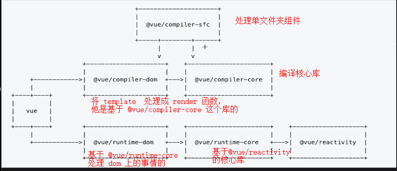

# Vue 3 整体结构

Vue3 是一个 monorepo 项目,

整体分为两个部分。 一个时运行时 一个时编译时。

@vue/compiler-sfc:

把 SFC 转换成一个浏览器可以执行的 js 文件。

@vue/compiler-dom & @vue/compiler-core :

他们之间配合使用将 template 转换成一个 render 函数。

@vue/runtime-dom & @vue/runtime-core & @vue/reactivity

## reactive 执行流程

reactive 通过 Proxy 对输入的对象进行包裹，　生产响应式对象。他的核心逻辑都在 baseHandlers 里面，去创建 get 和 set 当创建 get 时， 会触发 track （收集依赖）， 当触发 set 时， 会涉及到 trigger （触发依赖）

## effect 流程

创建 effect 对象， 执行用户传过来的 fn, 由于 fn 里面有 reactive 对象， 触发 get 操作。 接着触发 track， 接着把 effect 收集起来作为这个响应式对象的依赖存在他的 deps 中。

当我们去更改这个响应式的值的时候， 会触发他的 set 操作。 接着触发 trigger， 触发 trigger 之后又去运行 之前收集过的 deps 里面的 依赖函数， 调研 run ，这样有可以更新我们的响应式对象的值了。
