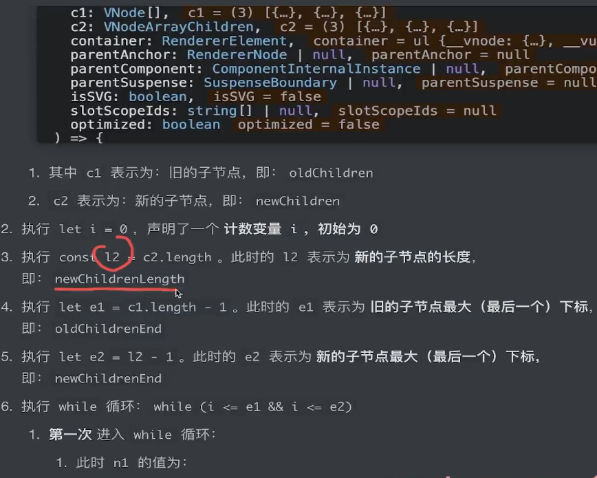

# runtime 的 diff 算法

renderer.ts 中的 patchKeyedChildren 是实现 diff 算法的核心函数， 它总共分成 五中情况。

key 属性的作用是什么？

作用是在 isSameVNodeType 这个函数里面判断是不是同一个节点。

## 1、**自前向后的 diff 比对**

    old: a b c
    new: a b d e

patchKeyedChildren 函数参数及其作用

循环获取节点是通过从前向后获取的。

主要通过判断 c1 和 c2 是不是同一个节点， 是则执行 patch 函数。

## 2. **自后向前的 diff 比对**

    old： a b c
    new: d e b c

循环获取节点是通过从后向前获取的。 然后通过 c1 和 c2 判断是不是同一个节点，是则执行 patch 函数。

## 3. **新节点多余于旧节点的 diff 比对**

    1. 在后面插入
    old: a b
    new：a b c

    2. 在前面插入
    old: a b
    new: c a b

这里主要的逻辑是获取插入的锚点，看看是在哪里插入新节点， 然后执行 patch 函数。

## 4、旧节点多余新节点

    1、 旧的后面多
    old：a b c
    new: a b

    2、 旧的前面多
    old: a b c
    new  b c

找到多余的节点然后执行 unmount 函数。

## 5、乱序下的 diff 比对

    old: a b c d e
    new: a c b f e

这个也是最复杂的一种情况， 它使用了最长递增子序列。

1.什么是最长递增子序列？

在一个给定的数值序列中，找到一个子序列，使得这个子序列元素的数值依次递增，并且这个子序列的长度尽可能地大。

假设，我们现在有一个这样两组节点：

旧节点：1,2,3,4,5,6
新节点：1,3,2,4,6,5

（注意：并不是惟一的），其结果为：我们可以根据新节点生成递增子序列（非最长）

1. 1、3、6 (这里要)

2. 1、2、4、6 (现在这个最长，那它就是最长的递增子序列)， 这里只移动 3 和 5 就可以了。

3. …

2.最长递增子序列在 diff 中的作用是什么？

因为最长的递增子序列可以减少节点移动的次数。

通过 renderer.ts 中的 getSequence 获取最长递增子序列元素的下标。 他是一个二分查找算法。

## 总结

5.组件内部维护了一个 effect 对象，以达到响应性渲染的效果。

6.而针对于 setup 函数而言，它在实现上反而更加简单，因为我们不需要改变 this 的指向

7.结合所学，新旧节点的所有挂载和更新情况，可以被分为九种场景：

1.旧节点为纯文本时：

    1.新节点为纯文本：执行文本替换操作
    2.新节点为空：删除旧节点
    3.新节点为数组：清空文本，添加多个新节点

2.旧节点为空时：

    1.新节点为纯文本：添加新节点
    2.新节点为空：不做任何事情
    3.新节点为数组时：添加多个新节点

3.旧节点是数组时：

    1.新节点为纯文本：删除所有旧节点，添加新节点
    2.新节点为空：删除所有旧节点
    3.新节点为数组时：进行diff操作

8.最后的 diff 分为 5 种场景，最后一种场景还是比较复杂的。
