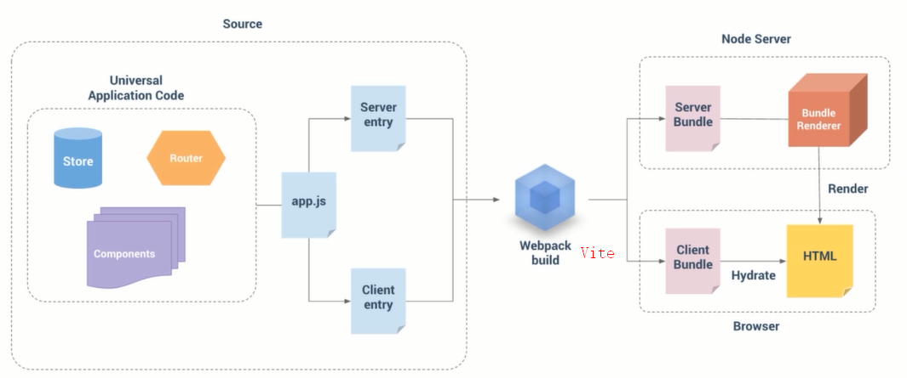

# SSR 原理

基本原理

·通过 Vue 的 server-renderer 模块将 Vue 应用实例转换成一段纯文本的 HTML 字符串；

·通过 Nodejs 创建一个静态 Web 服务器；

·通过 Nodejs 将服务端所转换好的 HTML 结构发送到浏览器端进行展示。

## 构建步骤

代码有两个入口， 服务端 server 入口和 客户端入口 client, 这两个文件打包成 俩个 bundle 文件， server bundle 用作服务端渲染， 客户端 client bundle 用来接管服务端渲染好的静态页面，对这个 html 进行激活（对服务端生成的 html 进行 Hydrate（水合处理： 这样我们自定义的一些在 dom 上的事件才会生效。） 。

基本目录结构

    -index.html
    -src
        - main.ts //通用的应用代码
        - entry-client.ts//客户端入口，只在浏览器中运行
        - entry-server.ts//服务端入口，只在服务器运行
    -server.js // Nodejs服务

占位符不能换行， 换行会渲染两次。
