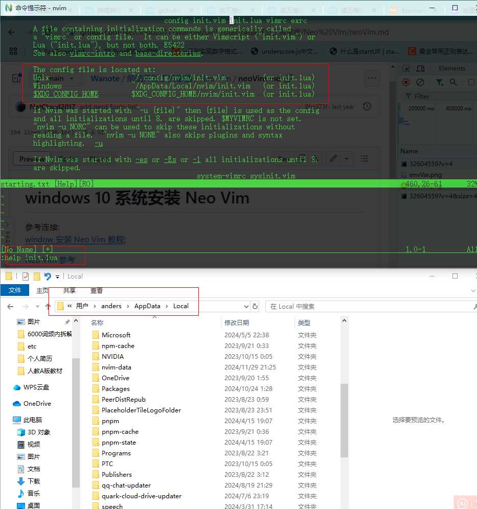
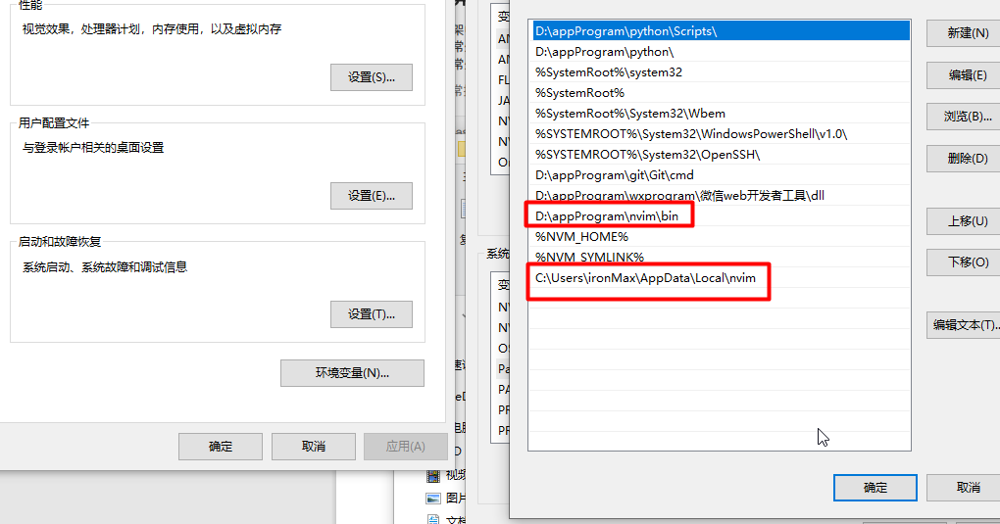

# windows 10 系统安装 Neo Vim

参考连接:  
[window 安装 Neo Vim 教程](https://dev.to/ritikadas/using-neovim-as-an-effortless-way-to-edit-code-installation-and-setup-guide-for-windows-10-5dhc#:~:text=You%20can%20now%20open%20Neovim,Enter%20for%20the%20same%20result.&text=Boom!);

[Neo Vim 参考](https://github.com/bryant-video/neovim-tutorial)

[Neo Vim 下载地址](https://neovim.io/)

Packer , Nvimtree, Tokyonight

[ Nerdfonts ](https://www.nerdfonts.com/)
[ Ripgrep ](https://github.com/BurntSushi/ripgrep)

### 安装

下载好了，就解压文件，将解压的文件放到安装的目录里面，我一般放到 D 盘, Programs 文件夹里面。 接着设置 Nvim 的环境变量：

将 Neovim 里面的 bin 文件夹目录放置环境变量里即可

**为 NeoVim 放置 开始键的目录里**

将 nvim-qt.exe 这个文件的快捷方式， 粘贴到的
`C:\Users\ironMax\AppData\Roaming\Microsoft\Windows\Start Menu\Programs`
这个目录即可。

## Neo Vim windows 配置

也可以在 nvim 的 command mode 里输入 :help init.lua, 查看配置文件可以在哪里配置。


启动 Nvim 编译器, 用 conmand mode 输入 :` echo stdpath('config')` 接着按 enter 就会显示配置文件的位置。一般在 AppData>LocaL>nvim 目录里面。同时将这个 目录也放置到环境变量中。



接着在这个文件里面创建 init.vim 或 init.lua （推荐, 以后 不支持 点 vim 文件配置了）文件。

这个文件就是专门放置 neo vim 的配置的。

粘贴如下内容, 然后保存：

```
call plug#begin('C:/Users/ironMax/AppData/Local/nvim/plugged')

" below are some vim plugins for demonstration purpose.
" add the plugin you want to use here.

Plug 'joshdick/onedark.vim'
Plug 'iCyMind/NeoSolarized'
Plug 'neoclide/coc.nvim'
Plug 'junegunn/vim-easy-align'
Plug 'https://github.com/junegunn/vim-github-dashboard.git'
Plug 'scrooloose/nerdtree', { 'on': 'NERDTreeToggle' }
Plug 'tpope/vim-fireplace', { 'for': 'clojure' }
Plug 'rdnetto/YCM-Generator', { 'branch': 'stable' }
Plug 'fatih/vim-go', { 'tag': '*' }
Plug 'nsf/gocode', { 'tag': 'v.20150303', 'rtp': 'vim' }
Plug 'junegunn/fzf', { 'dir': '~/.fzf', 'do': './install --all' }
Plug 'vim-airline/vim-airline'
Plug 'vim-airline/vim-airline-themes'

call plug#end()

```

打开 PowerShell , 粘贴如下内容到 PowerShell 里面执行：

```
md ~\AppData\Local\nvim\autoload
$uri = 'https://raw.githubusercontent.com/junegunn/vim-plug/master/plug.vim'
(New-Object Net.WebClient).DownloadFile(
  $uri,
  $ExecutionContext.SessionState.Path.GetUnresolvedProviderPathFromPSPath(
    "~\AppData\Local\nvim\autoload\plug.vim"
  )
)
```

执行后会在 ~\AppData\Local\nvim 目录里面 生成一个 autoload 文件夹； 文件夹里面有 plug.vim 文件；

到这里我们就可以去安装我们的 vim 插件了, 刚刚 编写的 init.vim 文件里面有有一些 Plug 命令，是安装 neo vim 插件的。

接着, 我们在 ~\AppData\Local\nvim 里创建一个 plugged 文件夹, 用来存放我们所有安装的插件。

在命令行里打开 neo vim 编辑器。 cmd --> nvim

`
:checkhealth:

查看所有的 options ， 在 command mode 输入 :help option-list

安装 packer

https://github.com/wbthomason/packer.nvim#bootstrapping

加入如下代码

```lua
local ensure_packer = function()
  local fn = vim.fn
  local install_path = fn.stdpath('data')..'/site/pack/packer/start/packer.nvim'
  if fn.empty(fn.glob(install_path)) > 0 then
    fn.system({'git', 'clone', '--depth', '1', 'https://github.com/wbthomason/packer.nvim', install_path})
    vim.cmd [[packadd packer.nvim]]
    return true
  end
  return false
end

local packer_bootstrap = ensure_packer()

return require('packer').startup(function(use)
  use 'wbthomason/packer.nvim'
  -- My plugins here
  -- use 'foo1/bar1.nvim'
  -- use 'foo2/bar2.nvim'

  -- Automatically set up your configuration after cloning packer.nvim
  -- Put this at the end after all plugins
  if packer_bootstrap then
    require('packer').sync()
  end
end)

```

## Linux 配置

## Neo vim plugins

nvimtree
tokyonight
autopair

### Nvimtree

[github nvim-tree](https://github.com/nvim-tree/nvim-tree.lua)
[github nerd fonts](https://github.com/ryanoasis/nerd-fonts)

> Nvimtree 命令

启动时 进入 command mode :NvimTreeToggle 就可以启动 nvim-tree 了. 这时，sidebar 的图标没有显示可以进入 如下操作

安装 window terminal， 打开软件， 打开软件的设置文件，

> 文件目录：
> C:\Users\ironMax\AppData\Local\Packages\Microsoft.WindowsTerminal_8wekyb3d8bbwe\LocalState\settings.json

```json
  "profiles": {
    "defaults": {},
    "list": [
      {
        "commandline": "%SystemRoot%\\System32\\WindowsPowerShell\\v1.0\\powershell.exe",
        // 在这里设置 nerd fonts 下载， 并安装到系统的字体的字体名字
        "font": {
          "face": "Arimo NF",
          "size": 12
        },
        // 这三行是gei  windows terminal 设置透明度的, 但是不是 很明显。
        "useAcrylic": true,
        "acrylicOpacity": 0.3,
        "backgroundImageOpacity": 0.3,
        //
        "guid": "{61c54bbd-c2c6-5271-96e7-009a87ff44bf}",
        "hidden": false,
        "name": "Windows PowerShell"
      },
  }
```

设置后 重新打开 Neovim 就可以看到图标了

o ： 打开文件夹

a： jk 上下选择选择文件， 按 a, 这时可以新建文件。

r: 选择文件， 按 r 然后既可以修改文件名了。

### tokyonight

添加主题的
[github tokyonight](https://github.com/folke/tokyonight.nvim)

```lua
local status, tn = pcal1(require, 'tokyonight')
if not status then
return
end
tn. setup({

    style = 'storn',
    dim_inactive = true
})

vim.cmd ('colorscheme tokyonight-storm')
```
