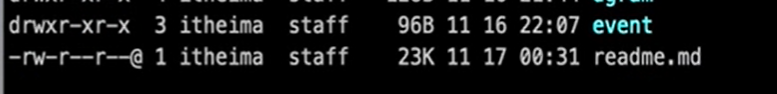

## 文件权限位 mode

因为 fs 模块是对文件进行操作的， 而有些文件操作权限时不一样的。因此在操作文件之前都要弄清楚改文件具有哪些权限。

文件权限表：
|权限分配|文件所有者|文件所属组|其他用户|
|:--|:--: |:--:|:--:|
|权限项| 读| 写 | 执行|
|字符表示| r | w | x|
|数字表示| 4 | 2 | 1|

---

git 或 linux 命令查看权限： `ls -al`



```bash
drwxr： 这是文件所有者拥有的权限，dr 表示文件夹， wxr 表示， w 可写， x 可执行， r 可读。

xr: 表示文件所属组的权限；

x: 代表其他用户的权限；

可以看出 readme 文件没有执行权限。

修改某个文件的权限：
chmod 444 test.js

查看权限：
-r--r--r--  1 itheima staff 0B 11 17 00:45 test.js // 都是只读，所以是不能编辑的。

```

## 标识位 Flag

表示对文件的操作方式；

- r: 读取文件，如果文件不存在则抛出异常。

- r+: 读取并写入文件，如果文件不存在则抛出异常。

- rs: 读取并写入文件，指示操作系统绕开本地文件系统缓存。

- W: 写入文件，文件不存在会被创建，存在则清空后写入。

- Wx: 写入文件，排它方式打开。

- W+: 读取并写入文件，文件不存在则创建文件，存在则清空后写入。

- WX+: 和 w+类似，排他方式打开。

- a： 追加写入，文件不存在则创建文件。

- ax: 与 a 类似，排他方式打开。

- a+: 读取并追加写入，不存在则创建。

- ax+: 与 a+类似，排他方式打开。

## 文件描述符

操作系统会为每个打开的文件分配一个名为文件描述符的数值标识，文件操作使用这些文件描述符来识别与追踪每个定的文件，Window 系统使用了一个不同但概念类似的机制来追踪资源，为方便用户，NodejS 抽象了不同操作系统间的差异，为所有打开的文件分配了数值的文件描述符。

在 NodejS 中，每操作一个文件，文件描述符是递增的，文件描述符一般从 3 开始，因为前面有 0、1、2 三个比较特殊的描述符，分别代表 process.stdin（标准输入）、process.stdout（标准输出）和 process.stderr （错误输出）。

## 方法

带 sync 的都是同步方法。

**readFileSync(filepath, ['utf-8'])**

readFile

writeFileSync

writeFile

```js
fs.writeFile("1.txt", "hello world.", (err) => {
	if (!err) {
		fs.readFile("1.txt", "utf8", (err, data) => {
			console.log(data);
		});
	}
});
```

appendFileSync：最加内容

open

```js

```

close

read
read 方法与 readFile 不同，一般针对于文件太大，无法一次性读取全部内容到缓存中或文件大小未知的情况，都是多次读取到 Buffer 中。

想了解 Buffer 可以看 NodeJS--Buffer 解读。
read 方法中有六个参数：
·fd：文件描述符，需要先使用 open 打开；
·buffer：要将内容读取到的 Buffer；
·offset：整数，向 Buffer 写入的初始位置；
·length：整数，读取文件的长度；
·position：整数，读取文件初始位置；
·callback：回调函数，有三个参数 err（错误），bytesRead（实际读取的字节数），buffer（被写入的
缓存区对象），读取执行完成后执行。

```js
const fs = require("fs");
let buf = Buffer.alloc(6);
//打开文件
fs.open("6.txt","r",(err, fd) => (
    //读取文件
    fs.read(fd, buf, 0, 3, 0, (err, bytesRead, buffer) => {
        console.log(bytesRead);
        console.log(buffer);
        //继续读取
        fs.read(fd, buf, 3, 3, 3, (err, bytesRead, buffer) => {
            console.log(bytesRead);
            console.log(buffer);
            console.log(buffer.toString());
        });
    });
});
//3
// <Buffer e4 bd a0 00 00 00>
//3
// <Buffer e4 bd a0 e5 a5 bd>
//你好复制代码

```

creadReadStream

```js
const fs=require('fs');
const path=require('path');
let readStream = fs.createReadStream('./test/b.js', {encoding:'utf8'});
//console.log(readStream);
//读取文件发生错误事件
readStream.on('error', (err) => {
    console.log('发生异常：',err);
});

//已打开要读取的文件事件 对文件读写第一步就是打开
readStream.on('open', (fd) => {
    console.log('文件已打开：'，fd);
});
//文件已经就位，可用于读取事件
readStream.on('ready', () => {
    console.log('文件已准备好..');
});
//文件读取中事件.....
readStream.on('data', (chunk) => {
    console.log('读取文件数据：，chunk');
});
//文件读取完成事件
readStream.on('end', () => {
    console.log('读取已完成..');
})；
//文件已关闭事件
readStream.on('close', () => {
    console.log('文件已关闭！')
});

```
