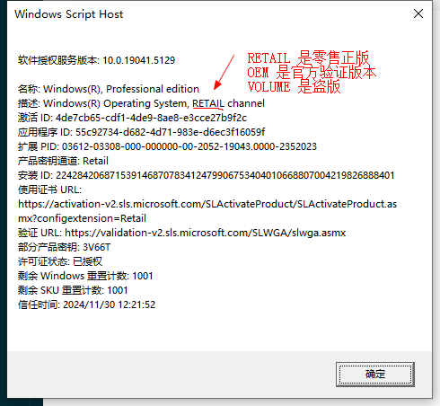

查看是不是 <span style="color:red" >正版系统</span>:

```bash
# win + r 然后在弹窗里输入这个
slmgr.vbs -dlv
```


清空 cmd 命令记录：

```powershell
cls
```

打开计算器

```powershell
calc
```

命令行进入管理员环境运行：

```bash
runas /user:administrator cmd
# 但是这里你得知道administrator的密码。而这里不用administrator这个用户也可以，可以用同在一个管理组中的其他用户来启动cmd也是可以的，权限同样是管理员，比如administrators中还有一个用户叫：abc 那么可以用命令：runas /user:abc cmd。这个时候只要输入abc用户的登录密码即可。
```
