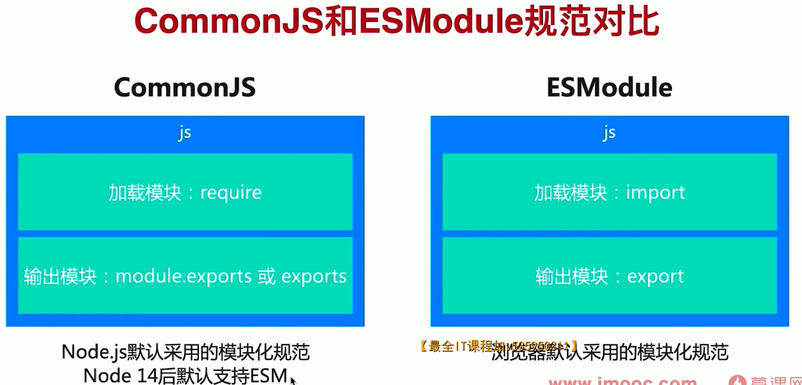

# 前端模块化

参考文章：

1. https://cloud.tencent.com/developer/article/1589084

前端模块化就是将各个功能进行拆分， 并且完成每部变量私有化， 然后提供接口 API 供外部使用。

1. 全局命名冲突

2. 全局命名空间

```js
var _module = {};
```

有是优化问题

闭包解决私有化问题

3. IIFE 创建 闭包

问题无法解决模块之间 的相互依赖问题

增强想的 IIFE 支持模块化

```js
// module.js 文件
(function (global) {
    var a  = 1;
    function api() {
        return {
            code: 0,
            data: {
                a,
                b： 1，
            }
        }
    }
    function handle(data, key) {
        return data.data[key]
    }
    global.__Module_API = {
        api,
        handle,
    }
})(window)


// entry.js 引入 module.js 的文件
(function(global, moduleAPI) {
    function sum(a, b) {
        return a + b;
    }
    global.__Module = {
        api: moduleAPI.api,
        handle: moduleAPI.handle,
        sum,
    }
})(window.window.__Module_API)
```

## CommonJS

Node.js 默认模块化规范，每个文件就是一个模块，有自己的作用域
Node 中 CJS 模块加载采用同步加载方式
通过 require 加载模块，通过 exports 或 module.exports 输出模块

特点：
所有代码都运行在模块作用域，不会污染全局作用域。
模块可以多次加载，第一次加载时会运行模块，模块输出结果会被
缓存，再次加载时，会从缓存结果中直接读取模块输出结果。
模块加载的顺序，按照其在代码中出现的顺序。

模块输出的值是值的拷贝，类似 IIFE 方案中的内部变量。

为啥么第一次引入会执行一遍呢？

CommonJS 实现原理；


CommonJS 打包

1. 安装 browserify:npm install browserify-g
2. 模块打包命令：browserify module_test/cjs/entry.js-o dist/bundle.js
3. 注意，当存在多个模块时，每个模块都需要单独打包

browserify 打包原理

1. 本质还是通过自执行函数实现模块化
2. 将每个模块编号，存入一个对象，每个模块标记依赖模块
3. 实现了 require 方法，核心是通过 call 方法调用模块，并传入 require、module、exports 方法,通过 module 存储模块信息，通过 exports 存储模块输出信息

## AMD 规范

AMD 规范介绍

- AMD 规范采用非同步加载模块，允许指定回调函数
- Node 模块通常都位于本地，加载速度快，所以适用于同步加载
- 浏览器环境下，模块需要请求获取，所以适用于异步加载
- require.js 是 AMD 的一个具体实现库

## CMD 规范

- CMD 整合了 CommonJS 和 AMD 的优点，模块加载是异步的
- CMD 专门用于浏览器端，sea.js 是 CMD 规范的一个实现
- AMD 和 CMD 最大的问题是没有通过语法升级解决模块化

## ESModule 规范

ESModule 设计理念是希望在编译时就确定模块依赖关系及输入输出
CommonJS 和 AMD 必须在运行时才能确定依赖和输入、输出
ESM 通过 import 加载模块，通过 export 输出模块

esmodule 对比 commonjs

1.CommonJS 模块输出的是值的拷贝，ES6 模块输出的是值的引用
2.CommonJS 模块是运行时加载，ES6 模块是编译时输出接口
3.CommonJs 是单个值导出，ES6 Module 可以导出多个
4.CommonJS 模块为同步加载，ES6 Module 支持异步加载
5.CommonJS 的 this 是当前模块,ES6 Module 的 this 是 undefined

```js
this === module.exports; // true
```

6.CommonJS 和 ES6 Module 的语法不同


脚本和模块对比
模块具备更高的开发效率（可读性强、复用高效）
脚本具有更高的页面性能(模块文件多，加载速度慢)
模块在浏览器中运行会存在兼容性问题，要特别注意

浏览器模块化的局限
缺乏模块管理能力，模块分散在各个项目中
性能加载慢，无法大型项目中直接使用
这两个问题是 npm 和 webpack 核心解决的问题
