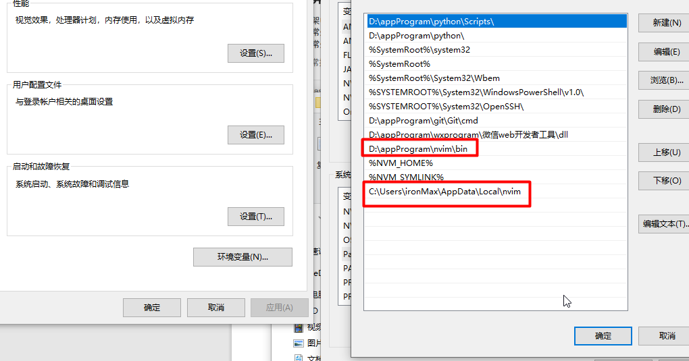

# windows 10 系统安装 Neo Vim

参考连接:  
[window 安装 Neo Vim 教程](https://dev.to/ritikadas/using-neovim-as-an-effortless-way-to-edit-code-installation-and-setup-guide-for-windows-10-5dhc#:~:text=You%20can%20now%20open%20Neovim,Enter%20for%20the%20same%20result.&text=Boom!);

[Neo Vim 参考](https://github.com/bryant-video/neovim-tutorial)

[Neo Vim 下载地址](https://neovim.io/)

Packer , Nvimtree, Tokyonight

[ Nerdfonts ](https://www.nerdfonts.com/)
[ Ripgrep ](https://github.com/BurntSushi/ripgrep)

### 安装

下载好了，就解压文件，将解压的文件放到安装的目录里面，我一般放到 D 盘, Programs 文件夹里面。 接着设置 Nvim 的环境变量：

将 Neovim 里面的 bin 文件夹目录放置环境变量里即可

**为 NeoVim 放置 开始键的目录里**

将 nvim-qt.exe 这个文件的快捷方式， 粘贴到的
`C:\Users\ironMax\AppData\Roaming\Microsoft\Windows\Start Menu\Programs`
这个目录即可。

### 编写 Neo Vim 配置文件

启动 Nvim 编译器, 用 conmand mode 输入 :` echo stdpath('config')` 接着按 enter 就会显示配置文件的位置。一般在 AppData>LocaL>nvim 目录里面。同时将这个 目录也放置到环境变量中。



接着在这个文件里面创建 init.vim 文件。

这个文件就是专门放置 neo vim 的配置的。

粘贴如下内容, 然后保存：

```
call plug#begin('C:/Users/Ritika/AppData/Local/nvim/plugged')

" below are some vim plugins for demonstration purpose.
" add the plugin you want to use here.

Plug 'joshdick/onedark.vim'
Plug 'iCyMind/NeoSolarized'
Plug 'neoclide/coc.nvim'
Plug 'junegunn/vim-easy-align'
Plug 'https://github.com/junegunn/vim-github-dashboard.git'
Plug 'scrooloose/nerdtree', { 'on': 'NERDTreeToggle' }
Plug 'tpope/vim-fireplace', { 'for': 'clojure' }
Plug 'rdnetto/YCM-Generator', { 'branch': 'stable' }
Plug 'fatih/vim-go', { 'tag': '\*' }
Plug 'nsf/gocode', { 'tag': 'v.20150303', 'rtp': 'vim' }
Plug 'junegunn/fzf', { 'dir': '~/.fzf', 'do': './install --all' }
Plug 'vim-airline/vim-airline'
Plug 'vim-airline/vim-airline-themes'

call plug#end()

```

打开 PowerShell , 粘贴如下内容到 PowerShell 里面执行：

```
md ~\AppData\Local\nvim\autoload
$uri = 'https://raw.githubusercontent.com/junegunn/vim-plug/master/plug.vim'
(New-Object Net.WebClient).DownloadFile(
  $uri,
  $ExecutionContext.SessionState.Path.GetUnresolvedProviderPathFromPSPath(
    "~\AppData\Local\nvim\autoload\plug.vim"
  )
)
```

执行后会在 ~\AppData\Local\nvim 目录里面 生成一个 autoload 文件夹； 文件夹里面有 plug.vim 文件；

到这里我们就可以去安装我们的 vim 插件了, 刚刚 编写的 init.vim 文件里面有有一些 Plug 命令，是安装 neo vim 插件的。

接着, 我们在 ~\AppData\Local\nvim 里创建一个 plugged 文件夹, 用来存放我们所有安装的插件。
