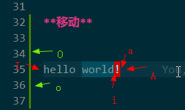
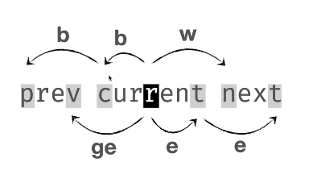
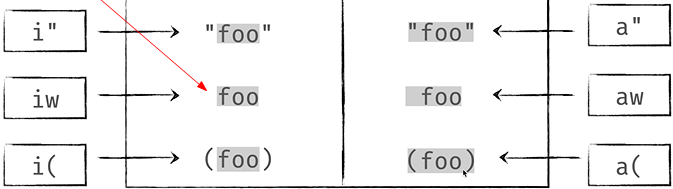

# vim


## vim 模式简介

vim 的模式三种分别是 normal mode、insert mode、visual mode、 command mode， 在初始启动是 normal mode，在 normal mode 下,进入 insert mode 按 <b> i </b>, 进入 visual mode 可以按 <b> v </b> 键， 进入 command mode 可以按 <b> shift + : </b>; 退出可以按 <b> Esc </b> 键或者按 <b> j j </b> 键两下（vscode vim 的默认配置是 j j）。 推出后就是 normal mode。

> 后面写符号所对应的键，则便是按此键如 i 表示按小写字母 i 键，如此类推。

### visual mode 进阶

|          按键           | 模式              |
| :---------------------: | :---------------- |
|          **v**          | visual mode       |
|      **shift + v**      | visual line mode  |
| **Ctrl + v / Ctrl + q** | visual block mode |

**visual mode**
visual mode: 文本选择是以字符为单位的。

- visual mode 下的一些操作

|          操作          | 作用                                           |
| :--------------------: | :--------------------------------------------- |
| number + [hjkl] + 操作 | 进行左右文本选择 如： 6 l d                    |
|         c / C          | 文本被选中后， 按 c 删除选中的文本，C 删除整行 |
|           ~            | 让 选中的文本 进行大小写切换                   |
|     shift + < / >      | 让选中的文本进行: < 向左缩进 ， > 向右缩进；   |
|    <b> v i w y </b>    | 快速选中光标所在的单词并复制                   |
|     <b> v i B </b>     | 快速选中光标所在的 {} 号里面的内容             |
|         v i e          | 选中全文档                                     |
|        v i b U         | 选中 () 里面的内容的字母转换成大写字母         |

---

选中单词后改变单词的大小写

~: 将光标下的字母改变大小写

3~: 将光标位置开始的 3 个字母改变其大小写

g~~: 改变当前行字母的大小写

gUU: 将当前行的字母改成大写

guu: 将当前行的字母改成小写

gUaw(gUiw): 将光标下的单词改成大写

guaw(guiw): 将光标下的单词改成小写

**visual line mode**

文本选择是以行为单位的。可以按 数字键 + ( j k ） 方向键 进行上下文本选择, 操作同上 。

**visual block mode**
可以选择一个矩形内的文本。必须先按左右键( h l )， 再按上下 ( j k ) 键， 其他操作同 visual mode 一样；

|             操作             | 作用                                                  |
| :--------------------------: | :---------------------------------------------------- |
|         J（ 大写 j)          | 将选中的代码合并成一行，用一空格隔开另一行。          |
|              gJ              | 合并没有空格                                          |
| <b> I (大写 i) + string </b> | 会在选中的文本每行开始的位置插入字符。 空行不会插入。 |
|          r + string          | 会将选中的文本替换为输入内容，空行不会插入。          |
|          A + string          | 会将选中的内容替换并插入每一行。空行也会插入。        |

## vim 操作

### 光标插入和移动

**光标插入**
| a | b|
| :--- |:---|
| i： 在光标前插入 | a：在光标后插入 |
| I: 在行的最前面插入 | A: 在行的最后面插入 |
| o: 在下一行插入 | O: 在上一行插入 |


**光标移动**

> normal mode 下移动

1. 上下左右

```
h: 左移一个字符； j: 下移一行; k: 上移一行；l: 右移一个字符；
```

2. 字符间跳转

w: 跳到下一个单词开头；b: 跳到本单词或上一个单词开头；e: 跳到本单词或下一个单词结尾
；ge: 跳到上一个单词结尾。



_1 和 2 的若进行次操作可以用 “数字 + 操作” , 如 2j: 向下两行， 2b, 2w， 2l 等等_

3. 精准定位

   | 操作 | 作用                         |
   | :--: | :--------------------------- |
   |  0   | 跳到行首                     |
   |  ^   | 跳到从行首开始第一个非空字符 |
   |  $   | 跳到行尾                     |
   | g g  | 跳到第一行                   |
   |  G   | 跳到最后一行                 |

> 精准定位到某一行：1、<b> ： + 数字 + enter </b>； 2、<b> 数字 + gg</b> 或 <b> 数字 + G </b>, 例如，20gg，光标就定位到 20 行。

---

全局快速定位后， 按高亮的字母后， 光标就跳到那个字母所在的位置。

> space 是空格, 可以通过 vsCode 的 setting.json 文件对 `"vim.leader"："<space>"` 进行配置。

|          操作          | 描述                         |
| :--------------------: | :--------------------------- |
|   space space s char   | 全局查找 char 字母           |
| space space f / t char | 光标之后的位置匹配字母 char  |
| space space F / T char | 光标之前的位置匹配字母 char  |
|     space space w      | 光标之后的单词的第一个字母   |
|     space space b      | 光标之前的单词的第一个字母   |
|     space space e      | 光标之后的单词的最后一个字母 |
|     space space ge     | 光标之前的单词的最后一个字母 |
|     space space j      | 光标之后的每行的第一个字母   |
|     space space k      | 光标之前的每行的第一个字母   |

4.  行间字符定位

    |            操作             | 作用                                       |
    | :-------------------------: | :----------------------------------------- |
    | <strong> f + char </strong> | 光标跳到下个 char 所在位置                 |
    |      <b> F + char </b>      | 反向移动到上一个 char 所在位置             |
    |          t + char           | 光标跳到下个 char 的前一个字符的位置       |
    |          T + char           | 光标反向移动到上个 char 的后一个字符的位置 |
    |         <b> ; </b>          | 重复上次的字符查找操作                     |
    |              ,              | 反向查找上次的查找命令                     |

5.  其他当定方式

    - 字符配置定位

      在 normal mode 下按 <b> / + 匹配字符 + enter </b> 光标就会定位到匹配的第一个字符，按 n 定位到下一个匹配的字符， shift + n 定位到上一个匹配的字符。

    - 空行定位

      <b> shift + } </b>: 光标移动到下一个行空行;

      <b> shift + { </b>: 光标移动回上一个空行

### 动作 （motion）

i (inner), a(around);

1. **i** 选中光标所在的不包括分隔符的非空内容
2. **a** 选中光标所在的包括分隔符在内的所有内容

   

   常用的 motion 有
   <b style="background: #ff9f00; padding: 0 10px">
   iw ，i( 或 ib ， i{ 或 iB , i' , i" , i` , i < , i[, it , is , ip
   </b>

> w: 单词， t:标签，s: 句子， p: 段落；

### 操作符 operator

> 操作符是告诉 vim 做什么， 动作是告诉 vim 怎么做。
> vim 对文本的操作有 c(change）删除或修改进入插入模式， d (delete) 删除或剪切， y (yank) 复制， p(paste）粘贴。

### 常用操作

|     操作      | 描述                                   |
| :-----------: | :------------------------------------- |
|      d d      | 删除光标当前行                         |
|      c c      | 删除光标当前行, 并进入 insert mode     |
|  number d d   | 向下删除 number 行                     |
|     y y p     | 复制当前行并粘贴                       |
| number y y p  | 向下复制 number 行， 并粘贴            |
|     y i e     | 复制整个文件内容                       |
| c i e / d i e | 清除整个文件内容                       |
|      c $      | 删除光标所在的后面所有的字符。         |
|     2 c c     | 向下删除两行并进入 insert mode         |
|     c i t     | 删除标签里的内容                       |
|     c a t     | 删除光标所在的，包括标签在内的所有内容 |

### 其他操作

|   操作   | 描述                                                 |
| :------: | :--------------------------------------------------- |
|    gd    | 查看光标所在的某个引用的定义。                       |
|    gh    | 展示光标所在悬浮时的提示                             |
| gt / g T | 向后 、 前切换文件标签页, 4 g t 向后跳到第四个标签页 |

---

### vsCode 快捷键

|    操作     | 描述                                            |
| :---------: | :---------------------------------------------- |
| Ctrl + 数字 | 在分页模式下切换窗口, Ctrl + 1 切换到第一个窗口 |
|  Ctrl + \   | 新建分页                                        |
|  Ctrl + u   | 往上半页                                        |
|  Ctrl + b   | 往上一页                                        |
|  Ctrl + d   | 往下半页                                        |
|  Ctrl + f   | 往下一页 （系统占据了于当前文件查找）           |

---

<b> Ctrl + 0</b> : 转到文件侧边栏，可以按 j / k 上下选择文件，按 space 空格键或 enter 打开文件或展开文件夹，按 l 则转到打开的文件这边，按 enter 键会直接转到打开的文件这边。

---

## command mode 命令行操作

**退出**

| 命令行               | 解析                                    |
| :------------------- | :-------------------------------------- |
| <b> : wq enter</b>   | w 是 write，q 是 quit，先保存文件后退出 |
| <b> : q! enter </b>  | 强制退出 vim 编辑器                     |
| <b> : wqa enter </b> | a 是 all , 保存所有文件并退出           |

**匹配替换**

<b> : % s / match string / replace string g(默认) enter </b>

## 安装 NeoVim

    winget install Neovim.Neovim

## normal 模式下的光标移动
