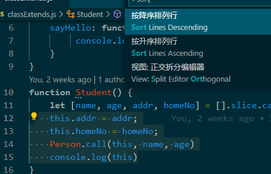
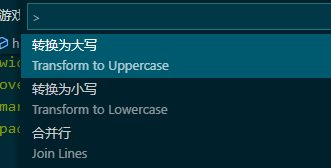
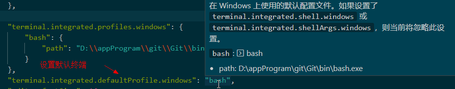
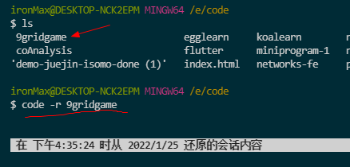

## vs code 学习地址

- https://geek-docs.com/vscode/vscode-tutorials/introduction-to-vscode.html

## vs code 常用快捷键

若是安装了 Vim, 以下所有的快捷键只有在 编辑模式下才能使用， 其他模式下失效。 在编辑模式下不生效， 很有可能被其他运行中的软件占用 快捷键 如 搜狗输入法。

- Ctrl + K + Ctrl + W ： 清空所有标签页；
- ctrl shift p : 打开命令面板
- ctrl shift m ： 查看错误和警告
- ctrl shift g ： 源代码管理
- ctrl shift x ： 拓展管理
- ctrl shift d ： 启动和调试
- ctrl shift f ： 跨文件搜索
- ctrl shift e ： 文件资源管理器
- ctrl shift ` : 打开终端
- ctrl shift n : 打开新窗口
- Ctrl + Shift + K ： 删除代码行
- Ctrl + x : 剪切代码行；
- Ctrl + b : 显示 / 隐藏 左侧边栏

- Ctrl + 鼠标左键： 引用定位 、或是连接跳转。
- Ctrl + [ Shift ] + Enter : 鼠标位置 下 [ 上 ] 新开一行
- Alt + 上下方向键： 鼠标行代码上下移动
- Ctrl + F4 : 关闭当前标签页
- Ctrl + \ : 创建分页
- Ctrl + num : 选择第 num 个分页
- 合并分屏 ctrl + alt + \
- 合并所有分屏 ctrl + shift + alt + \

**展示代码实现：(本地代码且非三方)**

悬停在代码上 + Ctrl

- 选中文本排序：



- 选中文本转换大小写：



- 代码格式化：
  Alt + shift + F
- 注释：
  Alt + shift + A: 多行注释 （ /\* \*/ ) ;

  Ctrl + / ： 单行注释；
  代码补全：

  ```json
    setting.json

    {

        "editor.quickSuggestions": {
            "other": true,
            "comments": false, // 注释 不进行代码提示
            "strings": false // 字符串不进行代码提示
        }
        editor.wordBasedSuggestions // 基于单词的自动补全提示关闭 false / true;

        editor.parameterHints.enabled // 参数窗口代码提示
    }

  ```

  其他几个自动补全的设置，你可以在设置里搜一搜 “editor.suggest”，自己修改玩一玩。

- 文本选择：

  shift + 方向键：

  单击鼠标左键：

  2 次 == 选中单词

  3 次 == 选中一行

  4 次 == 选中整个文件

  单击行号，就能够直接选中这一行。如果你在某个行号上按下鼠标，然后上下移动，则能够选中多行代码。

- 代码重构：

  当我们想修改一个函数或者变量的名字时候，我们只需把光标放到函数或者变量名上，然后按下 F2，这样这个函数或者变量出现的地方就都会被修改。并不是所有语言都支持重构。

- 文本移动 、移动复制粘贴

  1、选中文本 然后拖拽文本、

  2、选中文本的同时按住 Ctrl (option) 键，然后拖拽文本

- 多光标模式：

  1、 Alt + 鼠标选择 ；
  2、 Ctrl + Alt + 上下方向键；
  3、 Ctrl + D 1 次 2 次 3 次（但是这个快捷方式被 vim 覆盖了）
  4、 Alt + 鼠标中建 + 拖拽

- 打开文件：

  Ctrl + Tab （打开的文件少时可以用）
  Ctrl + P : 打开文件搜索框 + 选择文件后 enter (新增一页打开文件） | Ctrl + enter (新增分页窗口打开）

- 终端：

- Ctrl + ` | j : 打开第一个终端 、展示终端、 隐藏终端
- Ctrl + shift + ` : 创建新终端
- Ctrl + shift + 5: 创建分页终端
- Ctrl + A : 移动到终端行的开头位置
- clear : 清除终端命令

## 终端设置：

第三个非常常用的集成终端设置就是环境变量了，我们既可以把环境变量写到脚本里去，也可以使用 terminal.integrated.env.osx、
terminal.integrated.env.linux 或者 terminal.integrated.env.windows 来控制集成终端创建 Shell 时，该使用哪些特殊的环境变量。



终端美化：只有 osx 和 linux 才有， 如： zsh / oh-my-zsh ，window 的没用过;

## 网格编译布局

你可以先试着运行命令 “2 x 2 网格编辑器布局” [Grid Editor Layout（2 x 2）]；

**一个禅模式**

通过运行 “切换禅模式”(Toggle Zen Mode)，就可以把侧边栏、面板等全部隐藏。进入禅模式后，只需按下 Escape 键，即可退出禅模式。安装了 vim 插件的 Esc 被覆盖了， 再运行 切换禅 模式 即可；

## vs code 命令

code --help

code -r [ dirName | file path ]

最基本的命令行使用方式是在 code 命令后加上文件或者文件夹的地址，这样 VS Code 就会在一个新窗口中打开这个文件或文件夹。如果你希望使用已经打开的窗口来打开文件，可以在 code 命令后添加参数 -r 来进行窗口的复用。



**code -r -g package.json:128**

你也可以使用参数 -g <file:line[:character]> 打开文件，然后滚动到文件中某个特定的行和列，比如输入 code -r -g package.json:128 命令，你就可以打开 package.json 这个文件，然后自动跳转到 128 行

**code -r -d a.txt b.txt**

VS Code 也可以用来比较两个文件的内容，你只需使用 -d 参数，并传入两个文件路径，比如输入 code -r -d a.txt b.txt 命令，就可以比较 a.txt 和 b.txt 两个文件的内容了。

**ls | code -r -**

VS Code 命令行除了支持打开磁盘上的文件以外，也接受来自管道中的数据。这样你就可以将原本在命令行中展示的内容，实时地展示在 VS Code 里，然后在编辑器中搜索和修改。比如，你可以把当前目录下所有的文件名都展示在编辑器里，此时只需使用 ls | code - 命令。

## launch.json 调试文件：

```json
https://geek-docs.com/vscode/vscode-tutorials/vscode-code-debugger.html

https://code.visualstudio.com/Docs/editor/debugging

默认支持 node 环境调试， 进行 chrome 调试需要安装 [Deprecated] Debugger for Chrome 插件；

// 使用 IntelliSense 了解相关属性。
// 悬停以查看现有属性的描述。
// 欲了解更多信息，请访问: https://go.microsoft.com/fwlink/?linkid=830387
"type": "node", // 代表着调试器的类型
"request": "launch",
// 代表着该如何启动调试器。如果我们的代码已经运行起来了，则可以将它的值设为 attach，
// 那么我们则是使用调试器来调试这个已有的代码进程；而如果它的值是 launch，
// 则意味着我们会使用调试器直接启动代码并且调试。
"name": "启动程序", // 就名字， 写自己喜欢的
"program": "${file}"
// 就是告诉调试器，我们想要调试哪个文件。这个值支持预定义参数，
// 比如在上面的例子里，我们使用了${file}，也就是当前编辑器里打开的文件。
// 如果所有文件都被关闭了，那么${file} 就是空的了，这个调试配置并不能正确运行。
// https://code.visualstudio.com/docs/editor/variables-reference
 {
     "version": "0.2.0",
     "configurations": [
          {
           "type": "node", // 代表着调试器的类型
           "request": "launch",
           "name": "启动程序",
           "program": "${file}"
}
]
}
```

settings.json 文件：

tasks.json 文件：
https://geek-docs.com/vscode/vscode-tutorials/how-does-vscode-create-custom-tasks.html
