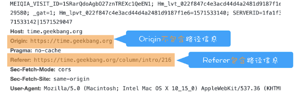

# CSRF 攻击

CSRF (Cross-site request forgery “跨站请求伪造”), 意思是黑客通过技术收单劫持用户账号信息， 登录态等数据， 再黑客自己的网站进行模仿用户请求。

## 常用攻击手段：

1. 在获取到用户账号信息的情况下进行 GET / POST 请求。

   ```html
   // GET
   <h1>黑客的站点：CSRF攻击演示</h1>
   

   // POST
   <form
   	id="hacker-form"
   	action="https://time.geekbang.org/sendcoin"
   	method="POST"
   >
   	<input type="hidden" name="user" value="hacker" />
   	<input type="hidden" name="number" value="100" />
   </form>
   <script>
   	document.getElementById("hacker-form").submit();
   </script>
   ```

2. 引诱用户点击连接，获取用户账号信息。 例例如让用户点击邮件连接， 黑客设置邮箱自动转发。然后修改用户账号

## CSRF 应对策略

> CSRF 攻击特点

    第一个，目标站点一定要有CSRF漏洞；
    第二个，用户要登录过目标站点，并且在浏览器上保持有该站点的登录状态；
    第三个，需要用户打开一个第三方站点，可以是黑客的站点，也可以是一些论坛。

策略：

1. 利用好 Cookie 的 SameSite 属性

   SameSite 字面意思是同站， 即在同一站点发过来的 Cookie， 我服务端才会接收。
   [SameSite 说明](https://web.dev/samesite-cookies-explained/)

   SameSite 的三个模式：

   Strict: 完全禁止第三方 Cookie。简言之，如果你从极客时间的页面中访问 InfoQ 的资源，而 InfoQ 的某些 Cookie 设置了 SameSite = Strict 的话，那么这些 Cookie 是不会被发送到 InfoQ 的服务器上的。只有你从 InfoQ 的站点去请求 InfoQ 的资源时，才会带上这些 Cookie。

   Lax: 在跨站点的情况下，从第三方站点的链接打开和从第三方站点提交 Get 方式的表单这两种方式都会携带 Cookie。但如果在第三方站点中使用 Post 方法，或者通过 img、iframe 等标签加载的 URL，这些场景都不会携带 Cookie。

   None: 在任何情况下都会发送 Cookie 数据。

2. 根据请求头的 Referer 属性和 Origin 属性验证请求的来源站点。

   Referer 是养一个页面的地址。

   Origin 是当前页面的域名

    

3. CSRF Token 验证

   先请求服务端获取一个 token，且这个 token 是不能被第三方站请求获取到的， 然后再发请求时带上这个 token
