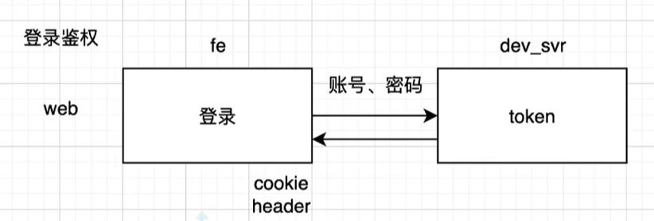
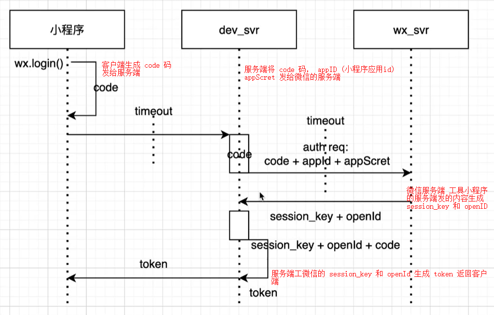
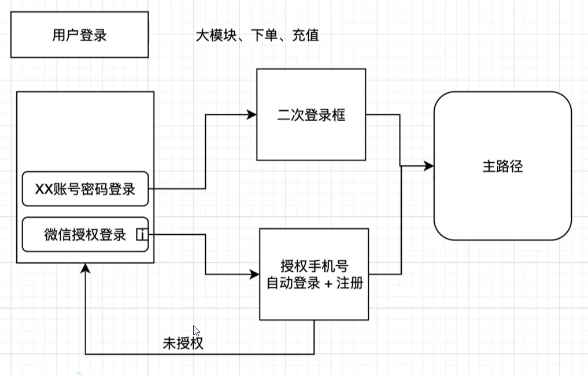

## 小程序

- 从面试开始?

  问：为什么用原生开发？kbone 开发?uniApp 开发?mock 数据如何做的？为什么要这么做？

  从需求和小组角度

  前端技术选型是怎么做的？

  1. 调研储备，了解当前项目技术栈和团队成员技术储备。有多少人会用 Vue / 会用 react, 然后再确定什么框架

  2. 产品产品选型， 和运营沟通， 确定当前的项目是做什么的， 例如： 产品有没有需要在整个微信小程序、 公众号、 和 web 打通。
  3. 需求规划。 规划基础建设， mock , Unit Testing (单元测试) 、 自动化

  4. 技术架构设计， 每个模块需要用什么样的技术。用什么库来做 。

  5. 产出产品模块。谁做那个模块，

- 小程序的登录？/你们项目的小程序鉴权是如何管理的？

  a. 技术实现角度去回答如何实现登录

  b. 从自己的业务出发，如何实现的鉴权

  网页登录鉴权

    

  小程序静默登录鉴权

    
    > appId 是 应用的id ， openId 是当次请求的Id，unitId 是账号ID.

  用户手动登录

    

- 小程序登录过期=>应用的登录态维持？

  重新登录：静默用户
  静默登录。 或者强制返回登录窗口重新登录

- 小程序服务如何做？有没有做过云服务?

  数据库+云函数+云托管

- 自身项目

  网络层优化：写法上的封装+权限/用户信息封装+数据发送封装 axios 的 goon 接口

  存储层优化：用户信息管理+状态管理+数据管理

  模块通信：路径参数+状态机+app 对象=>app 数据的实时性
