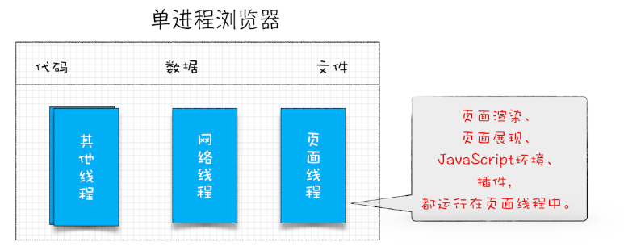

### 浏览器进程发展史

早期的浏览器是由单进程架构组成的，整个进程包含所有页面的渲染模块、JavaScript 执行环境以及插件都是运行在同一个线程中的页面线程，网络线程、插件线程。页面的所有功能都由一个个线程去实现， 因此单线程架构的浏览器有很很多问题。 主要表示就是不稳定， 不流畅， 不安全。

后来为了解决这些问题， Google 在 2008 年退出了多进程 Chrome 浏览器

多进程浏览器由渲染进程， 插件进程， 网络进程，浏览器主进程和 GPU 进程组成, 因此打开一个页面就会有 4 个进程， 如果打开这个页面有插件运行，就是 5 个进程了。

- 浏览器进程:

  主要负责界面显示、用户交互、子进程管理，同时提供存储等功能。

* 渲染进程:

  核心任务是将 HTML、CSS 和 JavaScript 转换为用户可以与之交互的网页，排版引擎 Blink 和 JavaScript 引擎 V8 都是运行在该进程中，默认情况下，Chrome 会为每个 Tab 标签创建一个渲染进程。出于安全考虑，渲染进程都是运行在沙箱模式下。

* GPU 进程:

  其实，Chrome 刚开始发布的时候是没有 GPU 进程的。而 GPU 的使用初衷是为了实现 3D CSS 的效果，只是随后网页、Chrome 的 UI 界面都选择采用 GPU 来绘制，这使得 GPU 成为浏览器普遍的需求。最后，Chrome 在其多进程架构上也引入了 GPU 进程。

* 网络进程:

  主要负责页面的网络资源加载，之前是作为一个模块运行在浏览器进程里面的，直至最近才独立出来，成为一个单独的进程。

* 插件进程:

  主要是负责插件的运行，因插件易崩溃，所以需要通过插件进程来隔离，以保证插件进程崩溃不会对浏览器和页面造成影响。

## 拓展

**线程并行处理：** 即多个线程同时处理一个项目的多个任务。 这样可以提高效率。

单线程和多线程处理任务对比：

**进程和线程的关系:**

**线程:** 它的功能是执行应用程序中的某个具体任务，比如一段程序、一个函数等。它不能独立地产生，线程是不能单独存在的，它是由进程来启动和管理的.

**进程:** 一个进程就是一个程序的运行实例。详细解释就是，启动一个程序的时候，操作系统会为该程序创建一块内存，用来存放代码、运行中的数据和一个执行任务的主线程，我们把这样的一个运行环境叫进程。一个进程最少包含一个线程， 这个最开始创建的线程就是主线程。

> 进程仅负责为各个线程提供所需的资源，真正执行任务的是线程，而不是进程。

线程和进程之间的关系，类似于工厂和工人之间的关系，进程好比是工厂，线程就如同工厂中的工人。一个工厂可以容纳多个工人，工厂负责为所有工人提供必要的资源（电力、产品原料、食堂、厕所等），所有工人共享这些资源，每个工人负责完成一项具体的任务，他们相互配合，共同保证整个工厂的平稳运行。

**进程和线程之间的关系有四个特点：**

1.  进程中的任意一线程执行出错，都会导致整个进程的崩溃。

2.  线程之间共享进程中的数据。

3.  当一个进程关闭之后，操作系统会回收进程所占用的内存。

4.  进程之间的内容相互隔离。因此其他进程崩溃，也不会影响到自身的进程。如果进程之间需要进行数据的通信，这时候，就需要使用用于进程间通信（IPC）的机制了。
