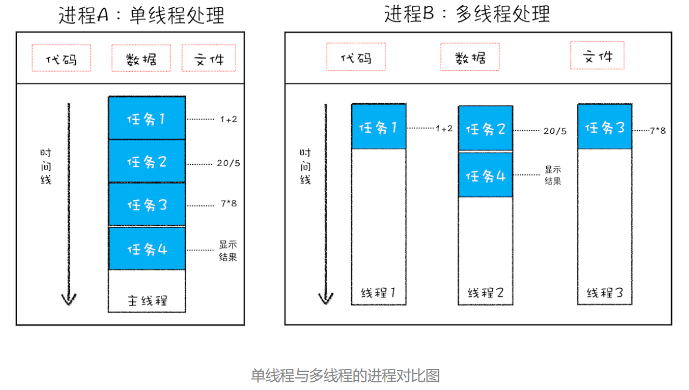

## 查看浏览器里的进程数量

浏览器右上角 > 选项 > 更多工具 > 任务管理器

## 进程和线程

1. 并行处理

   即多个线程同时处理一个项目的多个任务。 这样可以提高效率。

2. 进程和线程的关系

   **进程** ： 多线程可以并行处理任务，但是线程是不能单独存在的，它是由进程来启动和管理的。那什么又是进程呢？

   一个进程就是一个程序的运行实例。详细解释就是，启动一个程序的时候，操作系统会为该程序创建一块内存，用来存放代码、运行中的数据和一个执行任务的主线程，我们把这样的一个运行环境叫进程。 如下图：
   

   **进程和线程之间的关系有四个特点：**

   1. 进程中的任意一线程执行出错，都会导致整个进程的崩溃。
   2. 线程之间共享进程中的数据。
   3. 当一个进程关闭之后，操作系统会回收进程所占用的内存。
   4. 进程之间的内容相互隔离。因此其他进程崩溃，也不会影响到自身的进程。如果进程之间需要进行数据的通信，这时候，就需要使用用于进程间通信（IPC）的机制了。

在早期的浏览器是单进程的因此会经常出现卡顿，不稳定， 不安全的情况。 现在新的浏览器采用了多进程架构。

浏览器进程。主要负责界面显示、用户交互、子进程管理，同时提供存储等功能。

渲染进程。核心任务是将 HTML、CSS 和 JavaScript 转换为用户可以与之交互的网页，排版引擎 Blink 和 JavaScript 引擎 V8 都是运行在该进程中，默认情况下，Chrome 会为每个 Tab 标签创建一个渲染进程。出于安全考虑，渲染进程都是运行在沙箱模式下。

GPU 进程。其实，Chrome 刚开始发布的时候是没有 GPU 进程的。而 GPU 的使用初衷是为了实现 3D CSS 的效果，只是随后网页、Chrome 的 UI 界面都选择采用 GPU 来绘制，这使得 GPU 成为浏览器普遍的需求。最后，Chrome 在其多进程架构上也引入了 GPU 进程。

网络进程。主要负责页面的网络资源加载，之前是作为一个模块运行在浏览器进程里面的，直至最近才独立出来，成为一个单独的进程。

插件进程。主要是负责插件的运行，因插件易崩溃，所以需要通过插件进程来隔离，以保证插件进程崩溃不会对浏览器和页面造成影响。

因此打开一个页面就有四个进程。
