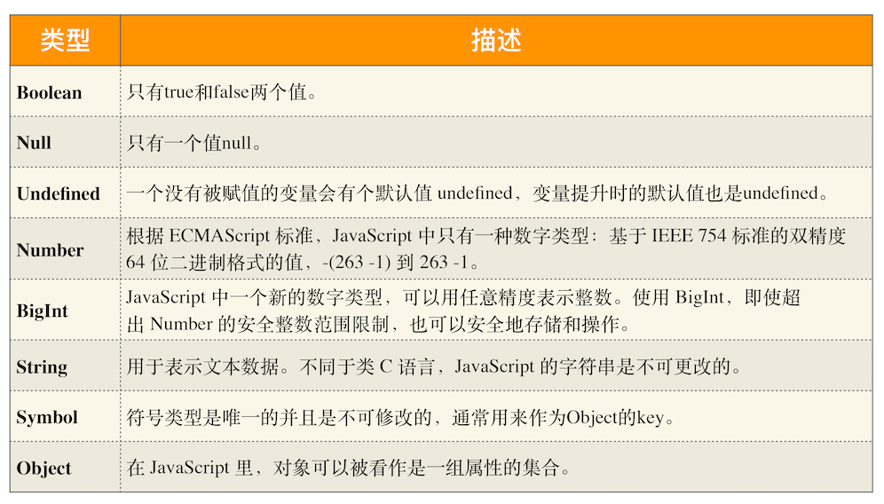
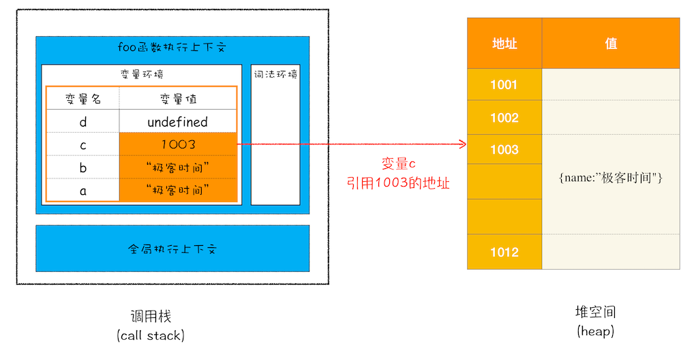
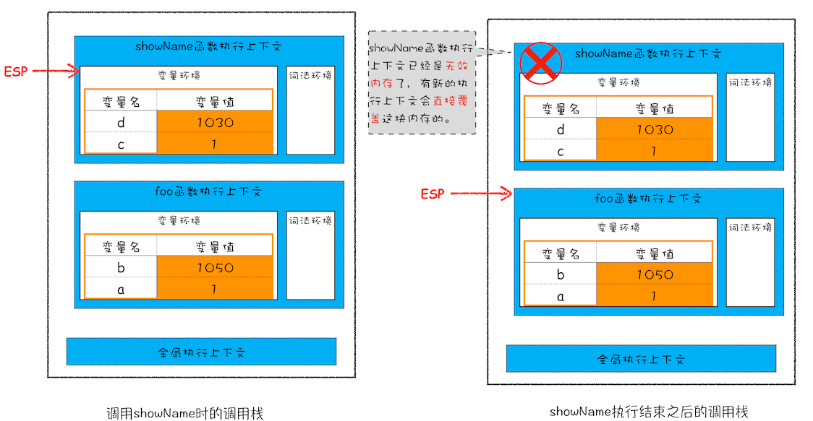
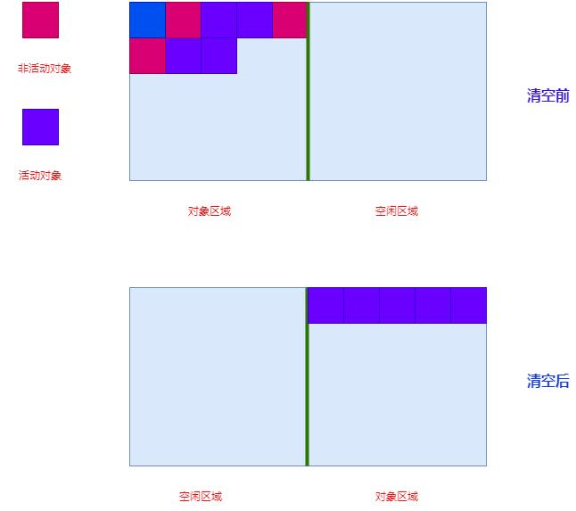
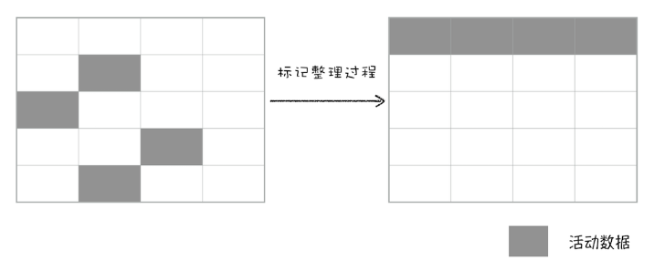
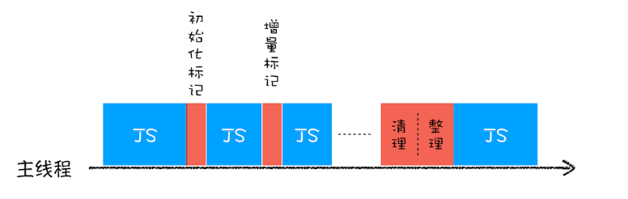
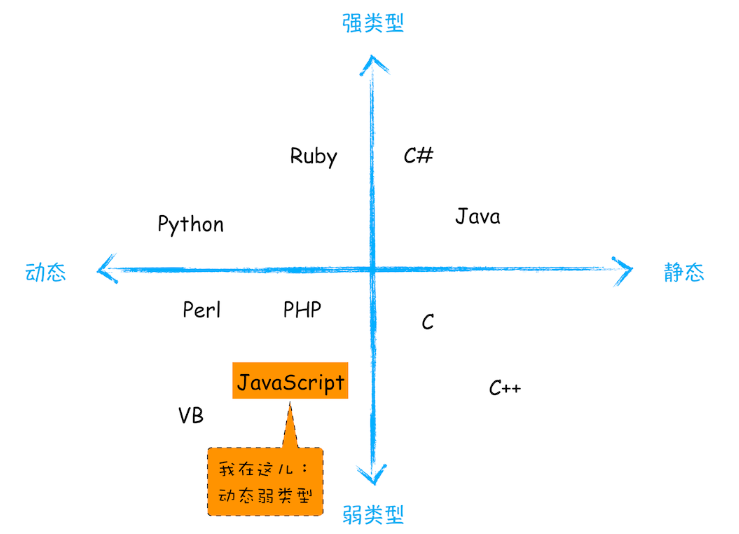

# JavaScript 数据存储

JavaScript 是弱类型的动态语言，它一共有 8 种数据类型分别是:



而这 8 种类又可以分成<b style="color: #aaffaa" > 原始类型 </b> 和 <b style="color: #aaffaa" >引用类型</b> 两大类。在 JavaScript 运行过程中有三种内存空间， 即代码空间、 栈空间和堆空间。

- **代码空间**： 用于存放运行的代码；

- **栈空间**： 用于存放原始类型数据以及引用类型数据的引用地址;

- **堆空间**： 用于存放引用类型数据；



<h2 style='color: #aaffaa'> 垃圾数据回收</h2>

<b style="color: #aaffaa; font-size: 16px" >栈内存清理</b>

JavaScript 语言和其他语言不同， JavaScript 的垃圾数据是由垃圾回收器自动回收的。当执行一段 JavaScript 代码的时候， 会为其创建执行上下文，执行上下文李包含着变量环境和词法环境，变量环境存放着 var 声明和函数声明的变量的原始数据和引用地址， 而词法环境存放着 let 和 const 声明的原始数据和引用地址， 并压入调用栈中，<div style="color:#aaffaa"> 因此原始数据，以及对象类型的引用地址都随着执行上下文存放在栈中。</div>

与此同时， 还会有一个**记录当前执行状态的指针（ESP)** 指向改执行上下文。当对应这个执行上下文的可执行代码执行完之后， 这个执行上下文就会出栈。 这时栈中的数据也自动被回收了，随后 ESP 则指向下一个执行上下文。

```js
function foo() {
	var a = 1;
	var b = { name: "极客邦" };
	function showName() {
		var c = "极客时间";
		var d = { name: "极客时间" };
	}
	showName();
}
foo();
```



<b style="color: #aaffaa; font-size: 16px" >堆内存清理</b>

对于对象类型数据，清理栈内存的时候， 只是清理了栈内存中引用数据地址的引用。并没有清理到堆内存里的数据。那 JavaScript 是怎么清理堆内存里的数据的呢？

在 V8 引擎中会把堆内存分为新生代和老生代两个区域，新生代中存放的是生存时间短的对象，老生代中存放的生存时间久的对象。 新生代内存通常只有 1 - 8 Mb 而老生代却很大一般几百 Mb 到 1 点几 Gb 不等。在 V8 引擎中采用了**副垃圾回收器回收新生代内存**和**主垃圾回收器回收老生代内存**。

不管是副垃圾回收器还是主垃圾回收器， 他们都有一套相同的回收流程。

1. 标记内存中活动对象和非活动对象。
2. 对非活动的对象进行清理。
3. 整理内存碎片，让内存空间连续。

## 副垃圾回收器

副垃圾回收器采用的是 Scavenge 内存清理算法，即新生代区域， 对半划分， 一半是对象区域， 一半是空闲区域。当对象区域快被写满时。就需要执行一次清理操作。将对象区域中的非活动对象清理之后。 然后整理活动对象， 有顺序的保存在空闲区域中。 然后清空对象区域。 这样原来的对象区域就变成了空闲区域， 原来的空闲区域就变成了对象区域。也就是经过两次垃圾回收依然还存活的对象，会被移动到老生区中。



除了对非活动对象的清理之外，由于新生代内存小很容易被写满的原因。JavaScript 引擎采用了对象对象晋升策略。也就是经过两次垃圾回收依然还存活的对象，会被移动到老生区中。

## 主垃圾回收器

老生代的内存空间比较大。采用的是标记-清除算法（Mark-Sweep），即标记出不活动的对象，然后清理掉。但是这个算法有个缺陷， 就是产生了很多碎片内存。 所以后面又有了标记-整理（Mark-Compact）算法。这个算法是在清理的基础上， 将活动的对象向一端移动， 将边界外的空闲空间清理后最后所有的活动对象连接在一起。


## 标记过程和回收过程

由于 JavaScript 是运行在主线程之上的，一旦执行垃圾回收算法，都需要将正在执行的 JavaScript 脚本暂停下来，待垃圾回收完毕后再恢复脚本执行。我们把这种行为叫做**全停顿（Stop-The-World）**。 在实际场景中， 若是一次性清理完后再执行其他任务会造成页面卡顿现象。 为了降低老生代的垃圾回收而造成的卡顿，V8 将标记过程分为一个个的子标记过程，同时让垃圾回收标记和 JavaScript 应用逻辑交替进行，直到标记阶段完成，我们把这个算法称为**增量标记（Incremental Marking）算法**。如下图所示：

这样将一个巨大的任务拆分成许多小任务并穿插在各个 JavaScript 任务中进行， 这样就是可以保证页面的流畅和用户体验了。

什么是静态语言和动态语言？

在声明变量之前需要先定义变量类型。我们把这种在使用之前就需要确认其变量数据类型的称为静态语言。相反地，我们把在运行过程中需要检查数据类型的语言称为动态语言。

什么是强类型语言和强类型语言？

们通常把这种偷偷转换的操作称为隐式类型转换。而支持隐式类型转换的语言称为弱类型语言，不支持隐式类型转换的语言称为强类型语言。


