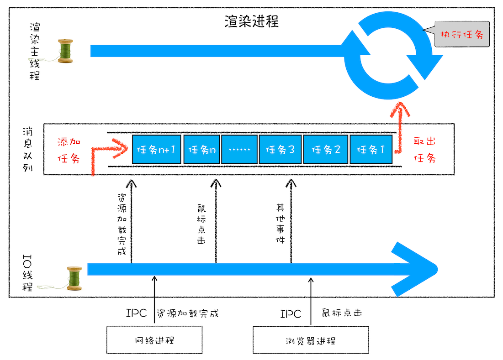

# JavaScript Evnets Loop（浏览器事件轮询）

> 消息队列： 符合先进先出的特点，要添加任务的话，添加到队列的尾部；要取出任务的话，从队列头部去取。

浏览器的渲染进程用消息队列的方式来进行事件轮询，这些事件任务，有渲染进程自身的也有来自其他进程的， 如网络进程和浏览器进程。 渲染进程里有一个 **IO 线程** 用来专门负责接收其他进程发来的任务。然后由它发送给渲染进程的事件队列，最后等待渲染进程处理。

## 如何处理高优先级的任务

> [宏任务与微任务详情](./12.%20%E5%AE%8F%E4%BB%BB%E5%8A%A1%E5%92%8C%E5%BE%AE%E4%BB%BB%E5%8A%A1.md)

为了权衡任务的效率和实时性， chrome 引入了微任务队列。通常我们把消息队列中的任务称为宏任务，每个宏任务中都包含了一个微任务队列，宏任务执行完之后， 会去执行微任务， 当微任务执行完之后再去执行下一个宏任务。



## 如何处理像定时器执行时间长的任务

在消息队列中出了正常的消息队列之外， 还有一个延时执行的消息队列。这个队列维护着需要延时执行的任务，如定时器和 chrome 内部的延时任务。当创建一个定时器任务时，这个任务会被添加到延时执行任务队列中，每当执行消息队列的时候都会检测延时队列里有哪些任务时到期可执行的。当想要取消这任务时， 可以用定时器的 clearTimeout(timer_id) 清除。

- 有关定时器使用的注意事项

  1、定时器不是严格安装预设时间执行的

  ```js
  function bar() {
  	console.log("bar"); // 过了很久才打印
  }
  setTimeout(bar, 0); //
  for (let i = 0; i < 5000; i++) {
  	console.log(i);
  }
  ```

  2、在激活的页面下运行定时器的最低时间是 4ms, 没未激活的页面下运行定时器最少时间是 1000ms 左右。

  ```js
  console.time("key");
  setTimeout(function () {
  	console.log("timer");
  }, 0);
  console.timeEnd("key");
  ```

  3、延时值是以 32bit 来存储的， 最大存放数字是 (31 个 1 [二进制]) 2147483647, 约 24.8 天， 超过这个值就会溢出。即相当于设置 0；

  ```js
  function showName() {
  	console.log("极客时间"); // 会 4ms 左右后执行。
  }
  var timerID = setTimeout(showName, 2147483648);
  ```

  4、定时器回调函数的 this 是 window。它相当于这样被调用：

  ```js
  function setTimeout(func, time) {
  	func();
  }
  ```
