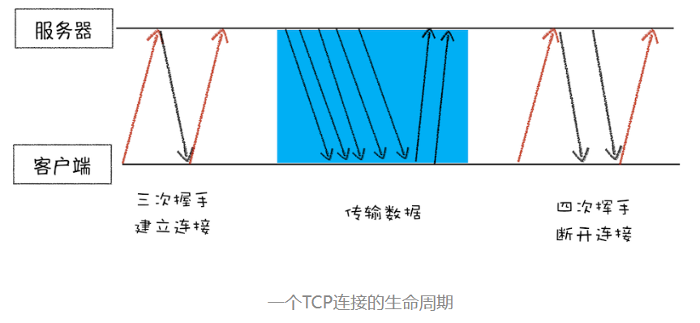

数据包要在互联网上进行传输，就要符合网际协议（Internet Protocol，简称 IP）标准。互联网上不同的在线设备都有唯一的地址(ip 地址)， 利用这个地址可以确定发送方和接收方。这样数据就可以精准送达目标设备。IP 协议只是将数据送到目的地，并没用送到目标应用，因此，需要基于 IP 之上开发能和应用打交道的协议，最常见的是“用户数据包协议（User Datagram Protocol）”，简称 UDP。
UDP 中最重要的信息就是端口号，IP 通过 IP 地址信息把数据包发送给指定的电脑，而 UDP 通过端口号把数据包分发给正确的程序。然而， UDP 不能保证数据可靠性，如果使用 UDP 来传输会存在两个问题：

1. 数据包在传输过程中容易丢失；

2. 大文件会被拆分成很多小的数据包来传输，这些小的数据包会经过不同的路由，并在不同的时间到达接收端，而 UDP 协议并不知道如何组装这些数据包，从而把这些数据包还原成完整的文件。

但是 UDP 传输速度却非常快，所以 UDP 会应用在一些关注速度、但不那么严格要求数据完整性的领域，如在线视频、互动游戏等。

那么如何确保数据传输的完整性和顺序呢？ 使用 TCP 协议 【TCP（Transmission Control Protocol，传输控制协议）是一种面向连接的、可靠的、基于字节流的传输层通信协议】， 相对于 UDP , TCP 有两个特点：

1. 对于数据包丢失的情况，TCP 提供重传机制；
2. TCP 引入了数据包排序机制，用来保证把乱序的数据包组合成一个完整的文件。

好了到这里我就叫来看看一个数据包基于 TCP 传输的“旅程” 吧。

**TCP 的三次握手和四次回收**

- 首先，建立连接阶段。这个阶段是通过“三次握手”来建立客户端和服务器之间的连接。TCP 提供面向连接的通信传输。面向连接是指在数据通信开始之前先做好两端之间的准备工作。所谓三次握手，是指在建立一个 TCP 连接时，客户端和服务器总共要发送三个数据包以确认连接的建立。

- 其次，传输数据阶段。在该阶段，接收端需要对每个数据包进行确认操作，也就是接收端在接收到数据包之后，需要发送确认数据包给发送端。所以当发送端发送了一个数据包之后，在规定时间内没有接收到接收端反馈的确认消息，则判断为数据包丢失，并触发发送端的重发机制。同样，一个大的文件在传输过程中会被拆分成很多小的数据包，这些数据包到达接收端后，接收端会按照 TCP 头中的序号为其排序，从而保证组成完整的数据。

- 最后，断开连接阶段。数据传输完毕之后，就要终止连接了，涉及到最后一个阶段“四次挥手”来保证双方都能断开连接。
