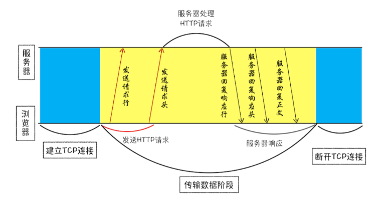
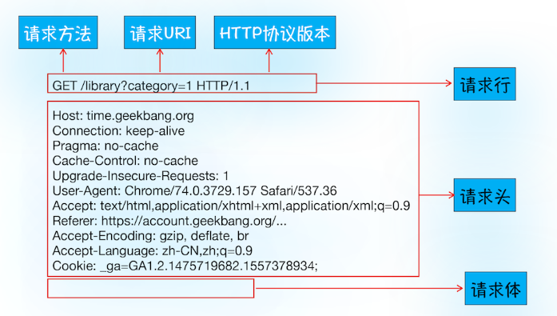
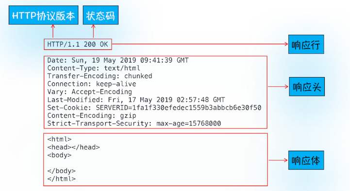
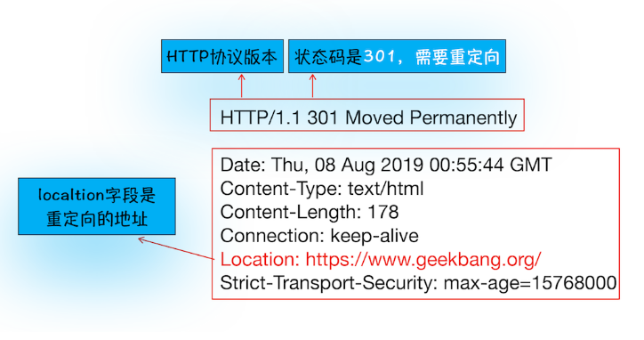
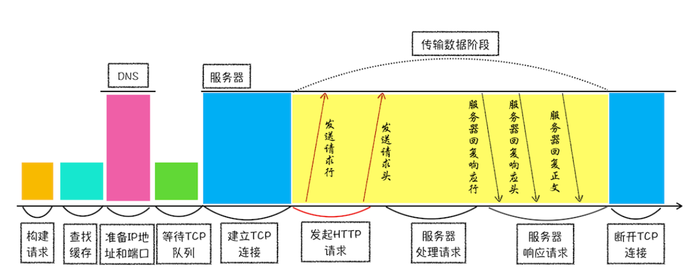

## 浏览器发起 HTTP 请求流程

在浏览器地址栏里键入极客时间网站的地址：`http://time.geekbang.org/index.html`， 那么接下来，浏览器会完成哪些动作呢？

1. 构建请求行信息, 构建好后浏览器准备发起网络请求。

   请求行信息：

   > GET /index.html HTTP1.1

2. 查找缓存， 检测缓存有没有对应的请求资源副本， 有则结束请求，直接使用资源副本， 没有或查找识别就进入网络请求过程。

3. 准备 IP 地址和端口， 在发起 http 请求之前需要浏览器网络进程提前与服务器建立 TCP 连接，然后再发送由 http 协议封装的请求文本信息。 TCP 和 HTTP 的关系如下图：

   > 浏览器是如何和服务器建立 TCP 连接的呢？ 前面由于我们在浏览器的输入框里输入了浏览地址， 浏览器会根据域名去查找对应的 IP 地址。这一套域名映射成 IP 的服务又叫 DNS（Domain Name System 域名系统）。 找到 IP 了就剩端口了。由于我们使用的是 http 协议， 且没有指明其他端口， 因此就是使用了 http 默认的 80 端口。

4. 等待 TCP 队列。 当浏览器准备好 IP 和 端口的时候， 并不是马上就可以建立请求的。 因为浏览器有一个请求限制：对同一域名下的请求最多只能建立 6 个 TCP 连接。当多于 6 个的部分就会被放进 TCP 等待队列。

5. 建立 TCP 连接。

6. 发送 HTTP 请求。

   这里我们来属性一下 http 请求报文。 

## 服务器处理好数据后返回数据浏览器的处理流程

- 相应的这里了解下返回的请求: 

- 最后就是断开连接了。 但是有一种情况请求头使用了 ` Connection:keep-alive` 字段。 这表示 TCP 连接处于保持打开状态， 当下次发起 http 请求是就直接用当前的 tcp 通道。 省去了从新建立 TCP 连接的时间。

## 特殊情况

1. 重定向，当返回的状态码是 301 时， 浏览器会去拿响应头里的 location 字段的地址去从新导航。

## Q&A 环节

1. 第二次访问页面为啥比首次打开页面快？

   现在这里可以回答一下为什么第二次访问页面比第一次快的问题了。原因是浏览器缓存了 DNS 和页面资源， 所以再次打开时候比第一次快。

2. 登录状态如何保持?

   利用 `Set-Cookie` 响应头字段，当服务器下发这个字段的时候， 浏览器会将里面的内容存储到本地， 当再有请求发到服务器的时候， 浏览器会将之前存储的内容放到 `Cookie` 这个请求头里。

   ```json
   <!-- Example -->
   // request header
   Cookie: UID=131uau;

   // response header
   Set-Cookie: UID=131uaa;
   ```

3. http 请求精力了哪些流程？

   共 8 个阶段：构建请求、查找缓存、准备 IP 和端口、等待 TCP 队列、建立 TCP 连接、发起 HTTP 请求、服务器处理请求、服务器返回请求和断开连接。
   

## 知识拓展

- [HTTP 缓存](https://developer.mozilla.org/zh-CN/docs/Web/HTTP/Caching)
