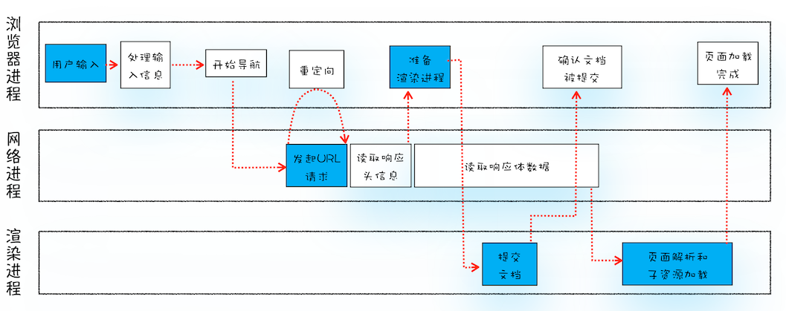
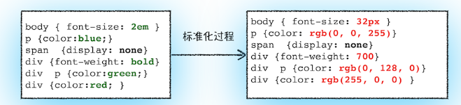
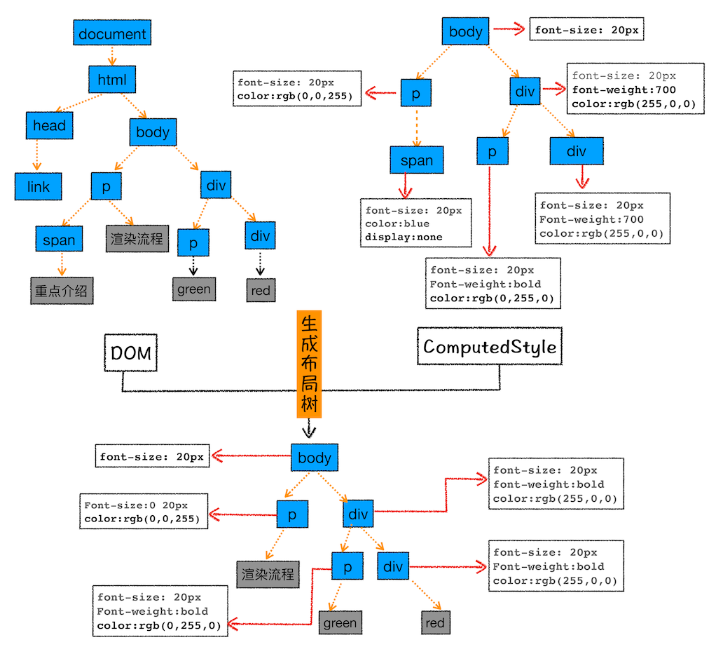
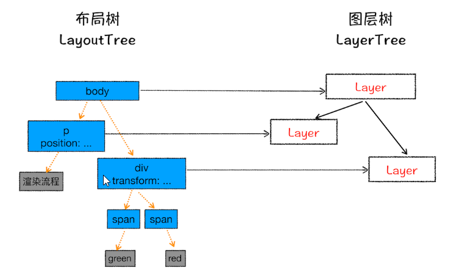
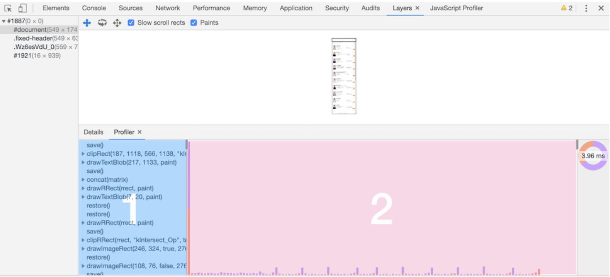
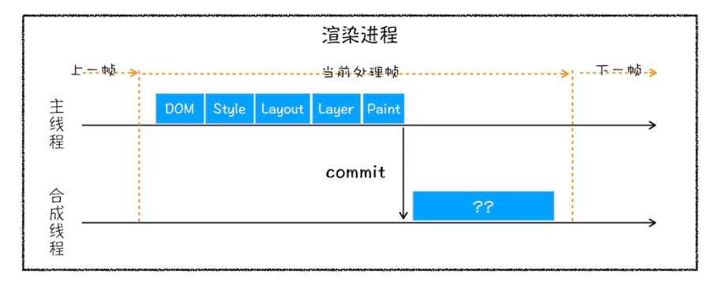
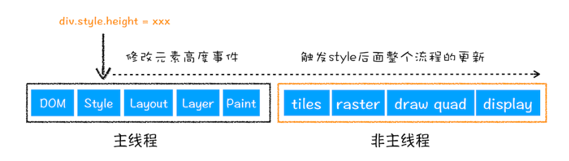
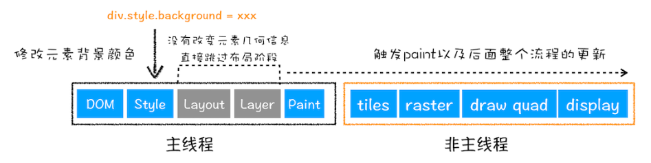
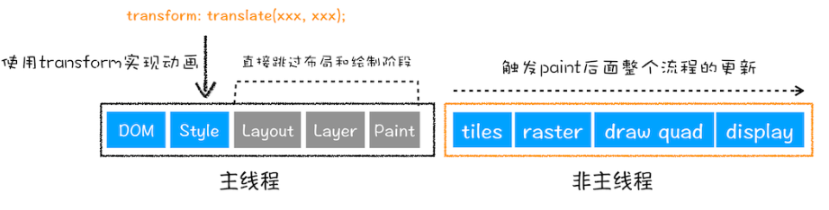

从输入 URL 到页面展示的完整流程


**1、进入 loading 状态**

浏览器判断地址栏输入的是地址还是搜索内容， 是地址则合成完整的 URL 地址，浏览器进入 loading 状态； 若是搜索资源， 则利用浏览器默认的搜索引擎合成带搜索关键字的地址， 接着进入浏览器也进入 loading 状态。

**2、发起浏览器请求**

发起 URL 请求流程， 浏览器进程获取到输入地址后， 通过进程间通信（IPC） 将 URL 地址发给网络进程， 由网络进程进行查找缓存，DNS 解析获取 IP , 和端口， 建立连接， 和发起请求的操作。若是 https 协议，网络进程还需建立 TLS 连接。

**3、确认响应数据是不是展示的类型**

浏览器根据 响应头的 `Content-Type`字段来决定如何处理响应体内容。例如值是 `text/html` 则显示， 是 ` application/octet-stream` 则下载。 

**4、浏览器准备渲染进程**

获取到的数据类型是 html 后， 浏览器就会准备渲染进程了。

在默认情况下浏览器会为每一个页面创建一个渲染进程，但是当在当前页面中打开一个同一站点的页面，该页面会复用父页面的渲染进程。

> 同一站点： 根域名（例如，geekbang.org）加上协议（例如，https:// 或者 http://），还包含了该根域名下的所有子域名和不同的端口，比如下面这三个:

```
https://time.geekbang.org
https://www.geekbang.org
https://www.geekbang.org:8080
```

他们都是同一站点。但是还没有进入渲染过程， 因为这时的渲染进程还没有拿到数据。

**5、浏览器进程发起提交文档阶段**

渲染进程准备好后， 就进入<b>提交文档阶段</b>，“提交文档”的消息是由浏览器进程发出的，渲染进程接收到“提交文档”的消息后，会和网络进程建立传输数据的“管道”。

等文档数据传输完成之后，渲染进程会返回“确认提交”的消息给浏览器进程。

浏览器进程在收到“确认提交”的消息后，会更新浏览器界面状态，包括了安全状态、地址栏的 URL、前进后退的历史状态，并更新 Web 页面。


到这里，一个完整的导航流程就“走”完了，这之后就要进入渲染阶段了。

**6、进入渲染流程**

一旦文档被提交，渲染进程便开始页面解析和子资源加载了,一旦页面生成完成，渲染进程会发送一个消息给浏览器进程，浏览器接收到消息后，会停止标签图标上的加载动画。 

渲染阶段做了什么工作呢？ 这里我们来了解一下。首先渲染阶段是一个流程， 整个流程大致分为： <b style="color: #aaffaa">构建 DOM 树， 样式计算， 布局阶段， 分层， 绘制， 分块， 光栅化和合成， 7 个阶段。</b>

---

**<b style="color: #aaffaa">1、构建 DOM 树</b>**

浏览器无法直接使用 HTML ，需要将 HTML 转换为浏览器能够理解的 DOM 树结构。

**<b style="color: #aaffaa">2、样式计算</b>**

样式计算大致可以分为以下三个阶段：

> 1、CSS 文本内容转换成 styleSheets

浏览器也是不能直接使用 CSS 样式表的，需要将 CSS 文本转换为浏览器可以理解的 styleSheets 样式表。 可以用 `document.styleSheets` 查看。

> 2、标准化样式表中的属性值

例如 em, rem , bold , red , blue 等类似的值， 浏览器引擎是不容易理解的，需要对其进行转换。 如下图 

> 3、计算样式，计算好的样式在 ComputedStyle 中。

**<b style="color: #aaffaa"/>3、布局阶段</b>**

布局阶段也有两个任务： 创建布局树和布局计算。

创建布局树的任务就是根据样式表遍历出 body 里的全部可见元素，和去除 head 标签里的所有元素，最后形成布局树，接着还进行布局树中每一个元素的在页面显示坐标的计算。最后将计算好的坐标信息放到布局树中。


**<b style="color: #aaffaa">4、分层</b>**

有了布局树还是不能进行页面绘制， 因为页面中有许多复杂的效果， 如 3D 变换， z-indexing 做 Z 轴排序， 动画等。 浏览器会为这些特定的节点生成专用的图层， 并合成一颗对应的图层树。如图: 
并不是布局树的每个节点都包含一个图层，如果一个节点没有对应的层，那么这个节点就从属于父节点的图层。如 span 就属于 div 父元素这个图层。

> 什么情况下浏览器会为元素创建新图层呢?

1、拥有层叠上下文属性的元素会被提升为单独的一层。如 固定定位， opcity 透明， CSS filter 滤镜 等； 层叠上下文属性可以参考：[层叠上下文 MDN](https://developer.mozilla.org/zh-CN/docs/Web/CSS/CSS_Positioning/Understanding_z_index/The_stacking_context)

2、需要剪裁（clip）的地方也会被创建为图层。如一个固定宽高的元素其内容布局超出了这个容器， 渲染引擎会为内容单独创建一个分层， 若是有滚动条， 也会为滚动条单独创建一个图层。

**<b style="color: #aaffaa">5、图层绘制</b>**

渲染引擎将图层拆分成许多个有序的绘制指令组成的绘制列表。

1 是绘制列表， 拖动区域 2 中的进度条可以重现列表的绘制过程

**<b style="color: #aaffaa">6、栅格化（raster) 操作</b>**

绘制列表只是用来记录绘制顺序和绘制指令的列表，而实际上绘制操作是由渲染引擎中的合成线程来完成的。你可以结合下图来看下渲染主线程和合成线程之间的关系：

当图层的绘制列表准备好之后，主线程会把该绘制列表提交（commit）给合成线程, 合成线程将图层划分为图块，然后合成线程会按照视口附近的图块来优先生成位图，实际生成位图的操作是由栅格化来执行的。所谓栅格化，是指将图块转换为位图。通常，栅格化过程都会使用 GPU 来加速生成，使用 GPU 生成位图的过程叫快速栅格化，或者 GPU 栅格化，生成的位图被保存在 GPU 内存中。

**<b style="color: #aaffaa">7、合成和显示</b>**

一旦所有图块都被光栅化， 浏览器进程的 viz 模块就会接收到 合成线程的 “DrawQuad” 命令，然后根据 DrawQuad 命令，将其页面内容绘制到内存中，最后再将内存显示在屏幕上。

直到这里渲染流程就结束了。

## 相关概念

- 重排：例如改变元素的宽度、高度等几何位置，浏览器都会触发重新布局，解析之后的一系列子阶段，这个过程就叫重排。

- 重绘：没有引起几何位置的变换，所以就直接进入了绘制阶段，然后执行之后的一系列子阶段，这个过程就叫重绘；

* 合成：渲染引擎将跳过布局和绘制，只执行后续的合成操作，我们把这个过程叫做合成；

### 参考文章

[MDN 渲染页面： 浏览器的工作原理](https://developer.mozilla.org/zh-CN/docs/Web/Performance/How_browsers_work)
