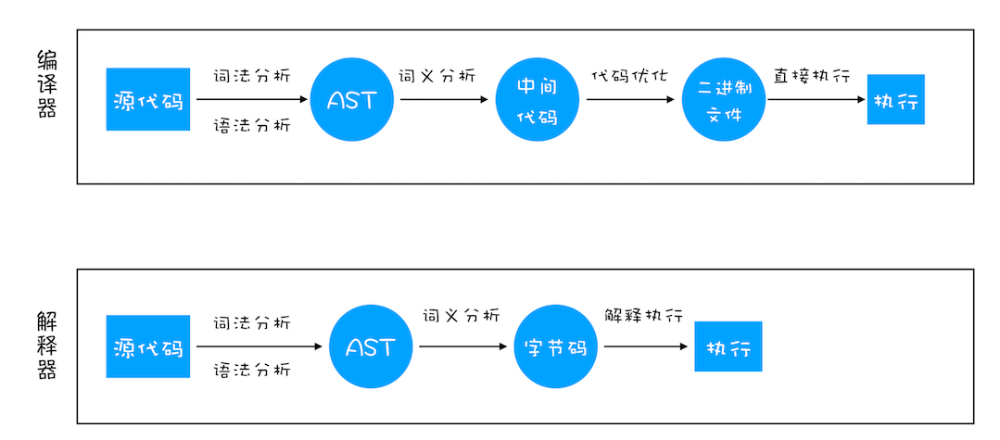
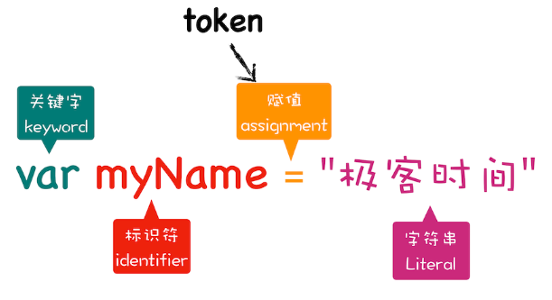
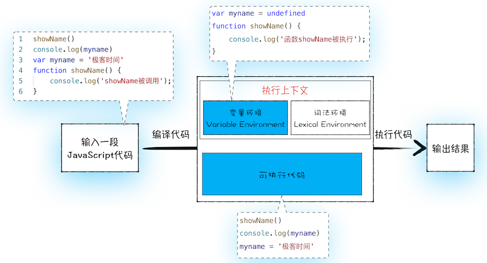

# JavaScript 解析流程和执行机制

> https://astexplorer.net/

> https://www.jointjs.com/demos/abstract-syntax-tree

按语言的执行流程，可以把语言划分为编译型语言和解释型语言。编译型语言在执行之前通过编译器编译成二进制文件然后执行。而解析型语言在执行前由解析器对程序进行动态解析成字节码， 然后逐行解析字节码执行。

虽然 JavaScript 是解析型语言， 但在 V8 引擎中解析器和编译器是同时配合使用的。V8 引擎执行一段代码需要经过以下几个阶段。

## JavaScript 解析流程

1. 第一阶段： 词法分析和语法分析。词法分析其作用是将一行行的源码拆解成一个个 token。

   

   其中关键字“var”、标识符“myName” 、赋值运算符“=”、字符串“极客时间”四个都是 token。

   语法分析。其作用是将上一步生成的 token 数据，根据语法规则转换成 AST。有了 AST 之后，那接下来 V8 就会生成该段代码的执行上下文。若是报错则在这个阶段结束。

2. 第二阶段：由解析器根据执行上下文和 AST 生成字节码。字节码是为了解决 V8 由编译器直接转换后的机器码大量内存占用问题而设计的介于 AST 和机器码之间的一种代码。字节码通过解析器逐行解析成机器码， 然后执行。

3. 第三阶段：执行代码。当代码中有一段代码（热点代码），有大量重复执行的时候， 会由编译器编译成二进制文件。然后执行。

## JavaScript 执行机制

一段 js 代码在执行之之前会被 js 解析引擎编译， 编译后的代码会被分词两部分： 执行上下文 和 可执行代码；

有以下三种情况会被创建执行上下文：

1. 当 JavaScript 执行全局代码的时候，会编译全局代码并创建全局执行上下文，而且在整个页面的生存周期内，全局执行上下文只有一份。

2. 当调用一个函数的时候，函数体内的代码会被编译，并创建函数执行上下文，一般情况下，函数执行结束之后，创建的函数执行上下文会被销毁。

3. 当使用 eval 函数的时候，eval 的代码也会被编译，并创建执行上下文。



执行上下文是 JavaScript 执行一段代码时的运行环境，比如调用一个函数，就会进入这个函数的执行上下文，确定该函数在执行期间用到的诸如 this、变量、对象以及函数等。

在执行上下文中存在一个变量环境的对象（Viriable Environment），该对象中保存了变量提升的内容，比如上面代码中的声明的变量 myname 和函数声明 showName，都保存在该对象中。

变量环境对象会为声明变量创建一个 myname 属性， 并使用 undefined 对其初始化。函数声明则是放在堆内存中， 并在变量环境对象中 创建一个 showName 属性， 属性的值指向堆内存函数的地址。 其结构类似如下：

```js
VariableEnvironment:
     myname -> undefined,
     showName ->function : {console.log(myname)

```

接着 JavaScript 引擎会把声明以外的代码编译为字节码, 就是就是图中的可执行代码。

接着 JavaScript 引擎开始执行“可执行代码”，会按照顺序一行行地执行先执行的是 showName 函数，在变量环境中找到 showName 执行，下一行是打印 myname, 由于 变量环境中的值是 undefined，所以打印的是 undefined。 最后就是第三行对 myname 变量进行赋值， 赋值之后变量环境中的值就是 “极客时间”。

以上就是 JavaScript 的执行机制了，这也是 JavaScript 声明提前的原因。

**注意：**
在行首获取同名变量或函数时， 则函数被优先获取。在后面获取同名变量或函数时， 则以变量为优先获取；

```js
console.log(a.toString());
/**
 * function a() {
 *     console.log(22);
 * }
 *
 */
var a = 12;
function a() {
	console.log("12");
}
console.log(a); // 12
function a() {
	console.log(22);
}
console.log(typeof a, a); // number 12
```
