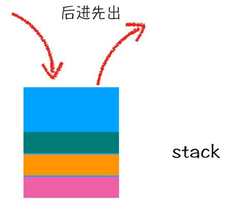
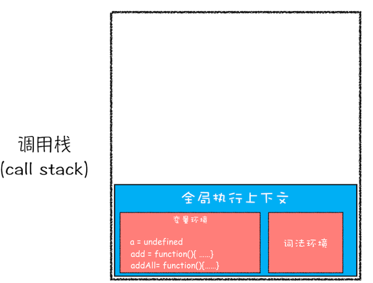
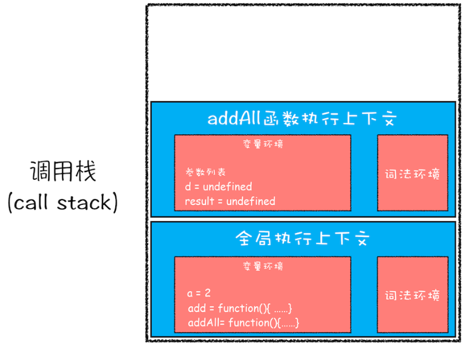
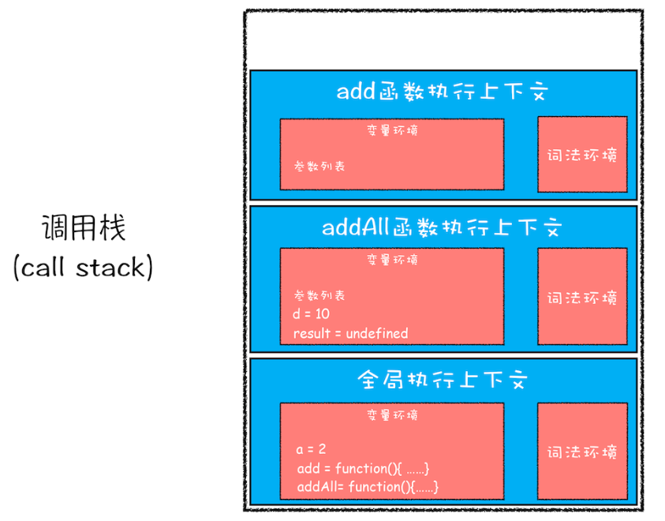
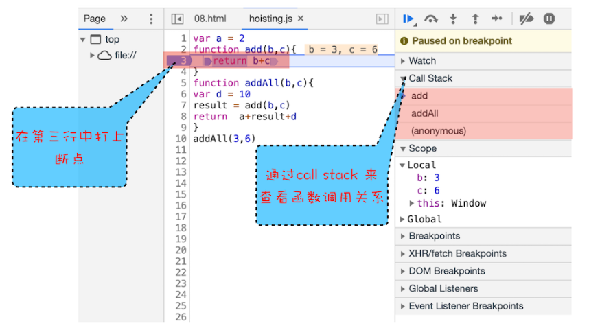

# JavaScript 调用栈

JavaScript 在编译后会创建执行上下文和可执行代码， 但是在实际开发中一个文件会有很多函数和变量。 对个函数就会创建出多个执行上下文。 那么浏览器是怎么管理这些上下文的呢？答案是通过一种叫栈(stack)的数据结构来管理的。栈的特点就是后入先出。



当创建后执行上下文之后，执行可执行代码时就会根据调用关系， 对执行上下文进行入栈和出栈操作，通常把这种用来管理执行上下文的栈称为执行上下文栈，又称调用栈。

接着我们分析一下下面这段代码时怎么进行入栈出栈操作的。

```js
var a = 2;
function add(b, c) {
	return b + c;
}
function addAll(b, c) {
	var d = 10;
	result = add(b, c);
	return a + result + d;
}
addAll(3, 6);
```

首先创建全局执行上下文， 并将全局执行上下文压入栈低。接着就执行 "可执行代码"。


可执行代码：

```js
// 全局上下文可执行代码
a = 2;
addAll(3, 6);
```

首先对 a 进行赋值，`a = 2`, 全局执行上下文变量环境中的 a 值变为 2， 接着调用 addAll 函数， JavaScript 引擎为该函数编译该函数并为其创建执行上下文并将其压入栈中。



然后进行执行 addAll 函数中的 “可执行代码”

```js
// addAll 函数的可执行代码
d = 10;
result = add(b, c);
return a + result + d;
```

同样当遇到 add 函数时，同样也会提为其创建执行上下文， 并压入栈中；



执行 add 函数中的可执行代码后，返回结果，接着将值赋值给 result。这时 add 函数的执行上下文就会被回收，进行出栈操作。同样 addAll 函数中的可执行低吗执行完后， addAll 函数的执行上下文也会被回收，然后进行出栈操作。


最后就剩下全局可执行上下文了。 这个全局执行上下文是不会被回收的。它是伴随着页面的整个生命周期的。

平时在工作中我们也可以通过 chrome 浏览器提供的 devtools 查看我的调用栈执行情况。



值得注意的是 JavaScript 中的调用栈内存是非常有限的，当调用栈被堆满的时候它就会报栈溢出的错误 ：Maximum call stack size exceeded

## 思考题

优化以下代码， 防止栈溢出报错。

```js
function runStack(n) {
	if (n === 0) return 100;
	return runStack(n - 2);
}
runStack(50000);
```

答案：

```js
function runStack(n) {
	while (n !== 0) {
		if (n === 0) {
			return 100;
		}
		n -= 2;
		if (n < 0) {
			return;
		}
	}
}
```
