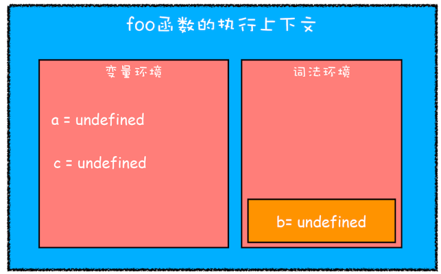
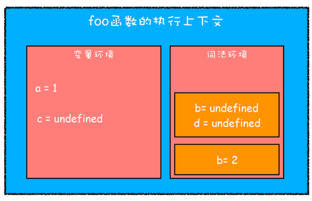
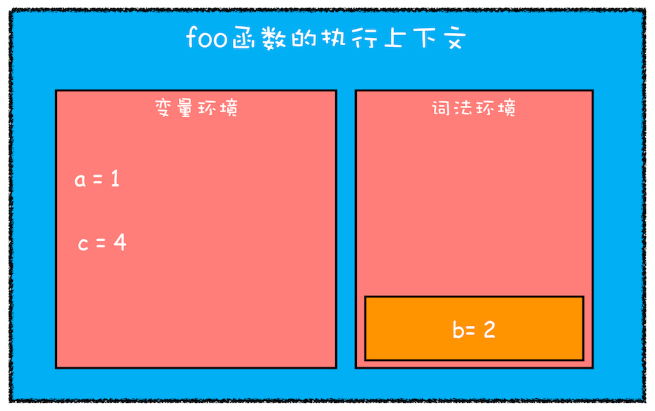

# JavaScript 作用域

> **作用域**: 是指在程序中定义变量的区域，该位置决定了变量的生命周期。通俗地理解，作用域就是变量与函数的可访问范围，即作用域控制着变量和函数的可见性和生命周期。

> **全局作用域**: 中的对象在代码中的任何地方都能访问，其生命周期伴随着页面的生命周期。

> **函数作用域**: 就是在函数内部定义的变量或者函数，并且定义的变量或者函数只能在函数内部被访问。函数执行结束之后，函数内部定义的变量会被销毁。

> **块级作用域**: 就是使用一对大括号包裹的一段代码，比如函数、判断语句、循环语句，甚至单独的一个 {} 都可以被看作是一个块级作用域。

在 ES6 之前 JavaScript 只有**全局作用域** 和 **函数作用域**，而没有**块级作用域**， 因此，导致了函数中的变量不管在哪里声明， 都会被提取到执行上下文的变量环境中，所以这些变量在整个函数体内部的任何地方都是能被访问的，这也就是 JavaScript 中的变量提升。

## 变量提升带来的问题

1.  **变量容易在不被察觉的情况下被覆盖掉**

    ```js
    var myname = "极客时间";

    function showName() {
    	console.log(myname); // 覆盖了全局变量 myname
    	if (0) {
    		var myname = "极客邦";
    	}
    	console.log(myname);
    }
    showName();
    ```

2.  **本应销毁的变量没有被销毁**

    ```js
    function foo() {
    	for (var i = 0; i < 7; i++) {}
    	// 循环结束后 i 没有被销毁。
    	console.log(i);
    }
    foo();
    ```

## ES6 块级作用域

JavaScript 在支持变量提升的情况下，通过引入 let 和 const 关键字创建块级作用域。下面通过一段代码看看它们是如何运作的。

```js
function foo() {
	var a = 1;
	let b = 2;
	{
		let b = 3;
		var c = 4;
		let d = 5;
		console.log(a);
		console.log(b);
	}
	console.log(b);
	console.log(c);
	console.log(d);
}
foo();
```

通过 JavaScript 引擎编译后，为 foo 函数创建执行上下文。



通过 var 声明的变量会被放到， 变量环境中； 通过 let 声明的变量会被放到词法环境中， 接着执行 “可执行代码”；

这时 a = 1， b = 2; 接着遇到新的作用域，然后把里面的块级作用域通过压栈的方式方到栈顶。



> 通过 let 和 const 声明的变量都会被放进这个词法环境中。在词法环境内部，维护了一个小型栈结构，栈底是函数最外层的变量，进入一个作用域块后，就会把该作用域块内部的变量压到栈顶；当作用域执行完成之后，该作用域的信息就会从栈顶弹出，这就是词法环境的结构。

接着， 运行 `console.log(a)` 这段代码，查找 a 会沿着词法环境的栈顶向下查询，如果在词法环境中的某个块中查找到了，就直接返回给 JavaScript 引擎，如果没有查找到，那么继续在变量环境中查找。

当执行完 {} 中的代码后， 其内部定义的变量就会从词法环境的栈顶弹出。这就是为什么外面拿不到块级作用域变量的原因, 最后运行到 `console.log(d)` 这里就报错 d is not define。 最终的执行上下文如图：



## 思考题

```js
let myname = "极客时间";
{
	console.log(myname);
	let myname = "极客邦";
}
```

答案：
在块级作用域中，从｛开始到 let myname= '极客邦' 代码之间会形成一个暂时性死区，如果中间去访问变量 myname，会报初始化之前不能访问 myname 的错误。Uncaught ReferenceError
