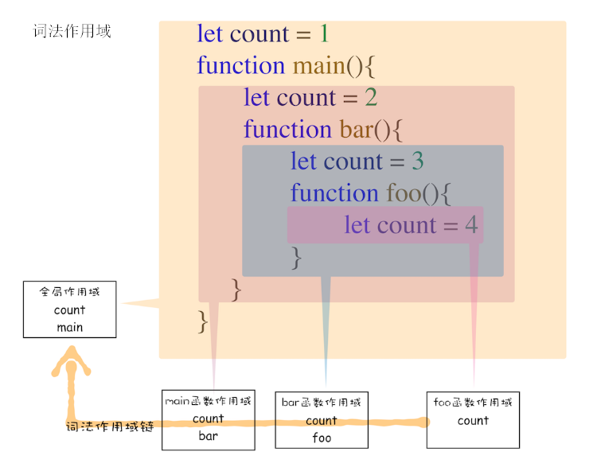
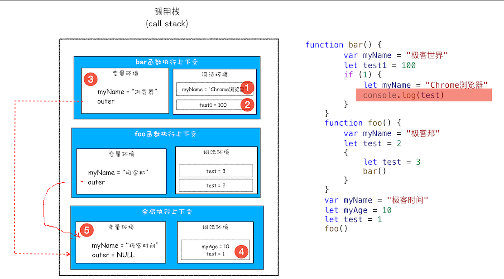
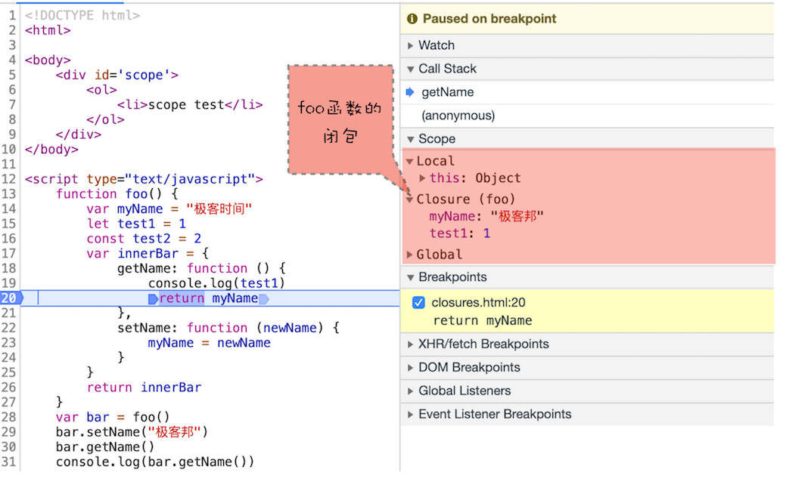
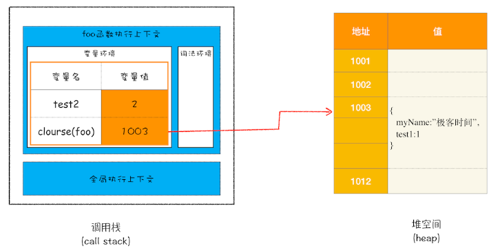

# JavaScript 作用域链和闭包

## 作用域链

> 就是作用域之间的关系链条。

我们知道当获取一个变量的时候会去执行上下文的词法环境和变量环境中查找，当没有找到的时候， 会向外层的作用域查找，直到找到最外层的全局作用域为止。那么它是通过什么方式去向外层作用域查找的呢? 其实， 每一个执行上下文的变量环境中都有一个指向外部执行上下文的引用 **outer**。当在当前作用域中没有查找到改变量时， 就会顺着这个外部引用向外部继续查找。

**outer** 的指向是由 JavaScript 的词法作用域决定的，词法作用域是静态作用域，是由代码中函数声明的位置来决定的, 通过它就能够预测代码在执行过程中如何查找标识符，并且词法作用域和函数是怎么调用的没有任何关系。



下面我们用一段代码来说明一下作用域链：



词法作用域确定了 bar 函数的执行上下文 outer 指向全局执行上下文，foo 执行上下文的 outer 也指向 全局执行上下文。 因此不管 bar 函数在 foo 内部被调用，还是在全局环境中被调用， 最终 test 的值都会顺着作用域链找到最外部的 test 变量。

## 闭包

了解了作用域链之后我们来看看闭包。

```js
function foo() {
	var myName = "极客时间";
	let test1 = 1;
	const test2 = 2;
	var innerBar = {
		getName: function () {
			console.log(test1);
			return myName;
		},
		setName: function (newName) {
			myName = newName;
		},
	};
	return innerBar;
}
var bar = foo();
bar.setName("极客邦");
bar.getName();
console.log(bar.getName());
```

通过代码调用我们可以发下， 当我们运行 `foo` 函数之后，其中的 `myName` 和 `test1` 没有被垃圾回收， 让然可以通过 `innerBar` 的 `setName` 和 `getName` 访问到，且只能通过这两个地方访问到。

在 JavaScript 中，根据词法作用域的规则，内部函数总是可以访问其外部函数中声明的变量，当通过调用一个外部函数返回一个内部函数后，即使该外部函数已经执行结束了，但是内部函数引用外部函数的变量依然保存在内存中，我们就把这些变量的集合称为闭包。比如外部函数是 foo，那么这些变量的集合就称为 foo 函数的闭包。

通过 chrome 调试工具查看闭包：



闭包的使用原则： 从上述代码可以看出， 我们返回的对象时赋值给了一个全局变量 bar ，它会直到页面关闭时才会被回收，假如我们的闭包一直使用的，就可以这样设计代码。但是使用不频率不高的话就会使内存泄漏。因此我们可以将它赋值给一个局部变量来规避这个问题。

<h3 style="color: #aaffaa"> 从数据存储的角度解析闭包 </h3>

1. 当 JavaScript 引擎执行到 foo 函数时，首先会编译，并创建一个空执行上下文。

2. 在编译过程中，遇到内部函数 setName，JavaScript 引擎还要对内部函数做一次快速的词法扫描，发现该内部函数引用了 foo 函数中的 myName 变量，由于是内部函数引用了外部函数的变量，所以 JavaScript 引擎判断这是一个闭包，于是在堆空间创建换一个“closure(foo)”的对象（这是一个内部对象，JavaScript 是无法访问的），用来保存 myName 变量。

3. 接着继续扫描到 getName 方法时，发现该函数内部还引用变量 test1，于是 JavaScript 引擎又将 test1 添加到“closure(foo)”对象中。这时候堆中的“closure(foo)”对象中就包含了 myName 和 test1 两个变量了。

4. 由于 test2 并没有被内部函数引用，所以 test2 依然保存在调用栈中。


