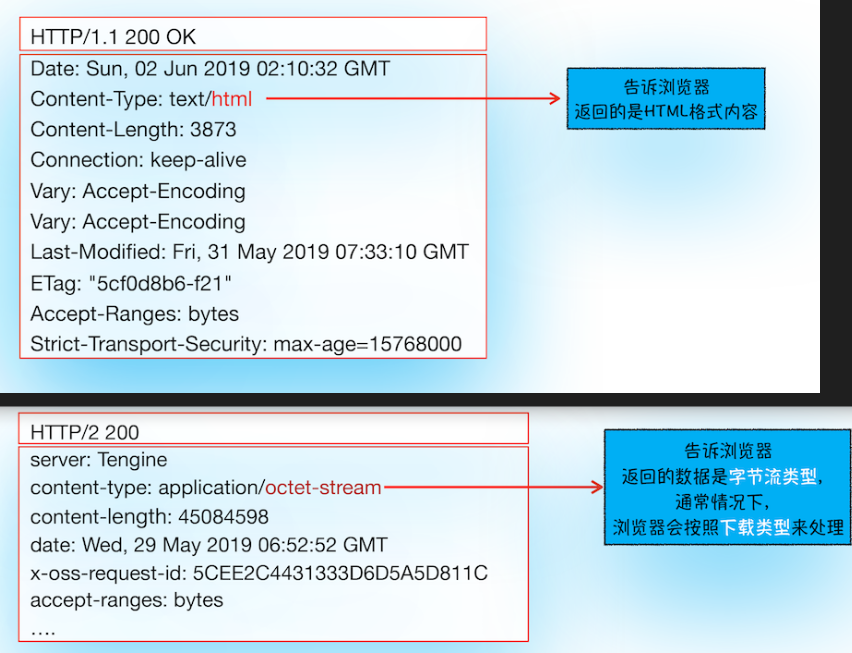

## 从用户输入开始

1. 浏览器判断地址栏输入的是地址还是搜索内容， 是地址则合成完整的 URL 地址，浏览器进入 loading 状态； 若是搜索资源， 则利用浏览器默认的搜索引擎合成带搜索关键字的地址， 接着进入浏览器也进入 loading 状态。

2. 发起 URL 请求流程， 浏览器进程获取到输入地址后， 通过进程间通信（IPC） 将 URL 地址发给网络进程， 由网络进程进行查找缓存，DNS 解析获取 IP , 和端口， 建立连接， 和发起请求的操作。若是 https 协议，网络进程还需建立 TLS 连接。

3. 响应数据处理。浏览器根据 响应头的 `Content-Type`字段来决定如何处理响应体内容。例如值是 `text/html` 则显示， 是 ` application/octet-stream` 则下载。 

4. 获取到的数据类型是 html 后， 浏览器就会准备渲染进程了。

   在默认情况下浏览器会为每一个页面创建一个渲染进程，但是当在当前页面中打开一个同一站点的页面，该页面会复用父页面的渲染进程。

   > 同一站点： 根域名（例如，geekbang.org）加上协议（例如，https:// 或者 http://），还包含了该根域名下的所有子域名和不同的端口，比如下面这三个:

   ```
   https://time.geekbang.org
   https://www.geekbang.org
   https://www.geekbang.org:8080
   ```

   他们都是同一站点。但是还没有进入渲染过程， 因为这时的渲染进程还没有拿到数据。

5. 渲染进程准备好后， 就进入<b>提交文档阶段</b>

   - “提交文档”的消息是由浏览器进程发出的，渲染进程接收到“提交文档”的消息后，会和网络进程建立传输数据的“管道”。
   - 等文档数据传输完成之后，渲染进程会返回“确认提交”的消息给浏览器进程。
   - 浏览器进程在收到“确认提交”的消息后，会更新浏览器界面状态，包括了安全状态、地址栏的 URL、前进后退的历史状态，并更新 Web 页面。

    
    到这里，一个完整的导航流程就“走”完了，这之后就要进入渲染阶段了。

6. <b> 渲染阶段 </b>

   一旦文档被提交，渲染进程便开始页面解析和子资源加载了,一旦页面生成完成，渲染进程会发送一个消息给浏览器进程，浏览器接收到消息后，会停止标签图标上的加载动画。 
