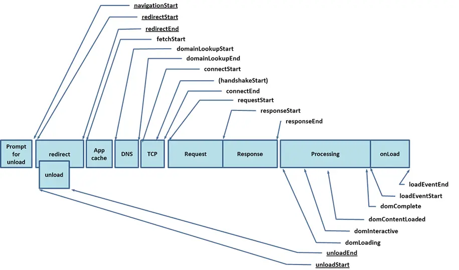

# 性能监控

参考地址： https://developer.mozilla.org/zh-CN/docs/Web/API/Performance_API/Navigation_timing#%E7%A4%BA%E4%BE%8B

[FP ](https://developer.mozilla.org/zh-CN/docs/Glossary/First_paint)

[FCP](https://developer.mozilla.org/en-US/docs/Glossary/First_contentful_paint)

[FMP](https://developer.mozilla.org/en-US/docs/Glossary/First_meaningful_paint);

[LCP, 最大内容渲染]()

[DCL dom content loaded, 对应的时间点也是 domContentLoaded ]()



1. from cache 和常规请求的区别

   直接从本地缓存获取， 不建立实际连接, http 1.0 , 1.1 最多可以 同时发送六个请求。

2. DNS 解析

```javascript
window.onload -
	function () {
		console.log(window.performance);
		// PerformanceTiming
		const { domainLookupStart, domainLookupEnd, domComplete, domLoading } =
			performance.timing;
		console.log("dns 获取时间", domainLookupEnd - domainLookupStart);

		console.log("dom 处理时间", domComplete, domLoading);

		// PerformanceNavigationTiming
		const perfEntries = window.performance.getEntries();
		console.log(perfEntries);

		const paint = window.performance.getEntriesByType("paint");
		const fp = paint.find((e) => e.name === "first-paint").startTime;
		const fcp = paint.find(
			(e) => (e.name = "first-contentful-paint")
		).startTime;

		console.log(fp, fcp, "log");
	};
```

用 `window.onload ` 去获取的缺陷是有些事件在我没有发生的时间点就获取到结果， 这样的结果是不准确的。而是要在发生的时候才获取它。而是要用 performanceObserver。

## performanceObserver

[performance Entry types](https://developer.mozilla.org/en-US/docs/Web/API/PerformanceEntry/entryType)

```javascript
function callback(list, ob) {
	list.getEntries().forEach((e) => {
		console.log(e);
	});
}
const observer = new PerformanceObserver(callback);
observer.observe({
	entrytypes: [
		"element", // 某个元素

		"navigation", // html 加载监控

		"mark",
		"measure", // 性能度量

		"resource", // 资源加载监听，如 img , script , file 等。

		"paint", //@渲染性能 fp 和 fcp

		"longtask", // 小号事件过长的任务。
	],
});
// observer.disconnect() 取消监听。

//性能度量 mark measure
```

```javascript
console.log("start 1s");
window.performance.mark("start");
setTimeout(() => {
	console.log("end 1s");
	performance.mark("end");
	performance.measure("calc", "start", "end"); // 开始标点减去 结束标点。
}, 1000);
```
