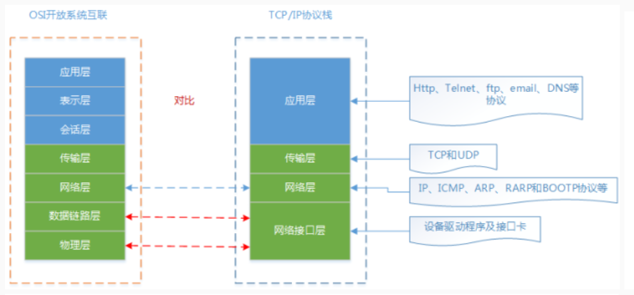

1. this 的使用原则

   this 的指向：this 的指向是根据执行上下文动态决定的。

   - 在简单调用时， this 的默认指向是， window / global / undefined; (浏览器、 node 、 严格模式)
   - 对象调用时， 绑定在对象上。
   - 使用 call 、 apply 、 bind 的时候， 绑定在第一个参数上。
   - 使用 new 关键字，通过构造函数调用创建对象；
   - 以上三条优先级： new > call/ bind / apply > 对象调用
   - 使用箭头函数时，根据外层的规则， 决定 this 的指向。

2. 实现一个 call 函数

```js
Function.prototype.called = called;
function called(ctx) {
	let args = Array.slice.call(arguments, 1);
	let fn = this;
	if (ctx) {
		ctx.fn = fn;
		let res = ctx.fn(...args);
		delete ctx.fn;
		return res;
	}
	return fn(...args);
}
```

3. 什么时闭包

   正确答案：函数嵌套函数时，内层函数引用了外层函数作用域下的变量，并且内层函数，在全局环境下可访问，就形成了闭包。当函数的执行时的作用域，没有在原本的词法作用域内，就形成了闭包。

4. promise 调用链是怎样实现的，

```js
const promiseArrGenerator = (num) => {
	return new Array(num).fill(0).map((item, index) => {
		return () =>
			new Promise((resolve, reject) => {
				setTimeout(() => {
					resolve(index);
				}, Math.random() * 1000);
			});
	});
};

const proArr = promiseArrGenerator(100);

const promiseChain = (proArr) => {
	proArr
		.reduce((proChain, pro) => {
			proChain.then((res) => {
				res && console.log(res);
				return pro();
			});
		}, Promise.resolve(-1))
		.then((res) => consolve(`the last one is  ${res}`));
};
//  promiseChain(proArr)
```

5. 设计一个 pipe 去并发执行一部分 promise

```js
const promisePipe = (proArr, concurrent) => {
	if (concurrent > proArr.length) {
		return Promise.all(proArr.map((fn) => fn())).then((res) =>
			console.log(res)
		);
	}
	let _arr = [...proArr];
	for (let i = 0; i < concurrent; i++) {
		let fn = _arr.shift();
		run(fn);
	}
	function fun(fn) {
		fn().then((res) => {
			console.log(res);
			if (_arr.length) run(_arr.shift());
		});
	}
};
```

6. 手写一个 UMD

```js
(function (global, factory) {
	if (typeof module === "object" && typeof exports !== "undefined") {
		module.exports = factory();
	} else if (typeof define === "function") {
		// 这里是 amd 和 cmd
		if (define.amd) {
			define(["module"], factory);
		} else if (define.cmd) {
		}
	} else {
		global = typeof glbalThis !== "undefined" ? globalThis : global;
		global.module = factory();
	}
})(this, function () {
	return "module";
});
```

7. AMD 和 CMD 的区别是什么？

   1、CMD 和 AMD 都是为了 JavaScript 模块化开发的规范

   2、CMD 是 sea.js 推广过程中对模块定义的规范化产出；AMD 是 require.js 推广过程中对模块定义的规范化产出

   3、AMD 是异步模块定义的意思，他是一个在浏览器端模块开发规范，由于不是 JS 原生支持，使用 AMD 规范进行页面开发时，需要对应的函数库

   4、require.js 解决的问题，多个 JS 文件可以有依赖关系，被依赖的文件需要早于依赖它的文件加载到浏览器，JS 加载的时候浏览器停止页面渲染，加载文件越多，页面失去响应时间越长

   5、CMD 通用模块定义,是国内发展的，有浏览器实现 Sea.js,Sea.js 要解决的问题和 require.js 一样，只不过模块定义的方式和模块加载时机有所不同

   6、CMD 推崇依赖就近，AMD 推崇依赖前置

8. stopPropgation 和 stopImmediatePropagation 的区别？

   stopPropgation： 会阻止事件继续进行传播， 包括捕获和冒泡阶段

   stopImmediatePropagation: 不仅会阻止， 而且对多个相同类型的事件的事件监听函数绑定同一个元素的情况， 会在触发时， 阻止该元素的其他事件。

9. dom 的几级事件， 区别是什么？

   DOM 级别 0: 不是 W3C 规范。而仅仅是对在 Netscape Navigator3.0 和 Microsoft Internet Explorer 3.0 中的等价功能性的一种定义。

   ```js
   document.querySelector('button').onclick = clickFn1
   <div onclick="clickFn()">点击一下</div>
   ```

   DOM 级别 1: 专注于 HTML 和 XML 文档模型。它含有文档导航和处理功能。

   DOM 级别 2: 对 DOM 级别 1 添加了样式表对象模型，并定义了操作附于文档之上的样式信息的功能性。DOM 级别 2 同时还定义了一个事件模型（Events，规定了访问文档事件的 API），并提供了对 XML 命名空间
   的支持。

   ```js
   document.querySelector("button").addEventListener("click", clickBtn);
   ```

   DOM Level3 : 规定了内容模型（DTD 和 Schemas）和文档验证。同时规定了文档加载和保存、文档查看、文档格式化和关键事件。

10. 衡量性能指标有哪些

    （1）FP-first print：首次绘制时间 首次绘制包括了任何用户自定义的背景绘制，它是将第一个像素点绘制到屏幕的时刻，对于应用页面，用户在视觉上首次出现不同于跳转之前的内容时间点，或者说是页面发生第一次绘制的时间点。

    （2）FCP-first contented print：首次有内容绘制时间指浏览器完成渲染 DOM 中第一个内容的时间点，可能是文本、图像、SVG 或者其他任何元素，此时用户应该在视觉上有直观的感受。

    （3） FMP.first meaningful print：首次有意义绘制时间 指页面关键元素渲染时间。这个概念并没有标准化定义，因为关键元素可以由开发者自行定义——究竟什么是“有意义”的内容，只有开发者或者产品经理自己了解。

    （4）首屏时间 对于所有网页应用，这是一个非常重要的指标。用大白话来说，就是进入页面之后，应用渲染完整个屏幕（未滚动之前）内容的时间。需要注意的是，业界对于这个指标其实同样并没有确切的定论，比如这个时间是否包含屏幕内图片的渲染完成时间。

    （5）TTI-Time to Interactive：用户可交互时间顾名思义，也就是用户可以与应用进行交互的时间。

    （6）TTFB-time for first byte：网络请求耗时 TTFB 是发出页面请求到接收到应答数据第一个字节所花费的毫秒数

    （7）DCL：DomContentLoaded L:DOM onload 总下载时间 页面所有资源加载完成所需要的时间，一般可以统计 window.onload 时间，这样可以统计出同步加载的资源全部加载完的耗时，如果页面中存在较多异步渲染，也可以将异步渲染全部完成的时间作为总下载时间。

    (8)LCP(LargestContentful Paint)good-2.5sec-middle-4.0 sec-poor 衡量页面的加载体验，它表示视口内可见的最大内容元表的渲染时间。相比 FCP，这个指标可以更加真实地反映具体内容加载速度，比如，如果页面渲染前有一个 loading 动画，那么 FCP 可能会以 loading 动画出现的时间为准，而 LCP 定义了 loading 动画加载后，真实渲染出内容的时间，

    （9）FID（First Input Delay）首次输入延迟 good-100ms-middle -300ms-poor

    (10) react 18-调度器。衡量可交互性, 它表示用户和页面进行首次交互操作所花费的时间。它比 TTI(Time to Interact) 更加提前, 这个阶段虽然页面已经显示出部分内容,但并不能完全具备可交互性，对于用户的响应可能会有较大的延迟。

    （11）CLS（Cumulative Layout Shift）good-0.1-middle-0.25-poor 衡量视觉稳定性，表示页面的整个生命周期中，发生的每个意外的样式移动的所有单独布局更改得分的总和，所以这个分数当然越小越好。

11. 函数式编程的优势有哪些？

    - 表达力更加清晰，因为“一切都是函数”，通过函数的合理命名，函数原子的拆分，我们能够一眼看出来程序在做什么，以及做的过程；

    - 利于复用，因为“一切都是函数”，函数本身具有天然的复用能力；

    - 利于维护，纯函数和幂等性保证同样的输入就有同样的输出，在维护或者调试代码时，能够更加专注，减少因为共享带来的潜在问题。

12. 手写一个 memorize 函数

```js
const memorize = (fn) => {
	let cache = {};
	return function (...args) {
		const cacheKey = args.join("_");
		if (cacheKey in cache) {
			return cache[cacheKey];
		} else {
			return (cache[cacheKey] = fn.apply(this || {}, args));
		}
	};
};

function add(a, b) {
	return a + b;
}
const madd = memorize(add);
madd(1, 2);
madd(1, 2);
```

13. 手写加法器。

```js
const add = (args) => {
	let _args = [args];
	const fn = (arg) => {
		_args.push(arg);
		return fn;
	};
	fn.toString = function () {
		return args.reduce((prev, next) => prev + next, 0);
	};
	return fn;
};
```

14. TS 枚举的 js 实现

```js
let enum;
(function (enum) {
	enum[(enum[0] = "A")] = 0;
	// 字符串枚举不可逆向mapping
})(enum || {});
```

15. type 和 interface 的异同?

    同： 都是对数据结构的辅助描述

    异： \

16. Vue 父子组件生命周期函数的执行顺序。

    **2.x 版本：**

    初始化流程：

    父 beforeCreate > 父 created > 父 beforeMount > 子 beforeCreate > 子 created > 子 beforeMount > 子 mounted > 父 mounted

    更新流程和销毁流程：

    父 beforeUpdate > 子 beforeUpdate > 子 updated > 父 updated

    父 beforeDestroy > 子 beforeDestroy > 子 destroyed > 父 destroyed

    **3.x 版本**

    去除了 beforeCreate 和 create 合并成了 setup , 将 beforeDestory 改为 beforeUnmount， destoryed 改为 unmounted

    初始化流程：

    父 setup > 父 beforeMount > 子 setup > 子 beforeMount > 子 mounted > 父 mounted

    更新流程和销毁流程：

    父 beforeUpdate > 子 beforeUpdate > 子 updated > 父 updated

    父 beforeUnmount > 子 beforeUnmount > 子 unmounted > 父 unmounted

17. Vue 组件间的通信方式

    a.props/ $emit -用于父子组件之间通信

    b.$ref/$children|$parent-用于指向性通信

    c.EventBus-隔代、兄弟等非直接通信

    d.$attrs/ $listener -隔代等监听型通信

    e.provide/ inject-隔代广播等

    f.vuex-整体状态机

18. Vue 的 extends 和 mixins

19. node 的 child_process 有哪几种线程的方法。 区别是什么？

    ·spawn:最基础的，其他的方法，都是基于此派生的；

    ·fork：在源码里加了一个 IPC，默认只能走 IPC；

    ·execfile:shell 默认是 false,拿不到系统环境；参数是数组；

    ·exec:shell 是 true，能拿到系统环境，将参数进行了格式化。

20. 手写一个发布订阅模式

```js
function EventEmitter() {
	this.events = {};
}
EventEmitter.prototype.on = function (type, listener) {
	if (!this.events[type]) {
		this.evnets[type] = [];
	}
	this.events[type].push(listener);
};
EventEmitter.prototype.off = function (type, listener) {
	if (this.events[type]) {
		this.events[type] = this.events[type].filter((func) => {
			return func !== listener && func._wrapper !== listener;
		});
	}
};

EventEmitter.prototype.once = function (type, listener) {
	let _wrapper = (...rest) => {
		listener.apply(this, rest);
		this.off(type, _wrapper);
	};
	listener._wrapper = _wrapper;
	this.on(type, _wrapper);
};
EventEmitter.prototype.emit = function (type, ...rest) {
	this.events[type] &&
		this.events[type].forEach((func) => {
			func.apply(this, rest);
		});
};
```

21. iso 七层模型 和 tcp/ip 四层模型的异同点
    

    **相同的：**

    1.应用层顶层功能一致：大多数普通与网络相关的程序为了通过网络与其他程序通信所使用的层。这个层的处理过程是应用特有的；数据从网络相关的程序以这种应用内部使用的格式进行传送，然后被编码成标准协议的格式；

    2.传输层一致：两台主机上的应用程序提供端到端的通信，有 2 种传输协议：TCP（传输控制协议）和 UDP（用户数据报协议）；

    3.网络层一致：处理分组在网络中的活动，例如分组的选路。网络层协议包括 IP 协议（网际协议）、ICMP 协议（Internet 互联网控制报文协议），以及 IGMP 协议（Interet 组管理协议）；

    4·网络接口层顶层功能一致：也称作数据链路层，包括操作系统中的设备驱动程序和计算机中对应的网络接囗卡。一起处理与电缆（或其他任何传输媒介）的物理接口细节；

    **区别**

    1.OSII 入了服务、接口、协议、分层的概念，TCP/IP 借鉴了 OSI 的这些概念建立 TCP/IP 模型；

    2.OSI 先有模型，后有协议，先有标准，后进行实践；而 TCP/IP 则相反，先有协议和应用再提出了模型，且是参照的 OS 模型；

    3.OSI 是一种理论下的模型，而 TCP/IP 已被广泛使用，成为网络互联事实上的标准；

22. redux 的设计原理是什么？ 如何与 react 结合起来？
